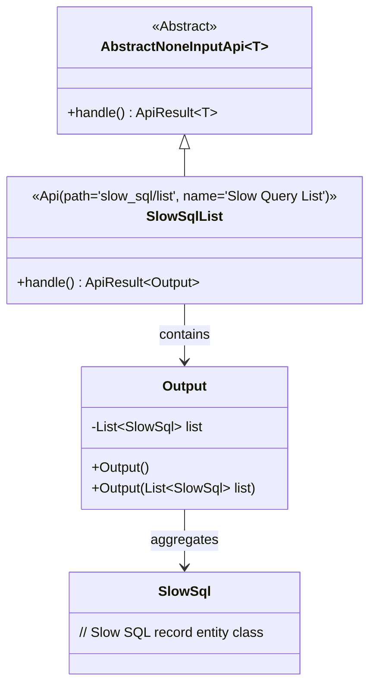
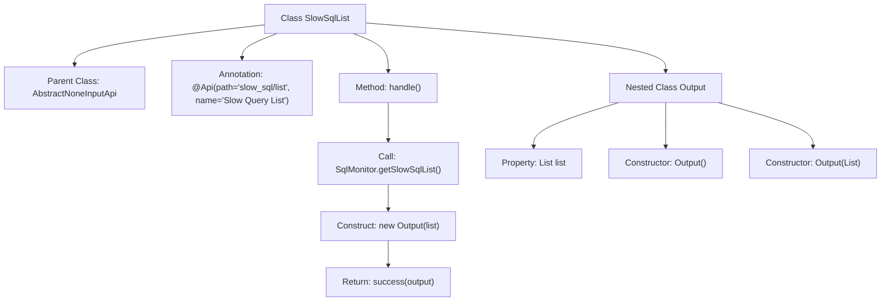

# Basic Information

|      |      |
|------|------|
| Name | SlowSqlList |
| Language | .java |
| Code Path | WeFe/common/java/common-web/src/main/java/com/welab/wefe/common/web/api/dev/SlowSqlList.java |
| Package Name | com.welab.wefe.common.web.api.dev |
| Dependencies | ['com.welab.wefe.common.data.mysql.sql_monitor.SlowSql', 'com.welab.wefe.common.data.mysql.sql_monitor.SqlMonitor', 'com.welab.wefe.common.exception.StatusCodeWithException', 'com.welab.wefe.common.web.api.base.AbstractNoneInputApi', 'com.welab.wefe.common.web.api.base.Api', 'com.welab.wefe.common.web.dto.ApiResult', 'java.util.List'] |
| Brief Description | This is a slow query list API class with the path "slow_sql/list". It takes no input parameters and returns an output containing a list of slow SQL queries. The processing logic involves fetching and returning the list of slow SQL queries. |

# Description

This is an API class named "Slow Query List" with the path "slow_sql/list". It inherits from the AbstractNoneInputApi base class, with generics specifying the inner class Output. The API does not accept input parameters, and its processing logic involves calling the SqlMonitor.getSlowSqlList() method to retrieve the slow SQL list, which is then encapsulated into an Output object for return. Output is a static inner class containing a list field of type List<SlowSql>, providing both parameterless and parameterized constructors. Upon successful execution, the API returns an ApiResult containing the Output object.

# Class Summary

| Name   | Type  | Description |
|-------|------|-------------|
| SlowSqlList | class | This is an API class for retrieving a list of slow queries, with the path "slow_sql/list", which returns an output result containing a list of SlowSql. |

## Class SlowSqlList

|      |      |
|------|------|
| Access Modifier | @Api(path = "slow_sql/list", name = "慢查询列表");public |
| Type | class |
| Name | SlowSqlList |
| Description | This is an API class for retrieving a list of slow queries, with the path "slow_sql/list", which returns an output result containing a list of SlowSql. |

### UML Class Diagram

This code demonstrates the implementation structure of an API for handling slow SQL query lists. The SlowSqlList class inherits from the generic abstract class AbstractNoneInputApi, specifying the output type as the inner class Output. The Output class encapsulates a list of SlowSql objects, retrieving monitoring data through the handle() method and returning successful results. The class diagram clearly illustrates inheritance relationships, containment relationships, and the use of generic parameters. The overall design adheres to the Single Responsibility Principle, achieving functional encapsulation of slow SQL queries through a layered structure.

### Internal Method Call Graph

This flowchart illustrates the structure and processing flow of the SlowSqlList class. The class inherits from AbstractNoneInputApi and includes a handle() method for retrieving slow SQL lists and returning encapsulated results. The nested Output class stores query results, featuring two constructors and a list property. The main flow involves obtaining data via SqlMonitor, constructing an Output object, and returning a success result.

### Field List

| Name  | Type  | Description |
|-------|-------|------|

### Method List

| Name  | Type  | Description |
|-------|-------|------|
| handle | ApiResult<Output> | Java method override, returning an ApiResult success response containing a list of slow SQL queries. |

