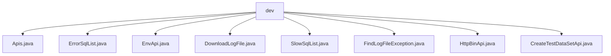

# Basic Information

|      |      |
|------|------|
| Name | dev |
| Language | .java |
| Code Path | WeFe/common/java/common-web/src/main/java/com/welab/wefe/common/web/api/dev |
| Package Name | docs.common.java.common-web.src.main.java.com.welab.wefe.common.web.api.dev |
| Brief Description | The Apis class retrieves a list of APIs, supporting formats such as json, markdown, or html. ErrorSqlList returns a list of erroneous SQL queries. EnvApi provides system environment information. DownloadLogFile handles log downloads. SlowSqlList returns a list of slow SQL queries. FindLogFileException searches for log exceptions. HttpBinApi displays HTTP request details. CreateTestDataSetApi generates test datasets. |

# Description

## Overview  
This module is a collection of development support APIs, with its core responsibilities including system monitoring, log management, and test data generation. The interface specifications follow a unified pattern, all inheriting from the `AbstractApi` or `AbstractNoneInputApi` base classes, with outputs mostly being `ResponseEntity` or custom `Output` classes. Key data structures include monitoring entity classes such as `ErrorSql` and `SlowSql`, as well as mapping structures containing log content, environment variables, and other information. External dependencies include `CommonConfig` for configuration management, `SqlMonitor` for monitoring services, and system file operations. For example, `EnvApi` aggregates system properties, while `DownloadLogFile` handles file downloads.  

## Primary Business Scenarios  
The module primarily serves development and debugging scenarios, similar to an operations console. It includes three typical applications: system status monitoring (e.g., `EnvApi` collects environment information), SQL performance analysis (e.g., `ErrorSqlList` retrieves failed SQL queries), and log management (e.g., `FindLogFileException` searches for exception stacks). The API interaction modes are divided into parameterless queries (e.g., `SlowSqlList`) and parameter-driven operations (e.g., `Apis` supports multi-format outputs). Integration examples include test data generation (`CreateTestDataSetApi`) and HTTP request diagnostics (`HttpBinApi`). For instance, combining these APIs can enable a complete development and debugging toolchain.

### Package Internal Structure View

This flowchart illustrates the API file structure under the dev directory in the common-web module of the WeFe project. The parent node "dev" contains 8 direct child file nodes, encompassing functional class files for log downloading, SQL monitoring, test data creation, and more. All files reside at the same level without nested subdirectories, reflecting a centralized management approach for development environment-related APIs.

# File List

| Name   | Type  | Description |
|-------|------|-------------|
| [Apis.java](Apis.md) | file | Java class Apis defines API interfaces, supporting JSON, Markdown, and HTML format outputs, including input and output parameter validation logic. |
| [ErrorSqlList.java](ErrorSqlList.md) | file | Define the API class `ErrorSqlList` to retrieve the list of failed SQLs. It takes no input parameters and returns an output result containing a collection of `ErrorSql`. The processing logic invokes `SqlMonitor` to fetch the data and encapsulates it into an `ApiResult` for return. |
| [EnvApi.java](EnvApi.md) | file | The EnvApi class is used to retrieve environment variables, system properties, and runtime information, including JVM memory, thread count, etc., and returns formatted output results. |
| [DownloadLogFile.java](DownloadLogFile.md) | file | This is an API class for downloading log files, which checks if the file exists and returns the file content. The path is "log_file/download". |
| [SlowSqlList.java](SlowSqlList.md) | file | This is a slow query list API class with the path "slow_sql/list". It takes no input parameters and returns an output containing a list of slow SQL queries. The processing logic involves fetching and returning the list of slow SQL queries. |
| [FindLogFileException.java](FindLogFileException.md) | file | Search for abnormal APIs in log files, which does not support Windows systems. After verifying the file's existence, execute the command to extract the exception stack trace, limiting the returned lines to 100-1000. |
| [HttpBinApi.java](HttpBinApi.md) | file | The HttpBinApi class is used to view HTTP request information, including request headers, client IP, server IP, and URLs, and can be accessed without logging in. |
| [CreateTestDataSetApi.java](CreateTestDataSetApi.md) | file | This API is designed to generate test datasets, supporting customizable parameters such as features, number of data rows, and missing rate, with output in CSV format. It includes functionalities for ID generation, data type processing, and missing value simulation. |

