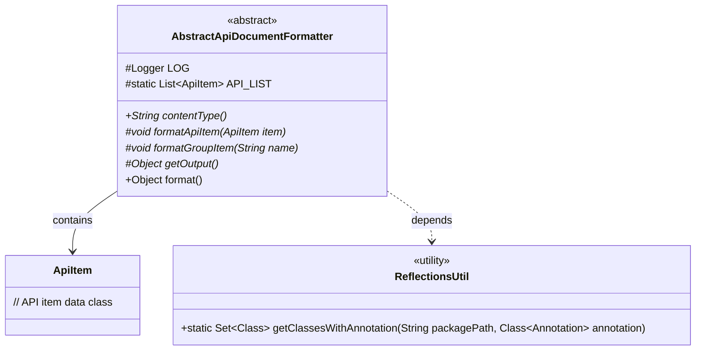
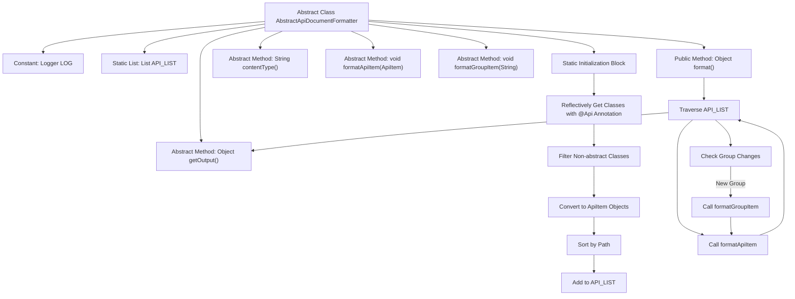

# Basic Information

|      |      |
|------|------|
| Name | AbstractApiDocumentFormatter |
| Language | .java |
| Code Path | WeFe/common/java/common-web/src/main/java/com/welab/wefe/common/web/api_document/AbstractApiDocumentFormatter.java |
| Package Name | com.welab.wefe.common.web.api_document |
| Dependencies | ['com.welab.wefe.common.util.ReflectionsUtil', 'com.welab.wefe.common.web.Launcher', 'com.welab.wefe.common.web.api.base.Api', 'com.welab.wefe.common.web.api_document.model.ApiItem', 'org.slf4j.Logger', 'org.slf4j.LoggerFactory', 'java.lang.reflect.Modifier', 'java.util.ArrayList', 'java.util.Comparator', 'java.util.List'] |
| Brief Description | The abstract class `AbstractApiDocumentFormatter` is used to format API documentation, including static API list initialization, abstract formatting methods, and output methods. It retrieves classes annotated with `@Api` through reflection, then filters, sorts, and processes them. |

# Description

This is an abstract class named AbstractApiDocumentFormatter, designed for formatting API documentation. The class contains a static initialization block that uses reflection tools to scan non-abstract classes annotated with `@Api` under a specified package path, generates `ApiItem` objects, and stores them in a static list `API_LIST` sorted by path. The class declares an abstract method `contentType` to return the content type, and abstract methods `formatApiItem` and `formatGroupItem` for formatting individual API items and grouped items, respectively. The `getOutput` abstract method retrieves the final output. The `format` method iterates through the API list, invokes the corresponding formatting methods by group, and returns the output result. The class also includes a protected logger instance.

# Class Summary

| Name   | Type  | Description |
|-------|------|-------------|
| AbstractApiDocumentFormatter | class | The abstract class AbstractApiDocumentFormatter is used for formatting API documentation, including static API list initialization, abstract formatting methods, and output methods. |

## Class AbstractApiDocumentFormatter

|      |      |
|------|------|
| Access Modifier | public abstract |
| Type | class |
| Name | AbstractApiDocumentFormatter |
| Description | The abstract class AbstractApiDocumentFormatter is used for formatting API documentation, including static API list initialization, abstract formatting methods, and output methods. |

### UML Class Diagram

Class diagram description: This diagram illustrates the core structure of an abstract API document formatter (AbstractApiDocumentFormatter), which utilizes the ReflectionsUtil utility class to scan classes annotated with @Api through a static initialization block to populate the API_LIST collection. The abstract class defines key methods including contentType(), formatApiItem(), formatGroupItem(), and getOutput(), with the format() method implementing the core workflow for iteratively processing API items. The ApiItem class serves as a data carrier for storing API metadata.

### Internal Method Call Graph

This flowchart illustrates the core structure and workflow of the abstract API document formatter. The static initialization block scans all non-abstract classes with @Api annotation in specified package paths through reflection mechanism, converts them into ApiItem objects, and stores them sorted. The format() method dynamically detects group changes while traversing the API list, calls group formatting and API item formatting methods respectively, and finally returns the result via getOutput(). The entire process implements automated API document collection and structured output functionality.

### Field List

| Name  | Type  | Description |
|-------|-------|------|
| API_LIST = new ArrayList<>() | List<ApiItem> | Declare a protected static constant API list initialized as an empty ArrayList. |
| LOG = LoggerFactory.getLogger(this.getClass()) | Logger | Define the logger instance LOG for the current class, using LoggerFactory to obtain the class name as the identifier. |

### Method List

| Name  | Type  | Description |
|-------|-------|------|
| formatGroupItem | void | Abstract method `formatGroupItem`, with parameter string `name`, used to format group items. |
| contentType | String | Abstract method, returns the content type as a string. |
| formatApiItem | void | Abstract method for formatting ApiItem objects. |
| getOutput | Object | Abstract method, returns an Object type result. |
| format | Object | This method iterates through the API list and outputs the results formatted by group. When encountering a new group, it calls formatGroupItem to process the group name, then processes each API item by calling formatApiItem, and finally returns the result. |

