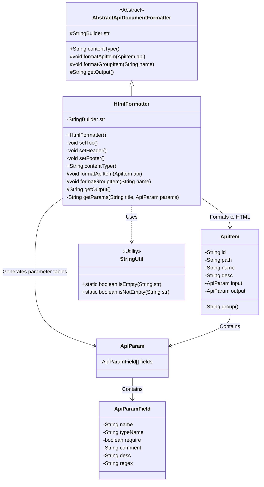
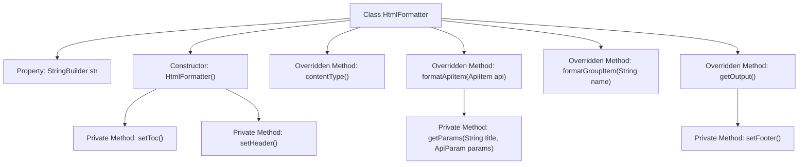

# Basic Information

|      |      |
|------|------|
| Name | HtmlFormatter |
| Language | .java |
| Code Path | WeFe/common/java/common-web/src/main/java/com/welab/wefe/common/web/api_document/HtmlFormatter.java |
| Package Name | com.welab.wefe.common.web.api_document |
| Dependencies | ['com.welab.wefe.common.util.StringUtil', 'com.welab.wefe.common.web.api_document.model.ApiItem', 'com.welab.wefe.common.web.api_document.model.ApiParam', 'com.welab.wefe.common.web.api_document.model.ApiParamField'] |
| Brief Description | The HtmlFormatter class inherits from AbstractApiDocumentFormatter and is used to generate API documentation in HTML format. It includes a table of contents, grouped display of API items, parameter tables, and interactive features supporting click-to-expand/collapse. The output is of type text/html. |

# Description

The HtmlFormatter class inherits from AbstractApiDocumentFormatter and is used to generate API documentation in HTML format. During initialization, it sets up the HTML header and a table of contents, where the API list items are displayed as an ordered list with links and names. Each API item is wrapped in a div, showing the path, name, and description, while parameters and response information are presented in tables containing fields such as name, type, and required status. It supports collapsing API items by group, and clicking the API name expands parameter details. The page includes a "Back to Top" button, with interactive functionality implemented using jQuery. The HTML structure is complete, including a DOCTYPE declaration, charset settings, responsive viewport, and inline CSS styles.

# Class Summary

| Name   | Type  | Description |
|-------|------|-------------|
| HtmlFormatter | class | The HtmlFormatter class inherits from AbstractApiDocumentFormatter and is used to generate API documentation in HTML format. It includes a table of contents, API items, parameter tables, supports group folding and parameter visibility toggling, and implements interactive features using jQuery. |

## Class HtmlFormatter

|      |      |
|------|------|
| Access Modifier | public |
| Type | class |
| Name | HtmlFormatter |
| Description | The HtmlFormatter class inherits from AbstractApiDocumentFormatter and is used to generate API documentation in HTML format. It includes a table of contents, API items, parameter tables, supports group folding and parameter visibility toggling, and implements interactive features using jQuery. |

### UML Class Diagram

Class diagram description: This diagram shows that HtmlFormatter inherits from AbstractApiDocumentFormatter and is used to format API documentation into HTML. HtmlFormatter constructs HTML content using StringBuilder, including methods to set the table of contents (setToc), header (setHeader), and footer (setFooter). It relies on classes like ApiItem and ApiParam to obtain API information and uses StringUtil for string validation. Overall, it implements the functionality of formatting API documentation into HTML.

### Internal Method Call Graph

This code flowchart illustrates the complete structure of the HtmlFormatter class, which inherits from AbstractApiDocumentFormatter and is primarily used to generate API documentation in HTML format. The core process begins with the constructor, sequentially calling setHeader() and setToc() to initialize the document structure. It dynamically generates API content blocks through formatApiItem() and formatGroupItem(), and finally outputs the complete HTML document via getOutput(). The private method getParams() is responsible for generating parameter tables, while setHeader() and setFooter() handle the header and footer structures of the HTML document, respectively. The entire process demonstrates clear HTML document construction logic and modular design.

### Field List

| Name  | Type  | Description |
|-------|-------|------|
| str = new StringBuilder(2048) | StringBuilder | Create a StringBuilder object with an initial capacity of 2048 characters. |

### Method List

| Name  | Type  | Description |
|-------|-------|------|
| setHeader | void | The method `setHeader` generates the HTML document header, including the DOCTYPE declaration, UTF-8 encoding, viewport settings, the title "API Documentation," and style definitions. The styles encompass centered headings, red group headings, API items with borders, parameter tables, and a "Back to Top" button. |
| getOutput | String | Rewrite the getOutput method to first call setFooter, then return the string representation of str. |
| formatApiItem | void | This method formats API entries, generating an HTML structure that includes grouping, ID, path, name, and description, while also adding input and output parameters. |
| setFooter | void | The method `setFooter` adds footer HTML, including a back-to-top link, the jQuery library import, and scripts to control element visibility. |
| getParams | String | Generate an HTML table to display API parameters, including name, type, required, comment, description, and regex. If there are no parameters, return an empty string. |
| setToc | void | This method generates an API directory list, iterates through each ApiItem in API_LIST, formats its path and name (if any) as a linked list item, and wraps them in ordered list tags. |
| formatGroupItem | void | This method is used to format grouped items by wrapping the names in h2 tags with class names and values. |
| contentType | String | Java method returns HTML content type. |

