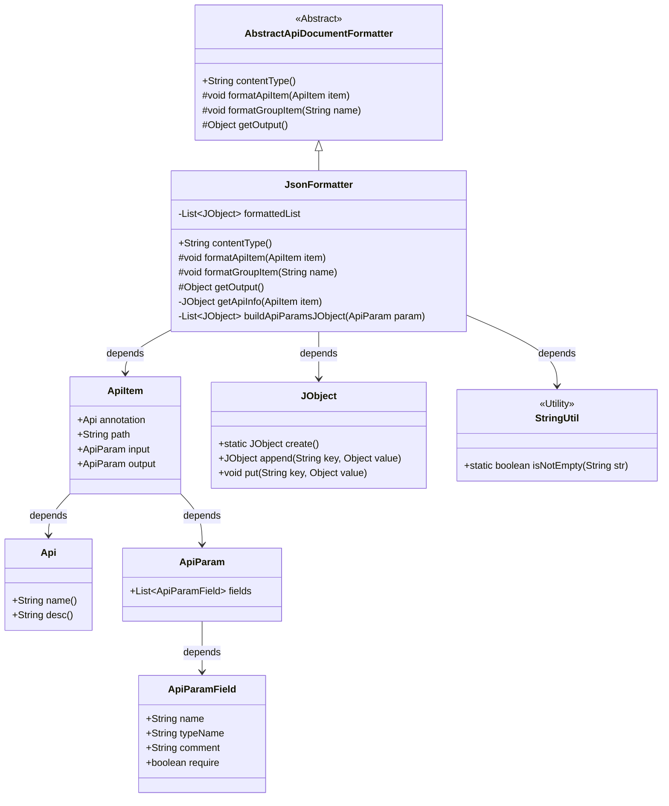
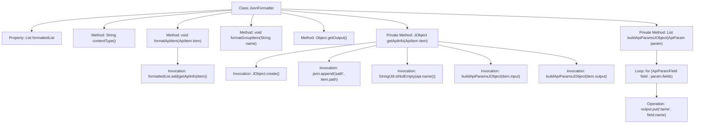

# Basic Information

|      |      |
|------|------|
| Name | JsonFormatter |
| Language | .java |
| Code Path | WeFe/common/java/common-web/src/main/java/com/welab/wefe/common/web/api_document/JsonFormatter.java |
| Package Name | com.welab.wefe.common.web.api_document |
| Dependencies | ['com.welab.wefe.common.util.JObject', 'com.welab.wefe.common.util.StringUtil', 'com.welab.wefe.common.web.api.base.Api', 'com.welab.wefe.common.web.api_document.model.ApiItem', 'com.welab.wefe.common.web.api_document.model.ApiParam', 'com.welab.wefe.common.web.api_document.model.ApiParamField', 'java.util.ArrayList', 'java.util.List'] |
| Brief Description | The JsonFormatter class inherits from AbstractApiDocumentFormatter and formats API information into JSON, including paths, names, descriptions, and input/output parameters. |

# Description

The JsonFormatter class inherits from AbstractApiDocumentFormatter and is used to format API documentation into JSON. It maintains a formattedList to store the formatted API information. The contentType method returns application/json. The formatApiItem method converts an API item into a JObject and adds it to the list, including the path, name, description, and input/output parameters. The input/output parameters are processed by the buildApiParamsJObject method, which generates a list containing the name, type, comment, and required fields. The formatGroupItem method is an empty implementation. The getOutput method returns the formatted list.

# Class Summary

| Name   | Type  | Description |
|-------|------|-------------|
| JsonFormatter | class | The JsonFormatter class inherits from AbstractApiDocumentFormatter, formatting API information into JSON, including paths, names, descriptions, and input/output parameters. |

## Class JsonFormatter

|      |      |
|------|------|
| Access Modifier | public |
| Type | class |
| Name | JsonFormatter |
| Description | The JsonFormatter class inherits from AbstractApiDocumentFormatter, formatting API information into JSON, including paths, names, descriptions, and input/output parameters. |

### UML Class Diagram

Class diagram description: This diagram illustrates the class structure of the JSON formatter JsonFormatter, which inherits from the abstract class AbstractApiDocumentFormatter to implement JSON conversion functionality for API documentation. The core class JsonFormatter utilizes helper classes such as ApiItem and JObject through composition, where ApiItem contains API metadata and JObject provides JSON construction capabilities, while StringUtil offers string utility methods. The design achieves the conversion of API information into structured JSON data, supporting dynamic generation of attributes like paths, names, and descriptions.

### Internal Method Call Graph

This flowchart illustrates the complete structure of the JsonFormatter class, highlighting the core process of JSON document generation. Inheriting from AbstractApiDocumentFormatter, the class collects API information through the formatApiItem method, constructs JSON object structures using getApiInfo, and recursively processes input/output parameters via the buildApiParamsJObject method. The workflow clearly demonstrates the transformation from raw API data to formatted JSON, including critical steps such as conditional judgments, loop processing, and object construction.

### Field List

| Name  | Type  | Description |
|-------|-------|------|
| formattedList = new ArrayList<>() | List<JObject> | Create an ArrayList named formattedList to store objects of type JObject. |

### Method List

| Name  | Type  | Description |
|-------|-------|------|
| getOutput | Object | Rewrite the getOutput method to return the formattedList object. |
| formatGroupItem | void | Rewrite the method formatGroupItem with the parameter name, without specific implementation. |
| contentType | String | The method returns content in JSON format. |
| formatApiItem | void | Override the method `formatApiItem`, process the `ApiItem` information, and add it to the `formattedList`. |
| getApiInfo | JObject | The method `getApiInfo` takes an `ApiItem` parameter and returns a JSON object containing the API path, name, description, and input/output parameters. |
| buildApiParamsJObject | List<JObject> | The method converts ApiParam into a list of JObject, containing field name, type, comment, and required attributes. Returns null if the parameter is empty. |

