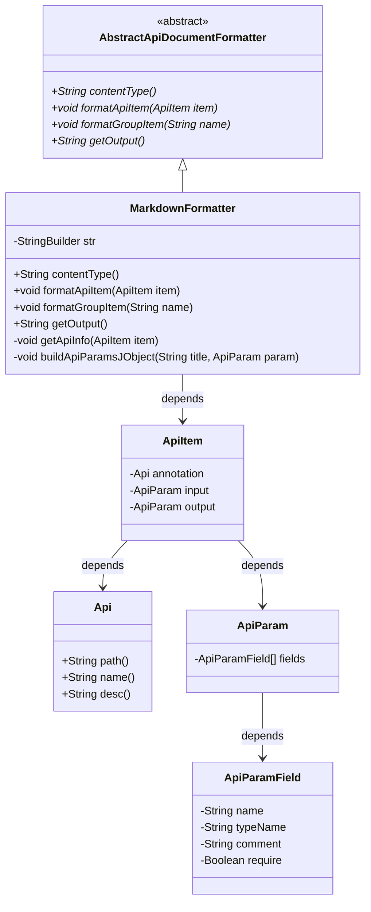
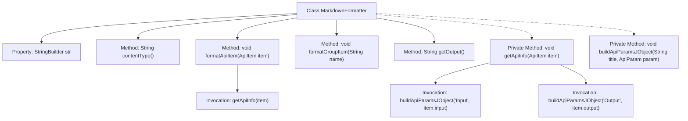

# Basic Information

|      |      |
|------|------|
| Name | MarkdownFormatter |
| Language | .java |
| Code Path | WeFe/common/java/common-web/src/main/java/com/welab/wefe/common/web/api_document/MarkdownFormatter.java |
| Package Name | com.welab.wefe.common.web.api_document |
| Dependencies | ['com.welab.wefe.common.util.StringUtil', 'com.welab.wefe.common.web.api.base.Api', 'com.welab.wefe.common.web.api_document.model.ApiItem', 'com.welab.wefe.common.web.api_document.model.ApiParam', 'com.welab.wefe.common.web.api_document.model.ApiParamField'] |
| Brief Description | The `MarkdownFormatter` class inherits from `AbstractApiDocumentFormatter` and is used to generate API documentation in Markdown format. It includes methods for formatting API items and group items, with the output content type being `text/markdown`. The `getApiInfo` method constructs the API title, description, and tables for input/output parameters. |

# Description

The MarkdownFormatter class inherits from AbstractApiDocumentFormatter and is used to generate API documentation in Markdown format. It constructs the output content using StringBuilder, with the contentType method returning text/markdown. The core method getApiInfo processes a single API item, generating a second-level heading that includes the path, name, and description, and calls the buildApiParamsJObject method to separately generate Markdown tables for input and output parameters. The tables include field names, types, comments, and required fields. The formatting uses ## headings, **bold**, and |table| delimiters, with line breaks implemented via System.lineSeparator.

# Class Summary

| Name   | Type  | Description |
|-------|------|-------------|
| MarkdownFormatter | class | The MarkdownFormatter class inherits from AbstractApiDocumentFormatter and is used to generate API documentation in Markdown format. It includes methods for formatting API items and group items, constructs API titles, descriptions, and input/output parameter tables through getApiInfo, and outputs the result as Markdown text. |

## Class MarkdownFormatter

|      |      |
|------|------|
| Access Modifier | public |
| Type | class |
| Name | MarkdownFormatter |
| Description | The MarkdownFormatter class inherits from AbstractApiDocumentFormatter and is used to generate API documentation in Markdown format. It includes methods for formatting API items and group items, constructs API titles, descriptions, and input/output parameter tables through getApiInfo, and outputs the result as Markdown text. |

### UML Class Diagram

This code describes a Markdown document generator that inherits from the abstract class AbstractApiDocumentFormatter, used to convert API documentation into Markdown format. Core functionalities include: generating API titles and descriptions via the getApiInfo method, and creating parameter tables via the buildApiParamsJObject method. The class structure clearly illustrates the inheritance relationship from the abstract base class to the concrete implementation class, as well as dependencies with data models such as ApiItem, Api, and ApiParam, enabling formatted output of API documentation.

### Internal Method Call Graph

This code demonstrates a MarkdownFormatter class that inherits from AbstractApiDocumentFormatter, designed to format API documentation into Markdown. Key functionalities include retrieving API content type, formatting API entries, grouping items, and generating output. The core private method getApiInfo constructs API titles and descriptions, while buildApiParamsJObject generates Markdown tables for input/output parameters. The flowchart clearly illustrates the class structure and method invocation relationships, showcasing the complete processing chain from formatting entry to final output.

### Field List

| Name  | Type  | Description |
|-------|-------|------|
| str = new StringBuilder(1024) | StringBuilder | Create a StringBuilder object with an initial capacity of 1024 characters. |

### Method List

| Name  | Type  | Description |
|-------|-------|------|
| contentType | String | The method returns content of type "text/markdown". |
| formatGroupItem | void | Override the method formatGroupItem, which takes a name parameter and has no specific implementation. |
| getOutput | String | Rewrite the getOutput method to return the string representation of str. |
| formatApiItem | void | Override the method formatApiItem, which calls getApiInfo to process the ApiItem object. |
| getApiInfo | void | The method `getApiInfo` processes API information, concatenates the title, summary, input and output parameters, and formats the output. |
| buildApiParamsJObject | void | This method is used to construct a Markdown table-formatted string for API parameters. After verifying the parameters are non-empty, it adds a title and table headers (name, type, comment, require), then iterates through the parameter field list to populate each row with field information. Empty require values are displayed as empty strings. |

