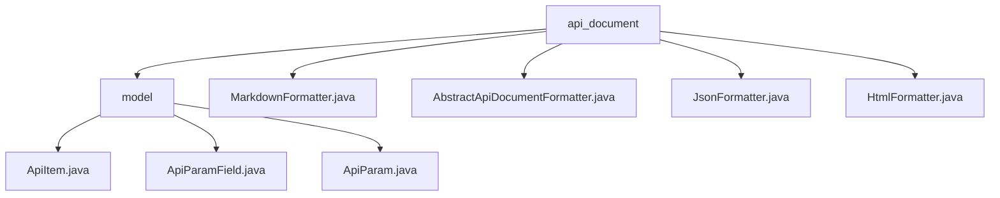

# Basic Information

|      |      |
|------|------|
| Name | api_document |
| Language | .java |
| Code Path | WeFe/common/java/common-web/src/main/java/com/welab/wefe/common/web/api_document |
| Package Name | docs.common.java.common-web.src.main.java.com.welab.wefe.common.web.api_document |
| Brief Description | This module automatically generates API documentation through reflection and annotations, supporting JSON, Markdown, and HTML formats. Its core includes a three-level ApiItem model that handles generics, validation rules, and field filtering, similar to Swagger but with a code-first approach. |

# Description

## Overview  
This module implements a multi-format API documentation generation system by parsing annotation metadata through reflection and converting it into structured models. It adopts an annotation-driven specification, such as using `Check`/`JSONField` to control field rules, and supports generic type recognition and naming conversion. The core data structure is a three-level nested model of `ApiItem-ApiParam-ApiParamField`, relying on Java reflection and the Jackson serialization library. Implementation examples include regular expression validation extraction and special handling for `NoneApiInput`, similar to Swagger but adopting a code-first approach.  

## Key Business Scenarios  
The typical workflow involves reflection parsing → building an `ApiItem` tree → generating documentation, supporting group management and dynamic field filtering. The interaction mode combines annotation configuration and runtime parsing, such as `Check` annotations driving validation rule generation. Output formats include Markdown/JSON/HTML, with Markdown using tables to display parameters and HTML supporting collapsible interactions. Integration examples include camelCase to snake_case standardization and mandatory field validation, suitable for automated RESTful API documentation generation.

### Package Internal Structure View

This flowchart illustrates the hierarchical structure of the API documentation module in the WeFe project. The top-level node `api_document` contains the `model` subdirectory and multiple formatter utility class files (Markdown/JSON/HTML, etc.), while the `model` directory includes three core model class files (ApiItem/ApiParam, etc.) that describe the API structure. The entire structure clearly reflects the code organization approach for the API document generation functionality.

# File List

| Name   | Type  | Description |
|-------|------|-------------|
| [MarkdownFormatter.java](MarkdownFormatter.md) | file | The MarkdownFormatter class inherits from AbstractApiDocumentFormatter and is used to generate API documentation in Markdown format. It includes methods for formatting API items and group items, with the output content type being text/markdown. The getApiInfo method constructs API titles, descriptions, and input/output parameter tables. |
| [AbstractApiDocumentFormatter.java](AbstractApiDocumentFormatter.md) | file | The abstract class `AbstractApiDocumentFormatter` is used to format API documentation, including static API list initialization, abstract formatting methods, and output methods. It retrieves classes annotated with `@Api` through reflection, then filters, sorts, and processes them. |
| [JsonFormatter.java](JsonFormatter.md) | file | The JsonFormatter class inherits from AbstractApiDocumentFormatter and formats API information into JSON, including paths, names, descriptions, and input/output parameters. |
| [HtmlFormatter.java](HtmlFormatter.md) | file | The HtmlFormatter class inherits from AbstractApiDocumentFormatter and is used to generate API documentation in HTML format. It includes a table of contents, grouped display of API items, parameter tables, and interactive features supporting click-to-expand/collapse. The output is of type text/html. |
| [model](model/_module.md) | package | ApiItem encapsulates API information, including annotation paths, and parses input/output types. ApiParamField describes parameter field attributes, automatically converts field names, and performs validation. ApiParam encapsulates parameter information and uses reflection to process fields, generating a list of ApiParamField. |

