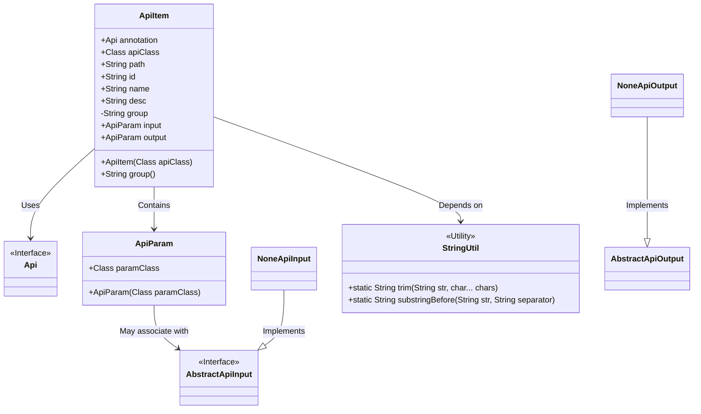
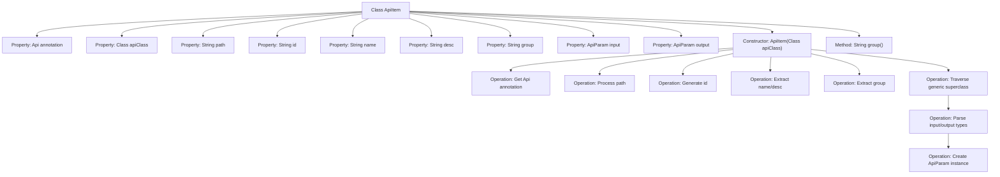

# Basic Information

|      |      |
|------|------|
| Name | ApiItem |
| Language | .java |
| Code Path | WeFe/common/java/common-web/src/main/java/com/welab/wefe/common/web/api_document/model/ApiItem.java |
| Package Name | com.welab.wefe.common.web.api_document.model |
| Dependencies | ['com.welab.wefe.common.util.StringUtil', 'com.welab.wefe.common.web.api.base.Api', 'com.welab.wefe.common.web.dto.AbstractApiInput', 'com.welab.wefe.common.web.dto.NoneApiInput', 'com.welab.wefe.common.web.dto.NoneApiOutput', 'sun.reflect.generics.reflectiveObjects.ParameterizedTypeImpl', 'sun.reflect.generics.reflectiveObjects.TypeVariableImpl', 'java.lang.reflect.ParameterizedType', 'java.lang.reflect.Type'] |
| Brief Description | The ApiItem class encapsulates API information, including path, ID, name, description, group, and input/output parameters, initialized through annotation and generic parsing. |

# Description

The ApiItem class is used to encapsulate API information, including annotations, paths, IDs, names, descriptions, groups, and input/output parameters. The constructor retrieves API class annotations via reflection, processes path formats, and extracts groups. Input and output types are obtained through generic parsing—if they are NoneApiInput or NoneApiOutput, they are set to null; otherwise, corresponding ApiParam instances are created. It provides a group method to return group information.

# Class Summary

| Name   | Type  | Description |
|-------|------|-------------|
| ApiItem | class | The ApiItem class encapsulates API information, including paths, IDs, names, descriptions, groups, and input/output parameters, initialized through annotation and generic type resolution. |

## Class ApiItem

|      |      |
|------|------|
| Access Modifier | public |
| Type | class |
| Name | ApiItem |
| Description | The ApiItem class encapsulates API information, including paths, IDs, names, descriptions, groups, and input/output parameters, initialized through annotation and generic type resolution. |

### UML Class Diagram

Class Diagram Description: The ApiItem class encapsulates API metadata information, including annotations, path, ID, name, description, etc., and handles input/output parameters through the ApiParam class. It depends on the StringUtil utility class for string processing and is associated with the Api interface. ApiParam may associate with the AbstractApiInput abstract interface, while NoneApiInput and NoneApiOutput are its concrete implementation classes. This structure is primarily used for API metadata management and parameter processing.

### Internal Method Call Graph

This flowchart illustrates the structure and main processing logic of the ApiItem class. During initialization via the constructor, the class sequentially processes the API path, generates a unique ID, extracts descriptive information, and determines input/output parameter types through reflection mechanism by parsing generic superclasses. Special attention is given to path normalization and generic type safety checks, culminating in the creation of corresponding ApiParam objects or setting them to null based on types. The group() method provides read-only access to grouping information.

### Field List

| Name  | Type  | Description |
|-------|-------|------|
| group | String | Declare an immutable string-type member variable group. |
| desc | String | Public string-type member variable desc defined in the class. |
| name | String | Declare a public string variable name. |
| path | String | Common string variable path |
| annotation | Api | Public API annotations. |
| output | ApiParam | Defined a public variable named output of type ApiParam. |
| apiClass | Class<?> | Declare a public Class type variable apiClass to store class objects. |
| input | ApiParam | API parameter input object. |
| id | String | Declare a string-type variable id. |

### Method List

| Name  | Type  | Description |
|-------|-------|------|
| group | String | Methods to obtain the group attribute. |

