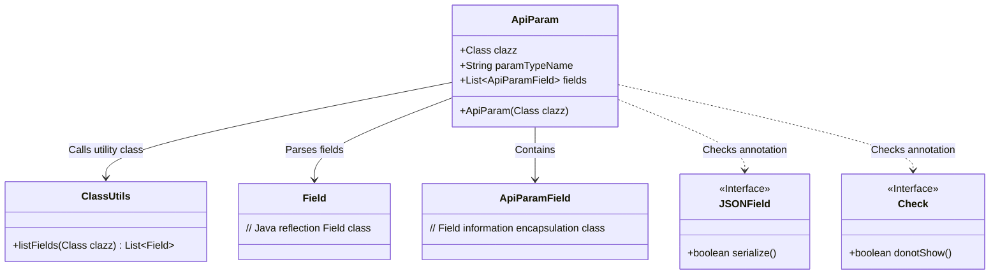
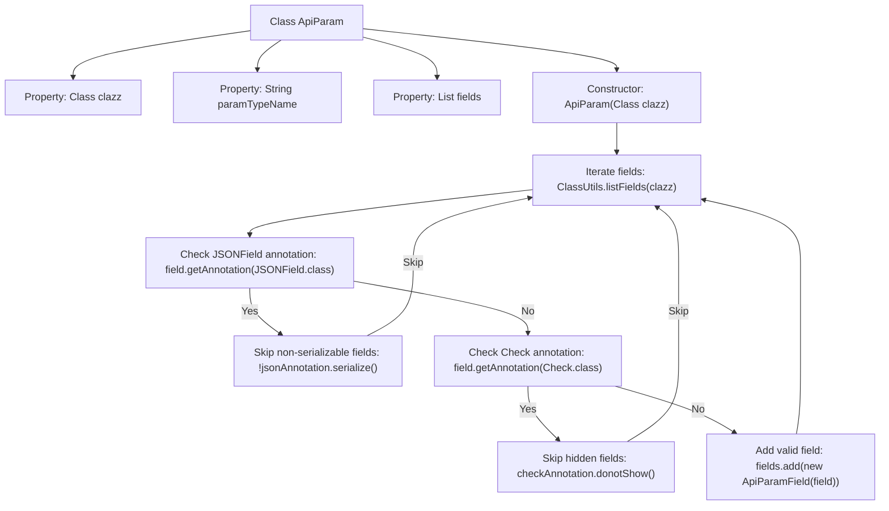

# Basic Information

|      |      |
|------|------|
| Name | ApiParam |
| Language | .java |
| Code Path | WeFe/common/java/common-web/src/main/java/com/welab/wefe/common/web/api_document/model/ApiParam.java |
| Package Name | com.welab.wefe.common.web.api_document.model |
| Dependencies | ['com.alibaba.fastjson.annotation.JSONField', 'com.welab.wefe.common.fieldvalidate.annotation.Check', 'com.welab.wefe.common.util.ClassUtils', 'java.lang.reflect.Field', 'java.util.ArrayList', 'java.util.List'] |
| Brief Description | The ApiParam class is used to encapsulate API parameter information, including parameter type, name, and field list, with the ability to filter non-displayed fields through annotations. |

# Description

The ApiParam class is used to encapsulate API parameter information and contains three member variables: `clazz` represents the parameter type, `paramTypeName` stores the class name, and `fields` stores the list of parameter fields. The constructor accepts a Class object to initialize `clazz` and `paramTypeName`. It traverses all fields of the class via reflection, skipping fields annotated with `JSONField` where `serialize` is false, as well as fields annotated with `Check` where `donotShow` is true. The remaining fields are encapsulated as `ApiParamField` objects and added to the `fields` list.

# Class Summary

| Name   | Type  | Description |
|-------|------|-------------|
| ApiParam | class | The ApiParam class defines the structure of API parameters, including type, name, and field list. The constructor initializes based on class information, skips non-displayed fields, and adds valid fields to the list. |

## Class ApiParam

|      |      |
|------|------|
| Access Modifier | public |
| Type | class |
| Name | ApiParam |
| Description | The ApiParam class defines the structure of API parameters, including type, name, and field list. The constructor initializes based on class information, skips non-displayed fields, and adds valid fields to the list. |

### UML Class Diagram

This code defines an `ApiParam` class for encapsulating metadata information of API parameters. It reads class fields via reflection, filters non-displayable fields based on `JSONField` and `Check` annotations, and ultimately encapsulates valid fields into a list of `ApiParamField` objects. The class diagram illustrates the dependencies between `ApiParam` and utility classes, annotation interfaces, and field classes, reflecting the core logic of parameter parsing.

### Internal Method Call Graph

The flowchart describes the construction process of the ApiParam class: After initializing class properties, it iterates through all fields of the input class, filters out fields that don't require processing by checking JSONField and Check annotations, and finally encapsulates valid fields as ApiParamField objects into a list. This process implements an annotation-based field filtering mechanism, ensuring only qualified fields (serializable and non-hidden) are processed.

### Field List

| Name  | Type  | Description |
|-------|-------|------|
| paramTypeName | String | The public member variable of string type paramTypeName defined in the class. |
| clazz | Class<?> | Declare a public variable clazz of type Class to store a reference to the class object. |
| fields = new ArrayList<>() | List<ApiParamField> | Defined a public list variable named fields, used to store ApiParamField objects, initialized as an empty ArrayList. |

### Method List

| Name  | Type  | Description |
|-------|-------|------|

