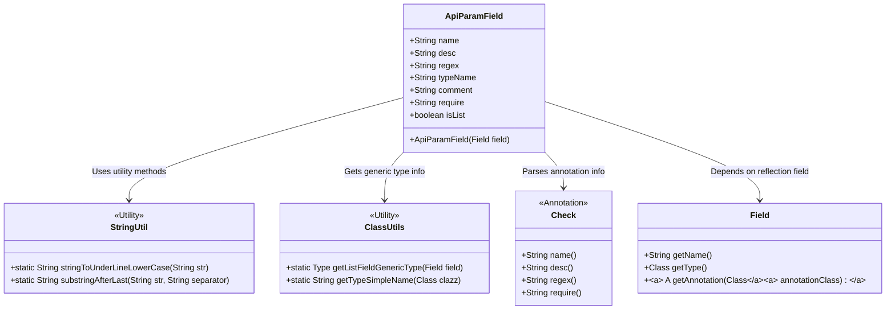
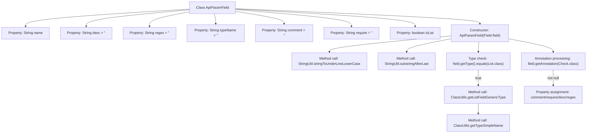

# Basic Information

|      |      |
|------|------|
| Name | ApiParamField |
| Language | .java |
| Code Path | WeFe/common/java/common-web/src/main/java/com/welab/wefe/common/web/api_document/model/ApiParamField.java |
| Package Name | com.welab.wefe.common.web.api_document.model |
| Dependencies | ['com.welab.wefe.common.fieldvalidate.annotation.Check', 'com.welab.wefe.common.util.ClassUtils', 'com.welab.wefe.common.util.StringUtil', 'java.lang.reflect.Field', 'java.lang.reflect.Type', 'java.util.List'] |
| Brief Description | The `ApiParamField` class is used to encapsulate API parameter field information, including name, description, regular validation, type, comment, whether it is required, and whether it is a list. It initializes field properties through the `Field` object and `Check` annotation. |

# Description

The `ApiParamField` class is used to describe the attributes of API parameter fields, including field name, description, regular validation rules, type name, comments, whether it is required, and whether it is a list type, among others. The constructor parses field information through reflection, automatically converts field names to underscore format, and identifies basic types or generic list types. If a field is annotated with the `Check` annotation, the validation-related attribute values are extracted from it and populated into the corresponding fields.

# Class Summary

| Name   | Type  | Description |
|-------|------|-------------|
| ApiParamField | class | The ApiParamField class defines the properties of API parameter fields, including name, description, regular expression, type, etc. The constructor processes the field name, type (including generic lists), and Check annotation information. |

## Class ApiParamField

|      |      |
|------|------|
| Access Modifier | public |
| Type | class |
| Name | ApiParamField |
| Description | The ApiParamField class defines the properties of API parameter fields, including name, description, regular expression, type, etc. The constructor processes the field name, type (including generic lists), and Check annotation information. |

### UML Class Diagram

Class diagram description: The ApiParamField class encapsulates API parameter metadata by parsing field annotations and type characteristics through reflection. It relies on StringUtil and ClassUtils utility classes for string and generic type handling, retrieves validation rules via Check annotation, and obtains field attributes based on Java reflection Field objects. Core functionalities include automatic field naming style conversion, List generic type recognition, and extraction of annotation-defined validation rules, providing structured data support for API documentation generation.

### Internal Method Call Graph

This flowchart illustrates the structure of the ApiParamField class and the main processing logic of its constructor. The class contains 7 string properties and 1 boolean property. The constructor takes a Field parameter and executes the following workflow: first converts the field name to underscore format and obtains the base type name; then checks if it's a List type, processing generic parameters if true; finally examines for the presence of Check annotation, extracting annotation property values if exists. The entire process demonstrates a complete operation chain involving Java reflection and annotation processing.

### Field List

| Name  | Type  | Description |
|-------|-------|------|
| comment = "" | String | Defined a public string variable named comment with an initial value of an empty string. |
| typeName = "" | String | Defined a public string variable typeName with an initial value of an empty string. |
| regex = "" | String | Defined a public string variable named regex with an initial value of empty. |
| name | String | public string name; |
| desc = "" | String | The empty string variable desc, of type String. |
| require = "" | String | Declaration of empty string variable |
| isList | boolean | The boolean variable isList indicates whether it is a list type. |

### Method List

| Name  | Type  | Description |
|-------|-------|------|

