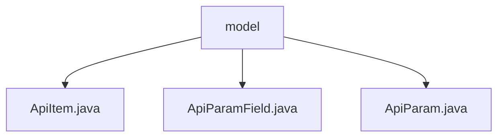

# Basic Information

|      |      |
|------|------|
| Name | model |
| Language | .java |
| Code Path | WeFe/common/java/common-web/src/main/java/com/welab/wefe/common/web/api_document/model |
| Package Name | docs.common.java.common-web.src.main.java.com.welab.wefe.common.web.api_document.model |
| Brief Description | ApiItem encapsulates API information, including annotation paths, and parses input/output types. ApiParamField describes parameter field attributes, automatically converts field names, and performs validation. ApiParam encapsulates parameter information and uses reflection to process fields, generating a list of ApiParamField. |

# Description

## Overview  
The core responsibility of this module is to build an API documentation generation system, which automatically parses API metadata through reflection mechanisms and stores it in a structured manner. The interface specification uniformly adopts an annotation-driven approach, such as using Check/JSONField annotations to control field visibility, with support for generic type recognition and underscore naming conversion. Key data structures include ApiItem (API main information), ApiParam (parameter container), and ApiParamField (field details), forming a three-level nested model. It relies on Java reflection mechanisms and annotations like JSONField, for example, requiring integration with the Jackson library for serialization control. Implementation cases include special type handling like NoneApiInput and regular expression validation rule extraction.

## Main Business Scenarios  
A typical application is automated API documentation generation, similar to Swagger but adopting a code-first model. The business process includes: reflection-based parsing of API classes → building an ApiItem tree → recursive processing of parameter types → generating documentation structures. The interaction model combines annotation configuration with runtime parsing, such as Check annotation-driven field validation rule generation. Functional completeness is reflected in support for group management, generic list recognition, and dynamic field filtering, such as skipping donotShow fields. API types cover conventional RESTful interfaces, with integration cases including standardized processing like regular expression validation and camelCase to underscore conversion.

### Package Internal Structure View

This flowchart illustrates the hierarchical structure of the API documentation model module in the WeFe project. The root node is the "model" folder, which contains three Java files: ApiItem.java, ApiParamField.java, and ApiParam.java. These files collectively form the data model portion of the API documentation, used to define API items and their parameter structures. The entire structure is concise and clear, reflecting a well-designed modular approach.

# File List

| Name   | Type  | Description |
|-------|------|-------------|
| [ApiItem.java](ApiItem.md) | file | The ApiItem class encapsulates API information, including path, ID, name, description, group, and input/output parameters, initialized through annotation and generic parsing. |
| [ApiParamField.java](ApiParamField.md) | file | The `ApiParamField` class is used to encapsulate API parameter field information, including name, description, regular validation, type, annotation, whether it is required, and whether it is a list. It initializes field properties through the `Field` object and `Check` annotation. |
| [ApiParam.java](ApiParam.md) | file | The ApiParam class is used to encapsulate API parameter information, including parameter types, names, and field lists, with the ability to filter non-displayed fields through annotations. |

