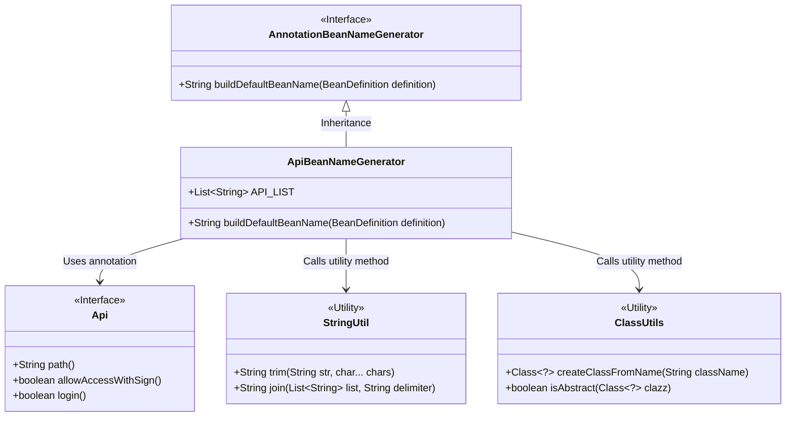
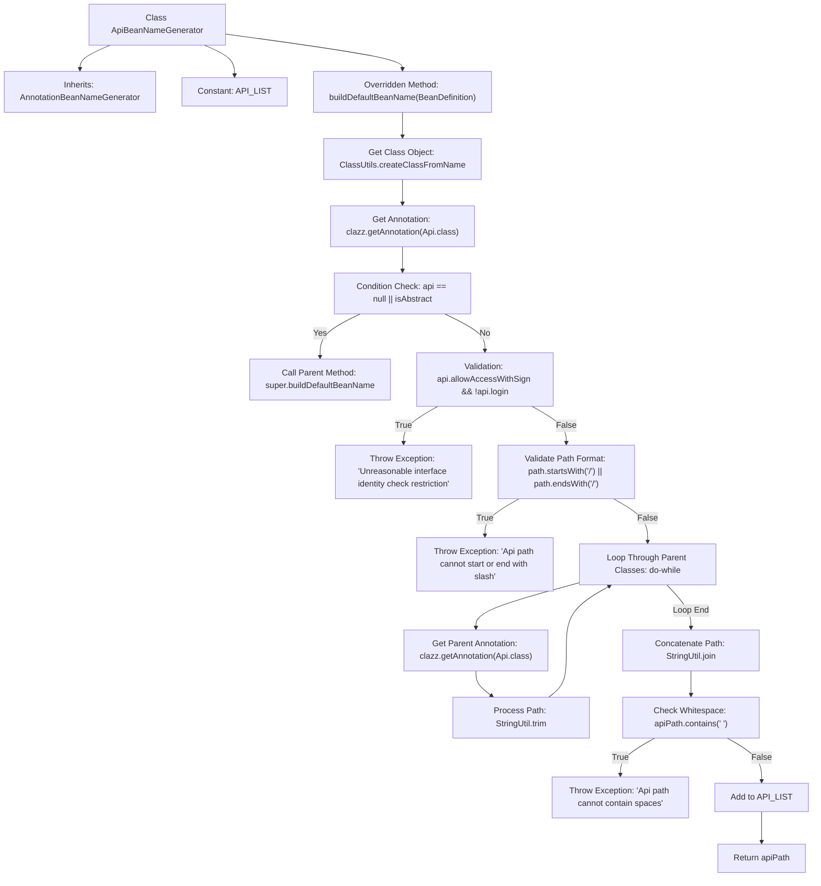

# Basic Information

|      |      |
|------|------|
| Name | ApiBeanNameGenerator |
| Language | .java |
| Code Path | WeFe/common/java/common-web/src/main/java/com/welab/wefe/common/web/config/ApiBeanNameGenerator.java |
| Package Name | com.welab.wefe.common.web.config |
| Dependencies | ['com.welab.wefe.common.util.ClassUtils', 'com.welab.wefe.common.util.StringUtil', 'com.welab.wefe.common.web.api.base.Api', 'org.springframework.beans.factory.config.BeanDefinition', 'org.springframework.context.annotation.AnnotationBeanNameGenerator', 'java.util.ArrayList', 'java.util.List'] |
| Brief Description | The ApiBeanNameGenerator extends AnnotationBeanNameGenerator, generating API paths as bean names. It checks the path format of the Api annotation, verifies the signature and login logic, concatenates the parent class path, ensures no spaces or slashes, and collects all API paths. |

# Description

ApiBeanNameGenerator extends AnnotationBeanNameGenerator and is used to generate bean names for API classes. The main logic includes: checking whether a class is annotated with @Api and is not an abstract class. It validates the annotation attributes: if signature verification is allowed but login is not required, an exception is thrown. It verifies the path format, ensuring no leading or trailing slashes. The method recursively collects the API paths of parent classes and concatenates them with the current path, ensuring the path contains no spaces. Finally, the valid path is added to the static list API_LIST and returned as the bean name.

# Class Summary

| Name   | Type  | Description |
|-------|------|-------------|
| ApiBeanNameGenerator | class | ApiBeanNameGenerator extends AnnotationBeanNameGenerator, generating API paths as bean names. It checks the format of the Api annotation path, verifies signatures and login logic, concatenates the parent class path to ensure no spaces or slashes, and adds it to the global API list. |

## Class ApiBeanNameGenerator

|      |      |
|------|------|
| Access Modifier | public |
| Type | class |
| Name | ApiBeanNameGenerator |
| Description | ApiBeanNameGenerator extends AnnotationBeanNameGenerator, generating API paths as bean names. It checks the format of the Api annotation path, verifies signatures and login logic, concatenates the parent class path to ensure no spaces or slashes, and adds it to the global API list. |

### UML Class Diagram

This code demonstrates an API Bean name generator that inherits from `AnnotationBeanNameGenerator` and generates standardized API paths as Bean names by processing the `@Api` annotation. Key functionalities include: validating annotation configuration rationality (e.g., signature verification and login logic), normalizing path formats (removing leading/trailing slashes, handling inherited paths), checking for illegal characters like spaces in paths, and adding the final path to a static list. The class diagram clearly illustrates the inheritance relationship, utility class dependencies, and the usage of annotation interfaces.

### Internal Method Call Graph

This flowchart illustrates the core logic of the ApiBeanNameGenerator class for processing API paths. Its primary function is to obtain Api annotations from classes and their parent classes via reflection, validate the rationality of interface access permission configurations, standardize path formats, and ultimately generate normalized API path strings. The process involves multi-level conditional checks and loop processing, with particular emphasis on security validations (signature/login configuration checks, path format validation, whitespace checks, etc.) to ensure generated API paths comply with standards and are free from security vulnerabilities. All validation failures immediately throw runtime exceptions, strictly guaranteeing the规范性 of interface definitions.

### Field List

| Name  | Type  | Description |
|-------|-------|------|
| API_LIST = new ArrayList<>() | List<String> | Define a static constant API_LIST of type string list, initialized as an empty ArrayList. |

### Method List

| Name  | Type  | Description |
|-------|-------|------|
| buildDefaultBeanName | String | The method generates a default name based on the Bean definition. If the class lacks an Api annotation or is an abstract class, it invokes the parent class method. Otherwise, it checks the Api path format: leading or trailing slashes are prohibited, and login is mandatory if signature verification is required. It recursively collects the parent class Api paths, concatenates them, ensures no spaces exist, adds the result to the global list, and returns the path as the name. |

