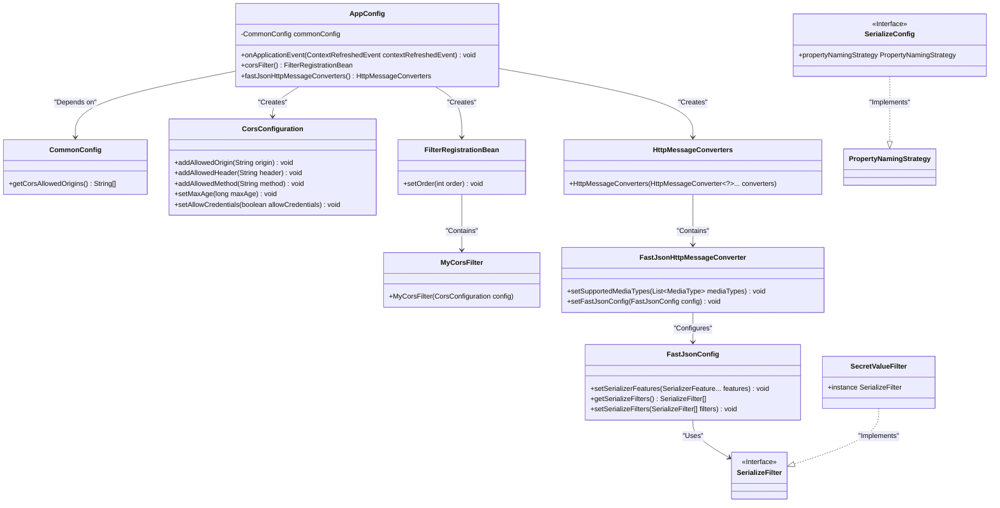
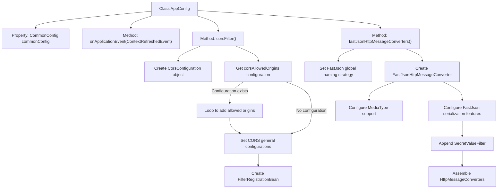

# Basic Information

|      |      |
|------|------|
| Name | AppConfig |
| Language | .java |
| Code Path | WeFe/common/java/common-web/src/main/java/com/welab/wefe/common/web/config/AppConfig.java |
| Package Name | com.welab.wefe.common.web.config |
| Dependencies | ['com.alibaba.fastjson.PropertyNamingStrategy', 'com.alibaba.fastjson.serializer.SerializeConfig', 'com.alibaba.fastjson.serializer.SerializeFilter', 'com.alibaba.fastjson.serializer.SerializerFeature', 'com.alibaba.fastjson.support.config.FastJsonConfig', 'com.alibaba.fastjson.support.spring.FastJsonHttpMessageConverter', 'com.welab.wefe.common.TimeSpan', 'com.welab.wefe.common.fieldvalidate.secret.SecretValueFilter', 'org.springframework.beans.factory.annotation.Autowired', 'org.springframework.boot.autoconfigure.http.HttpMessageConverters', 'org.springframework.boot.web.servlet.FilterRegistrationBean', 'org.springframework.context.ApplicationListener', 'org.springframework.context.annotation.Bean', 'org.springframework.context.annotation.Configuration', 'org.springframework.context.event.ContextRefreshedEvent', 'org.springframework.http.MediaType', 'org.springframework.web.cors.CorsConfiguration', 'java.util.ArrayList', 'java.util.List'] |
| Brief Description | The AppConfig configuration class implements a cross-origin filter, allowing access from specified sources or all sources, sets FastJson as the JSON serialization component, and supports snake case naming and null value output. |

# Description

This is a Spring Boot application configuration class primarily implementing cross-origin configuration and JSON serialization settings. The class implements the ApplicationListener interface to listen for container refresh events. The cross-origin configuration registers a CORS filter via FilterRegistrationBean, supporting dynamically configurable allowed domains, with all origins permitted by default. It sets all methods and headers as allowed, caches for 10 minutes, and enables credentials. JSON serialization uses FastJson, configuring a global underscore naming strategy and supporting UTF-8 JSON media types. It enables field sorting, null value output, and erroneous getter ignoring features, along with adding sensitive value filtering.

# Class Summary

| Name   | Type  | Description |
|-------|------|-------------|
| AppConfig | class | The AppConfig configuration class implements a cross-origin filter and FastJSON message converter. The cross-origin configuration allows specifying sources or all, setting headers, methods, caching, and credentials. The FastJSON configuration adopts an underscore naming strategy, supports null field output, and includes a SecretValueFilter. |

## Class AppConfig

|      |      |
|------|------|
| Access Modifier | @Configuration;public |
| Type | class |
| Name | AppConfig |
| Description | The AppConfig configuration class implements a cross-origin filter and FastJSON message converter. The cross-origin configuration allows specifying sources or all, setting headers, methods, caching, and credentials. The FastJSON configuration adopts an underscore naming strategy, supports null field output, and includes a SecretValueFilter. |

### UML Class Diagram

This code represents a Spring Boot configuration class that primarily implements CORS filter configuration and FastJSON message converter configuration. The class diagram illustrates the relationships between AppConfig and multiple components, including CommonConfig for retrieving CORS settings, CorsConfiguration for defining cross-origin rules, FilterRegistrationBean for filter registration, and FastJsonHttpMessageConverter for JSON serialization handling. Through dependency injection and object creation, it enables custom configuration for cross-origin request processing and JSON response formatting.

### Internal Method Call Graph

This code represents a Spring Boot configuration class that primarily implements two core functionalities: 1) Configuring a Cross-Origin Resource Sharing (CORS) filter by reading the allowed origins list from CommonConfig and setting cross-domain access rules; 2) Configuring FastJson as the JSON message converter, setting global serialization strategies, supported media types, and custom filters. The flowchart clearly illustrates the branching paths of configuration initialization and processing logic, particularly the priority handling of CORS configurations and the multi-layer configuration process of FastJson.

### Field List

| Name  | Type  | Description |
|-------|-------|------|
| commonConfig | CommonConfig | The code snippet uses the @Autowired annotation to automatically inject the CommonConfig dependency. |

### Method List

| Name  | Type  | Description |
|-------|-------|------|
| onApplicationEvent | void | This is an event listener method in the Spring framework, used to handle the application context refresh completion event. |
| corsFilter | FilterRegistrationBean | Define a CORS filter Bean, configure allowed origins, headers, and methods, set cache duration and credential permissions, and register it as the highest-priority filter. |
| fastJsonHttpMessageConverters | HttpMessageConverters | Configure the FastJson converter to use the underscore naming strategy globally, support UTF-8 JSON format, enable field sorting, null value output, and error ignoring features, and add the SecretValueFilter. |

