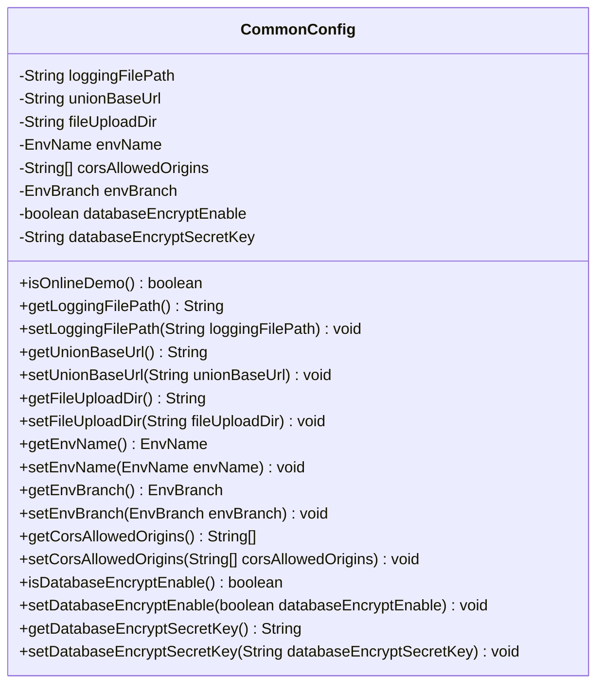
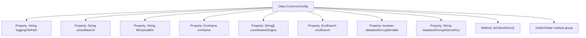

# Basic Information

|      |      |
|------|------|
| Name | CommonConfig |
| Language | .java |
| Code Path | WeFe/common/java/common-web/src/main/java/com/welab/wefe/common/web/config/CommonConfig.java |
| Package Name | com.welab.wefe.common.web.config |
| Dependencies | ['com.welab.wefe.common.wefe.enums.env.EnvBranch', 'com.welab.wefe.common.wefe.enums.env.EnvName', 'org.springframework.beans.factory.annotation.Value', 'org.springframework.stereotype.Component'] |
| Brief Description | The CommonConfig class includes configuration items such as log path, federation URL, file upload directory, environment name and branch, cross-origin settings, database encryption switch and key, and provides getter/setter methods. |

# Description

CommonConfig is a configuration class used to manage general settings of the application. It includes the log file storage path, federation base URL, file upload directory, environment name (default is prod), cross-origin allowed sources (default is all), environment branch (default is master), and database encryption-related configurations (whether encryption is enabled and the encryption key). When the environment branch is set to online_demo, users are restricted to deleting only the data they created. The class provides getter and setter methods for all configuration items.

# Class Summary

| Name   | Type  | Description |
|-------|------|-------------|
| CommonConfig | class | The `CommonConfig` class includes configuration items such as log path, combined base URL, file upload directory, environment name and branch, cross-origin allowed sources, database encryption switch and key, and provides getter/setter methods. |

## Class CommonConfig

|      |      |
|------|------|
| Access Modifier | @Component("commonConfig");public |
| Type | class |
| Name | CommonConfig |
| Description | The `CommonConfig` class includes configuration items such as log path, combined base URL, file upload directory, environment name and branch, cross-origin allowed sources, database encryption switch and key, and provides getter/setter methods. |

### UML Class Diagram

This code demonstrates a Spring configuration class CommonConfig, designed to centrally manage various application properties. The class injects property values from configuration files using @Value annotations, including logging paths, file upload directories, environment names, and CORS allowed origins. It provides complete getter/setter methods and includes a special method isOnlineDemo() to determine whether the current environment branch is in online demo mode. Serving as a configuration hub, this class offers a unified configuration access interface for other components.

### Internal Method Call Graph

This code demonstrates a Spring configuration class CommonConfig, which injects various parameter values from configuration files through @Value annotations. The class contains 8 main properties covering configurations such as log path, base URL, file upload directory, environment name, CORS settings, environment branch, database encryption switch, and secret key. It specifically provides the isOnlineDemo() method for environment branch determination and a complete set of getter/setter methods for property access control. All configuration items support default value settings, reflecting robust fault-tolerant design.

### Field List

| Name  | Type  | Description |
|-------|-------|------|
| unionBaseUrl | String | The code defines a private string variable `unionBaseUrl`, which injects a value from the configuration property `wefe.union.base-url` via the `@Value` annotation, with an empty string as the default value. |
| databaseEncryptSecretKey | String | The code defines a private string variable `databaseEncryptSecretKey`, which is used to store the database encryption key obtained from the configuration item `privacy.database.encrypt.secret.key`, with a default value of empty. |
| corsAllowedOrigins | String[] | The code defines a private string array `corsAllowedOrigins`, which retrieves the allowed cross-origin sources from the configuration via the `@Value` annotation, with the default value being all sources (`*`). |
| envBranch | EnvBranch | The code defines a private variable `envBranch`, which retrieves the value of `env.branch` from the configuration via the `@Value` annotation, with a default value of `master`. |
| databaseEncryptEnable | boolean | Configuration item controls whether the database encryption feature is enabled, with the default setting being off. |
| envName | EnvName | The code snippet defines a private variable envName, which injects the environment name from configuration via the @Value annotation, with a default value of prod. |
| loggingFilePath | String | The code defines a private string variable loggingFilePath, which retrieves the value of logging.file from the configuration file through the @Value annotation, with a default value of an empty string. |
| fileUploadDir | String | The code defines a private string variable fileUploadDir, which injects a value from the configuration item wefe.file.upload.dir via the @Value annotation, with a default value of empty. |

### Method List

| Name  | Type  | Description |
|-------|-------|------|
| isOnlineDemo | boolean | This method checks whether the current environment branch is the online demo environment and returns a boolean value. |
| getEnvName | EnvName | Methods to obtain the current environment name, returning an object of type EnvName. |
| getEnvBranch | EnvBranch | Methods to obtain the current environment branch object, with a return type of EnvBranch. |
| getLoggingFilePath | String | Methods to obtain the log file path, returning a string-type variable loggingFilePath. |
| setEnvName | void | The method to set the environment name assigns the passed `envName` to the `envName` property of the current object. |
| getUnionBaseUrl | String | A public string method to obtain the unionBaseUrl. |
| setUnionBaseUrl | void | The method to set the alliance base URL involves assigning the parameter unionBaseUrl to the class member variable unionBaseUrl. |
| getFileUploadDir | String | The method returns the file upload directory path. |
| setFileUploadDir | void | The method to set the file upload directory is to assign the parameter `fileUploadDir` to the class variable `this.fileUploadDir`. |
| setDatabaseEncryptEnable | void | Method to set database encryption status, with a boolean parameter controlling whether encryption is enabled. |
| getDatabaseEncryptSecretKey | String | Methods to obtain the database encryption key. |
| setDatabaseEncryptSecretKey | void | Methods for setting database encryption keys. |
| setLoggingFilePath | void | The method to set the log file path assigns the input parameter to the class variable loggingFilePath. |
| getCorsAllowedOrigins | String[] | The method returns an array of origin addresses that allow cross-origin requests. |
| setEnvBranch | void | Set the environment branch properties, with the parameter being of type EnvBranch. |
| setCorsAllowedOrigins | void | Set an array of allowed cross-origin request source domains. |
| isDatabaseEncryptEnable | boolean | Check if database encryption is enabled, returning a boolean result. |

