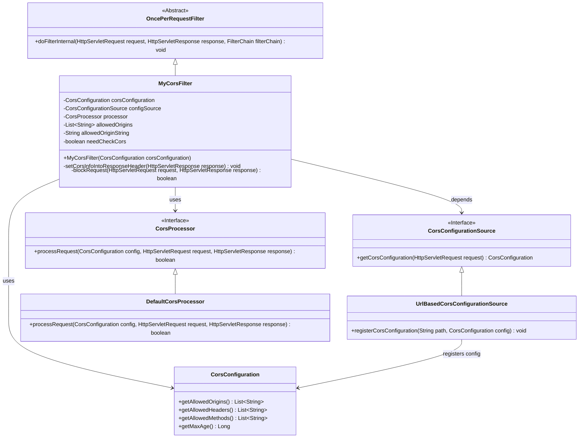
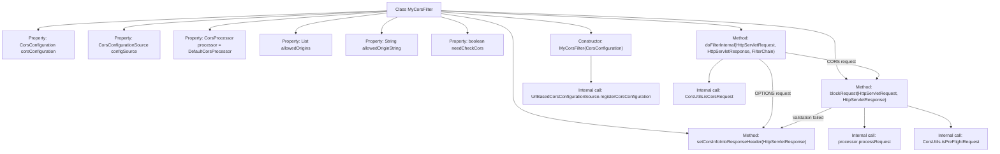

# Basic Information

|      |      |
|------|------|
| Name | MyCorsFilter |
| Language | .java |
| Code Path | WeFe/common/java/common-web/src/main/java/com/welab/wefe/common/web/config/MyCorsFilter.java |
| Package Name | com.welab.wefe.common.web.config |
| Dependencies | ['com.welab.wefe.common.util.StringUtil', 'org.apache.commons.collections4.CollectionUtils', 'org.springframework.http.HttpHeaders', 'org.springframework.web.cors', 'org.springframework.web.filter.OncePerRequestFilter', 'javax.servlet.FilterChain', 'javax.servlet.ServletException', 'javax.servlet.http.HttpServletRequest', 'javax.servlet.http.HttpServletResponse', 'java.io.IOException', 'java.util.List'] |
| Brief Description | Custom CORS filter class, inheriting from OncePerRequestFilter, handles cross-origin requests. The constructor accepts CorsConfiguration to initialize allowed origins, methods, and headers. The doFilterInternal method checks the request type, sets response headers, and validates the request origin. Returns 200 directly for OPTIONS requests. Returns 403 error if validation fails. |

# Description

This is a custom CORS filter class `MyCorsFilter`, which inherits from `OncePerRequestFilter`. It receives `CorsConfiguration` through the constructor, creates a URL-based configuration source, and initializes the allowed origin list and check flags. The main functionalities include: directly returning a 200 status code when handling OPTIONS preflight requests; for CORS requests, checking whether the request origin is allowed and returning a 403 error if prohibited; setting response headers including allowed origins, headers, methods, and maximum cache time. The `blockRequest` method is responsible for validating the legality of the request by processing the configuration through a handler and determining the request type.

# Class Summary

| Name   | Type  | Description |
|-------|------|-------------|
| MyCorsFilter | class | Custom CORS filter class, inheriting from OncePerRequestFilter, handles cross-origin requests through configuration sources, checks allowed origins, and sets response headers. |

## Class MyCorsFilter

|      |      |
|------|------|
| Access Modifier | public |
| Type | class |
| Name | MyCorsFilter |
| Description | Custom CORS filter class, inheriting from OncePerRequestFilter, handles cross-origin requests through configuration sources, checks allowed origins, and sets response headers. |

### UML Class Diagram

Class Diagram Description:
This diagram illustrates the inheritance and dependency structure of the MyCorsFilter class. MyCorsFilter extends the abstract class OncePerRequestFilter to implement CORS (Cross-Origin Resource Sharing) filtering functionality. It relies on CorsConfiguration to obtain cross-origin settings, manages configuration paths through UrlBasedCorsConfigurationSource (which implements the CorsConfigurationSource interface), and uses DefaultCorsProcessor (implementing the CorsProcessor interface) to validate cross-origin requests. The diagram clearly shows the relationships between interfaces and their implementations, as well as the flow of configuration information.

### Internal Method Call Graph

This code implements a custom CORS filter that extends OncePerRequestFilter. Its main functionalities include: 1) Initializing CORS configuration through the constructor; 2) Handling OPTIONS preflight requests and regular CORS requests in doFilterInternal; 3) Setting response headers via the setCorsInfoIntoResponseHeader method; 4) Validating request origin legitimacy using the blockRequest method. The flowchart clearly illustrates the class structure, method invocation relationships, and key processing logic branches, particularly highlighting different processing paths for OPTIONS requests and CORS requests.

### Field List

| Name  | Type  | Description |
|-------|-------|------|
| allowedOrigins | List<String> | Private immutable list storing allowed source address strings. |
| processor = new DefaultCorsProcessor() | CorsProcessor | Declare an immutable CorsProcessor instance using the default implementation DefaultCorsProcessor. |
| needCheckCors | boolean | The flag for cross-origin requests needs to be checked. |
| configSource | CorsConfigurationSource | Private immutable CORS configuration source object. |
| corsConfiguration | CorsConfiguration | Private immutable cross-domain configuration object. |
| allowedOriginString | String | Private immutable string variable storing allowed source addresses. |

### Method List

| Name  | Type  | Description |
|-------|-------|------|
| doFilterInternal | void | This is a Java filter method that handles CORS requests. If the request method is OPTIONS, it sets CORS response headers and returns a 200 status code. For other CORS requests, it checks whether origin validation is required. If validation fails, a 403 error is returned; if validation passes, CORS headers are set and the filter chain continues. |
| blockRequest | boolean | Method checks whether the request should be intercepted: intercept if CORS configuration is invalid or it's a preflight request; otherwise, allow passage. |
| setCorsInfoIntoResponseHeader | void | Method to set CORS response headers, including allowed origins, headers, methods, and maximum cache time. |

