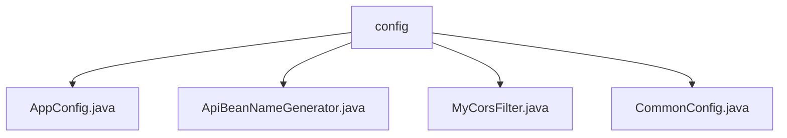

# Basic Information

|      |      |
|------|------|
| Name | config |
| Language | .java |
| Code Path | WeFe/common/java/common-web/src/main/java/com/welab/wefe/common/web/config |
| Package Name | docs.common.java.common-web.src.main.java.com.welab.wefe.common.web.config |
| Brief Description | Spring Boot configuration class implements cross-origin and JSON serialization settings, including CORS filter, FastJson configuration, and sensitive value handling. ApiBeanNameGenerator generates bean names with Api annotations and validates path formats. MyCorsFilter processes CORS requests, verifies origins, and sets response headers. CommonConfig manages general settings such as log paths, environment variables, and database encryption. |

# Description

## Overview  
This module serves as the core web layer configuration component for Spring Boot applications, primarily responsible for cross-origin processing, API route management, and global configuration management. It implements dynamic CORS policies through FilterRegistrationBean, resembling gateway-level access control, and customizes JSON serialization rules using FastJson with support for sensitive data filtering. Key data structures include CorsConfiguration (cross-origin configuration), Api annotations (route metadata), and CommonConfig (environment variables). It depends on Spring Boot Web, FastJson, and Servlet API. For example, MyCorsFilter intercepts OPTIONS requests and validates Origin whitelists.

## Core Business Scenarios  
The module uniformly handles typical interaction scenarios in frontend-backend separation architectures: cross-origin requests (e.g., preflight responses), API route registration (e.g., interfaces with signature verification), and global configuration loading (e.g., encryption switches). It adopts a "configuration-as-rules" approach, where CommonConfig can restrict data permissions in environments like `online_demo`. Integration examples include: dynamically registering CORS filters, generating bean names based on annotations (e.g., concatenating parent class paths), and automatically filtering sensitive fields during JSON serialization. The interaction flow resembles the strategy pattern, combining Filters and Listeners to manage the request lifecycle.

### Package Internal Structure View

This flowchart illustrates the directory structure under the `config` folder in the `common-web` module of the WeFe project. With `config` as the root node, it includes four Java configuration files: `AppConfig`, `ApiBeanNameGenerator`, `MyCorsFilter`, and `CommonConfig`. These configuration classes collectively form the foundational web-layer setup of the project, handling core functionalities such as application configuration, bean naming, and cross-origin filtering.

# File List

| Name   | Type  | Description |
|-------|------|-------------|
| [AppConfig.java](AppConfig.md) | file | The AppConfig configuration class implements a cross-origin filter, allowing access from specified sources or all sources, configures FastJson as the JSON serialization component, and supports snake case naming and null value output. |
| [ApiBeanNameGenerator.java](ApiBeanNameGenerator.md) | file | ApiBeanNameGenerator extends AnnotationBeanNameGenerator, generating API paths as bean names. It checks the path format of the Api annotation, verifies signatures and login logic, concatenates the parent class path, ensures no spaces or slashes, and collects all API paths. |
| [MyCorsFilter.java](MyCorsFilter.md) | file | Custom CORS filter class, inheriting from OncePerRequestFilter, handles cross-origin requests. The constructor accepts CorsConfiguration to initialize allowed origins, methods, and headers. The doFilterInternal method checks the request type, sets response headers, and validates the request origin. Returns 200 directly for OPTIONS requests. Returns 403 error if validation fails. |
| [CommonConfig.java](CommonConfig.md) | file | The CommonConfig class includes configuration items such as log path, federation URL, file upload directory, environment name and branch, cross-origin settings, database encryption switch and key, and provides getter/setter methods. |

