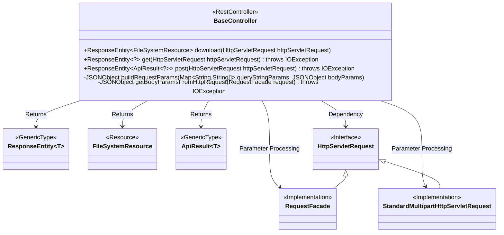
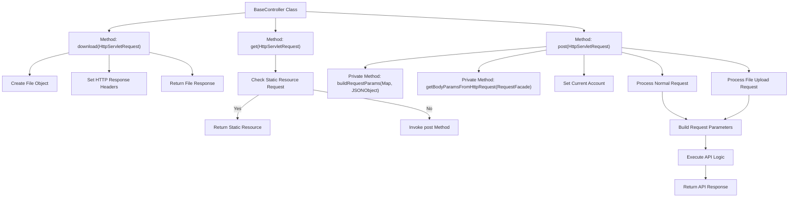

# Basic Information

|      |      |
|------|------|
| Name | BaseController |
| Language | .java |
| Code Path | WeFe/common/java/common-web/src/main/java/com/welab/wefe/common/web/controller/BaseController.java |
| Package Name | com.welab.wefe.common.web.controller |
| Dependencies | ['com.alibaba.fastjson.JSON', 'com.alibaba.fastjson.JSONObject', 'com.alibaba.fastjson.parser.Feature', 'com.welab.wefe.common.util.StringUtil', 'com.welab.wefe.common.util.UrlUtil', 'com.welab.wefe.common.web.ApiExecutor', 'com.welab.wefe.common.web.dto.ApiResult', 'com.welab.wefe.common.web.util.CurrentAccountUtil', 'org.apache.catalina.connector.RequestFacade', 'org.springframework.core.io.ClassPathResource', 'org.springframework.core.io.FileSystemResource', 'org.springframework.http.HttpHeaders', 'org.springframework.http.MediaType', 'org.springframework.http.ResponseEntity', 'org.springframework.util.FileCopyUtils', 'org.springframework.util.MultiValueMap', 'org.springframework.web.bind.annotation.GetMapping', 'org.springframework.web.bind.annotation.PostMapping', 'org.springframework.web.bind.annotation.RestController', 'org.springframework.web.multipart.MultipartFile', 'org.springframework.web.multipart.support.StandardMultipartHttpServletRequest', 'javax.servlet.http.HttpServletRequest', 'java.io.BufferedReader', 'java.io.File', 'java.io.IOException', 'java.util.Map', 'java.util.TreeMap'] |
| Brief Description | The BaseController provides REST interfaces, including file downloading, static resource handling, GET/POST request functionalities, supporting parameter merging and file uploads, and uniformly returning results in the ApiResult format. |

# Description

The code defines a Spring framework-based REST controller named `BaseController`, which includes three core interfaces. The `download` interface implements file download functionality, configuring HTTP headers to disable caching and specify attachment formats. The `get` interface handles static resource requests, returning PNG images or forwarding to the `post` interface. The `post` interface serves as the core request processor, supporting regular parameters and file uploads, merging GET/POST parameters, and executing logic via `ApiExecutor` to return a uniformly formatted `ApiResult` response. The controller also includes utility methods: `buildRequestParams` for merging request parameters and `getBodyParamsFromHttpRequest` for extracting request body parameters. The entire process involves request timing, account information management, and final cleanup of thread variables.

# Class Summary

| Name   | Type  | Description |
|-------|------|-------------|
| BaseController | class | The BaseController class provides three endpoints: 1) /download returns file downloads; 2) GET requests handle static resources or forward to POST; 3) POST processes regular/file requests, merges parameters, executes API logic, and returns a unified response format. It includes request parameter processing and performance statistics. |

## Class BaseController

|      |      |
|------|------|
| Access Modifier | @RestController;public |
| Type | class |
| Name | BaseController |
| Description | The BaseController class provides three endpoints: 1) /download returns file downloads; 2) GET requests handle static resources or forward to POST; 3) POST processes regular/file requests, merges parameters, executes API logic, and returns a unified response format. It includes request parameter processing and performance statistics. |

### UML Class Diagram

This code represents a Spring Boot controller class primarily handling file downloads, static resource requests, and generic API requests. The BaseController processes different types of HTTP requests through three main methods: download() for file downloads, get() for static resource requests, and post() for generic API requests with file upload support. The class diagram illustrates the controller's relationships with request/response objects and the inheritance structure of different request types. The controller also includes two private methods for parameter processing and request body parsing.

### Internal Method Call Graph

This code implements a Spring Boot controller that primarily provides three functionalities: file downloading, static resource retrieval, and generic API request processing. The flowchart illustrates the core method invocation relationships within the BaseController class, including the download method for file downloads, the get method for handling GET requests with static resource differentiation, and the post method for processing POST requests with file upload support. The controller also includes helper methods for parameter construction and request body parsing, ultimately returning different types of HTTP responses.

### Field List

| Name  | Type  | Description |
|-------|-------|------|

### Method List

| Name  | Type  | Description |
|-------|-------|------|
| getBodyParamsFromHttpRequest | JSONObject | Retrieve JSON parameters from an HTTP request, read the request body, and parse it into an ordered JSON object. |
| buildRequestParams | JSONObject | Construct request parameters: Merge URL query parameters (handling null values after decoding) with JSON request body parameters, and return the consolidated JSON object. |
| download | ResponseEntity<FileSystemResource> | Spring Boot download interface, set no-cache response headers, return file stream. |
| get | ResponseEntity<?> | This is a Spring MVC controller method that handles all GET requests. If the request path starts with /static/, it returns the corresponding static resource file (such as an image); otherwise, it forwards the request to the post method for processing. The response format is JSON with a UTF-8 character set. |
| post | ResponseEntity<ApiResult<?>> | Handle HTTP POST requests, support both regular and file uploads, return JSON responses, log processing time, and clean up thread variables. |

