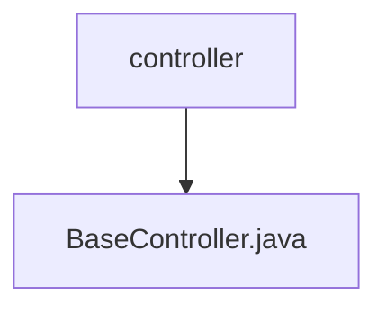

# Basic Information

|      |      |
|------|------|
| Name | controller |
| Language | .java |
| Code Path | WeFe/common/java/common-web/src/main/java/com/welab/wefe/common/web/controller |
| Package Name | docs.common.java.common-web.src.main.java.com.welab.wefe.common.web.controller |
| Brief Description | The BaseController provides REST interfaces, including file downloading, static resource handling, GET/POST request functionalities, supports parameter merging and file uploads, and uniformly returns results in ApiResult format. |

# Description

The code defines a Spring framework-based REST controller named `BaseController`, which includes three core interfaces. The `download` interface implements file download functionality, configuring HTTP headers to disable caching and specify attachment formatting. The `get` interface handles static resource requests, returning PNG images or forwarding to the `post` interface. The `post` interface serves as the core request processor, supporting regular parameters and file uploads, merging GET/POST parameters, and executing logic via `ApiExecutor` to return a unified `ApiResult` response. The controller also includes utility methods: `buildRequestParams` for merging request parameters and `getBodyParamsFromHttpRequest` for extracting request body parameters. The entire process involves request timing, account information management, and final cleanup of thread-local variables.

### Package Internal Structure View

This flowchart illustrates the controller hierarchy in the common-web module of the WeFe project. The top-level node is the controller folder, which contains a base controller file BaseController.java. This structure is a simplified representation of the controller layer in a typical MVC architecture, where BaseController usually serves as the parent class for other controllers to provide common functionalities.

# File List

| Name   | Type  | Description |
|-------|------|-------------|
| [BaseController.java](BaseController.md) | file | The BaseController provides REST interfaces, including file downloading, static resource handling, GET/POST request functionalities, supports parameter merging and file uploads, and uniformly returns results in the ApiResult format. |

