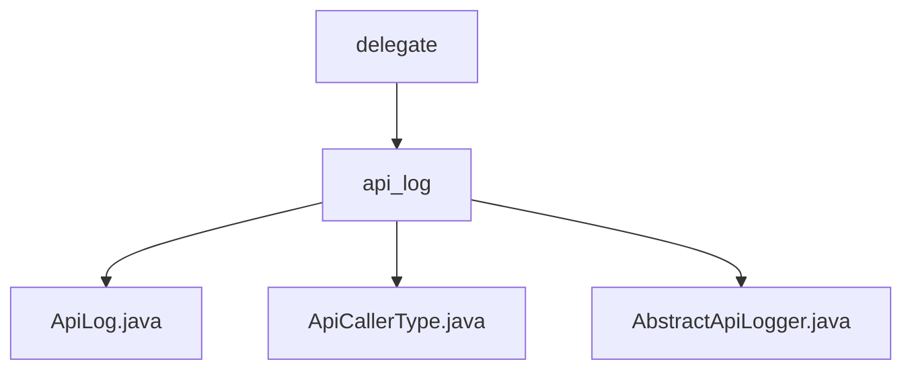

# Basic Information

|      |      |
|------|------|
| Name | delegate |
| Language | .java |
| Code Path | WeFe/common/java/common-web/src/main/java/com/welab/wefe/common/web/delegate |
| Package Name | docs.common.java.common-web.src.main.java.com.welab.wefe.common.web.delegate |
| Brief Description | The ApiLog class records API call logs, including request and response information. The ApiCallerType enum defines the types of callers, currently supporting only User. The AbstractApiLogger abstract class manages logs and user activity time, providing an ignore API list and update functionality. |

# Description

## Overview  
The core responsibility of this module is to standardize and record API call logs while managing user activity time. The interface specifications include the log abstraction methods `save/updateAccountLastActionTime` and the ignore rule control method `ignoreWithoutLogin`. Key data structures consist of the `ApiLog` entity (containing full-chain request/response fields) and a `ConcurrentHashMap`-stored user activity timeline. External dependencies are limited to Java's basic concurrency library. For example, whitelist filtering is implemented via the static `IGNORE_LOG_APIS` list, resembling a message screening mechanism similar to the event bus pattern.  

## Primary Business Scenarios  
A typical scenario involves the API gateway intercepting requests, then automatically recording structured logs with caller information (e.g., `User` type + IP + latency) through `AbstractApiLogger`, while maintaining user active status. The interaction mode adopts a "post-execution interception" mechanism, combined with thread pool asynchronous processing for log persistence. Full functionality covers log field assembly, access frequency control (e.g., updating activity time at 5-minute intervals), and whitelist filtering. Integration cases demonstrate the use of enums to restrict caller types, reserving the ability to extend third-party application types in the future.

### Package Internal Structure View

This flowchart illustrates the directory structure under the delegate folder in the common-web module of the WeFe project. The top level is the delegate folder, which contains the api_log subdirectory. Within the api_log directory, there are three Java files: ApiLog.java, ApiCallerType.java, and AbstractApiLogger.java. These files collectively form the core implementation of the API logging functionality.

# File List

| Name   | Type  | Description |
|-------|------|-------------|
| [api_log](api_log/_module.md) | package | The ApiLog class records API call logs, including request and response information. The ApiCallerType enum defines the types of callers, currently supporting only User. The AbstractApiLogger abstract class manages logs and user activity time, providing an ignore API list and update functionality. |

