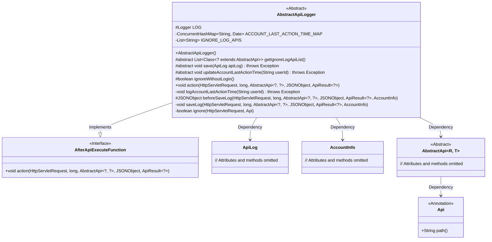
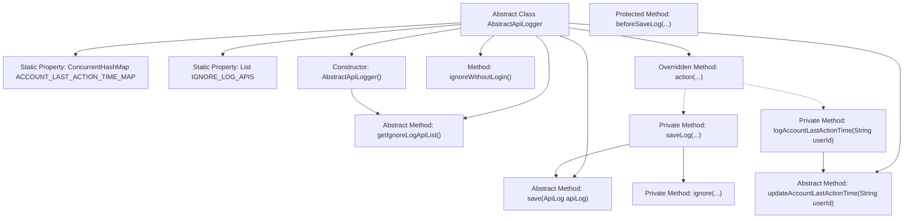

# Basic Information

|      |      |
|------|------|
| Name | AbstractApiLogger |
| Language | .java |
| Code Path | WeFe/common/java/common-web/src/main/java/com/welab/wefe/common/web/delegate/api_log/AbstractApiLogger.java |
| Package Name | com.welab.wefe.common.web.delegate.api_log |
| Dependencies | ['com.alibaba.fastjson.JSON', 'com.alibaba.fastjson.JSONObject', 'com.welab.wefe.common.fastjson.LoggerValueFilter', 'com.welab.wefe.common.util.StringUtil', 'com.welab.wefe.common.web.api.base.AbstractApi', 'com.welab.wefe.common.web.api.base.Api', 'com.welab.wefe.common.web.dto.ApiResult', 'com.welab.wefe.common.web.function.AfterApiExecuteFunction', 'com.welab.wefe.common.web.service.account.AccountInfo', 'com.welab.wefe.common.web.util.HttpServletRequestUtil', 'org.slf4j.Logger', 'org.slf4j.LoggerFactory', 'javax.servlet.http.HttpServletRequest', 'java.util.ArrayList', 'java.util.Date', 'java.util.List', 'java.util.concurrent.ConcurrentHashMap', 'java.util.stream.Collectors'] |
| Brief Description | The abstract class AbstractApiLogger implements API logging functionality, including an ignore list for logging APIs, updating user last activity time, and log saving capabilities, with support for asynchronous processing and parameter filtering. |

# Description

AbstractApiLogger is an abstract class that implements the AfterApiExecuteFunction interface, designed for recording API logs and managing user last activity time. It includes a static ConcurrentHashMap to store user last activity time and a static list IGNORE_LOG_APIS to store APIs that do not require logging. The class provides abstract methods getIgnoreLogApiList, save, and updateAccountLastActionTime, which are used to retrieve the list of APIs excluded from logging, save logs, and update user activity time, respectively. The constructor initializes the list of APIs excluded from logging and starts a thread. The method ignoreWithoutLogin controls whether to skip logging for unauthenticated requests. The action method handles post-API execution logging and user activity time updates. The saveLog method constructs a log object and invokes the save method to store it, while the ignore method determines whether to skip logging based on request parameters and API paths. The logAccountLastActionTime method manages the update frequency of user activity time.

# Class Summary

| Name   | Type  | Description |
|-------|------|-------------|
| AbstractApiLogger | class | The abstract class AbstractApiLogger implements API logging functionality, including an ignore list for logging APIs, updating user last activity time, and log saving capabilities, with support for asynchronous processing and conditional filtering. |

## Class AbstractApiLogger

|      |      |
|------|------|
| Access Modifier | public abstract |
| Type | class |
| Name | AbstractApiLogger |
| Description | The abstract class AbstractApiLogger implements API logging functionality, including an ignore list for logging APIs, updating user last activity time, and log saving capabilities, with support for asynchronous processing and conditional filtering. |

### UML Class Diagram

Class Diagram Description: This diagram illustrates the structure of an abstract API logger `AbstractApiLogger`, which implements the `AfterApiExecuteFunction` interface. It contains core functionalities such as logging and updating user activity timestamps. The logger maintains a static cache of APIs excluded from logging and provides hook methods for pre-logging parameter processing. It has dependencies with classes like `ApiLog` and `AccountInfo`, while handling diverse API requests through the generic `AbstractApi` type.

### Internal Method Call Graph

This flowchart illustrates the core structure and invocation relationships of the AbstractApiLogger class. The class contains static hash tables and time lists, initializing the ignore API list through its constructor. Core functionality is triggered by the action method, branching into two paths: saveLog handles log storage (involving parameter processing and ignore checks), while logAccountLastActionTime manages user activity time updates. Abstract methods are implemented by subclasses, forming a template method pattern. Logs undergo multi-layer validation and preprocessing before being persisted via the save method.

### Field List

| Name  | Type  | Description |
|-------|-------|------|
| LOG = LoggerFactory.getLogger(this.getClass()) | Logger | Declare a protected final log object LOG, initialized with the current class name. |
| ACCOUNT_LAST_ACTION_TIME_MAP = new ConcurrentHashMap() | ConcurrentHashMap<String, Date> | A thread-safe hash map that stores key-value pairs of account IDs and their last operation timestamps. |
| IGNORE_LOG_APIS = new ArrayList<>() | List<String> | Define a static list IGNORE_LOG_APIS to store the names of APIs that ignore logs. |

### Method List

| Name  | Type  | Description |
|-------|-------|------|
| action | void | Method override, handle HTTP requests, log activities and update user's last active time, catch exceptions and record errors. |
| ignoreWithoutLogin | boolean | The method `ignoreWithoutLogin` returns `false`, indicating that it does not ignore unauthenticated cases. |
| updateAccountLastActionTime | void | Abstract method to update the last operation time of a user account, requires passing the user ID, may throw exceptions. |
| logAccountLastActionTime | void | Record the user's last operation time: update immediately upon first access, then update once per minute thereafter. |
| save | void | Abstract method `save`, which takes an `ApiLog` parameter and may throw an exception. |
| getIgnoreLogApiList | List<Class<? extends AbstractApi>> | Abstract method for obtaining the list of API classes that ignore logging. |
| beforeSaveLog | JSONObject | This is a Java method used to process request parameters before saving logs. The method receives an HTTP request, start time, API object, parameter JSON, result, and account information, and returns the processed parameter JSON object. |
| saveLog | void | The method `saveLog` records API call logs, including request time, duration, response time, caller IP, ID, nickname, API path, request data, response code, and message. It skips logging for specific requests when ignored. Errors are logged in case of exceptions. |
| ignore | boolean | Method checks if the request should be ignored: skip logging if the frontend refresh parameter is true or the API is in the blacklist. |

