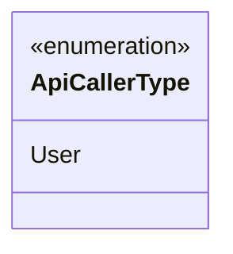
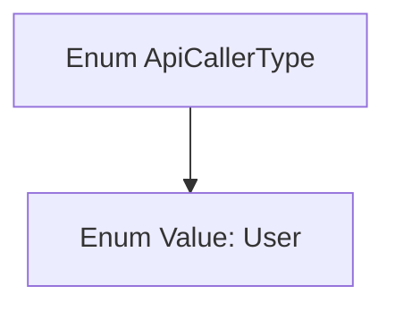

# Basic Information

|      |      |
|------|------|
| Name | ApiCallerType |
| Language | .java |
| Code Path | WeFe/common/java/common-web/src/main/java/com/welab/wefe/common/web/delegate/api_log/ApiCallerType.java |
| Package Name | com.welab.wefe.common.web.delegate.api_log |
| Dependencies | [] |
| Brief Description | The enumeration type ApiCallerType defines a member User, representing the API caller type. |

# Description

The content defines a public enumeration type named `ApiCallerType`, which contains only one enumeration value: `User`. This represents the classification of API caller types, currently supporting only the user type. Enumerations are used to restrict the range of variable values, providing a clear caller type identifier for subsequent code here. The entire definition is concise and leaves room for system expansion.

# Class Summary

| Name   | Type  | Description |
|-------|------|-------------|
| ApiCallerType | enum | The enumeration type ApiCallerType defines a value User. |

## Class ApiCallerType

|      |      |
|------|------|
| Access Modifier | public |
| Type | enum |
| Name | ApiCallerType |
| Description | The enumeration type ApiCallerType defines a value User. |

### UML Class Diagram

This code defines an enumeration type named `ApiCallerType`, currently containing only one enum constant `User`. Enumeration types are used to represent a fixed set of constant values, in this context likely for identifying the type of API caller. As an enum definition, the class diagram uses the `<<enumeration>>` stereotype and directly lists the enum values. This design provides a foundational structure for future expansion to include different caller types (e.g., Admin, System, etc.).

### Internal Method Call Graph

This code defines an enum type named ApiCallerType, which contains an enum value User. An enum is a special class used to represent a fixed set of constants. In this example, the ApiCallerType enum includes only one constant, User, likely used to identify the type of API caller. Enum types are typically employed to restrict the range of variable values, enhancing code readability and safety.

### Field List

| Name  | Type  | Description |
|-------|-------|------|

### Method List

| Name  | Type  | Description |
|-------|-------|------|

