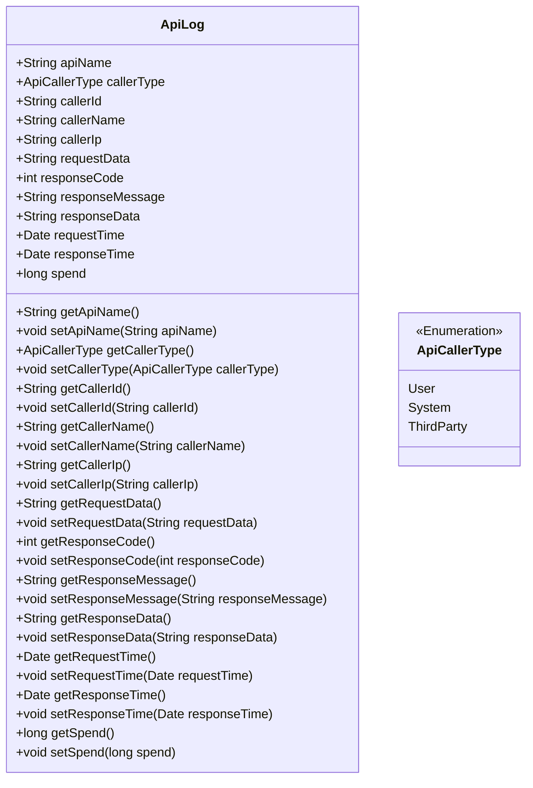

# Basic Information

|      |      |
|------|------|
| Name | ApiLog |
| Language | .java |
| Code Path | WeFe/common/java/common-web/src/main/java/com/welab/wefe/common/web/delegate/api_log/ApiLog.java |
| Package Name | com.welab.wefe.common.web.delegate.api_log |
| Dependencies | ['java.util.Date'] |
| Brief Description | The ApiLog class records API call information, including the interface name, caller type, ID, name, IP, request parameters, response code, message, content, request and response times, and duration. It provides getter/setter methods. |

# Description

The ApiLog class is used to record API call logs, including the request interface name, caller type, ID, name, IP, request parameters, response code, message, content, request time, response time, and duration. It provides getter and setter methods for each field, with the default caller type being user.

# Class Summary

| Name   | Type  | Description |
|-------|------|-------------|
| ApiLog | class | The ApiLog class records API call information, including the interface name, caller type/ID/name/IP, request parameters, response code/message/content, request/response time, and duration. |

## Class ApiLog

|      |      |
|------|------|
| Access Modifier | public |
| Type | class |
| Name | ApiLog |
| Description | The ApiLog class records API call information, including the interface name, caller type/ID/name/IP, request parameters, response code/message/content, request/response time, and duration. |

### UML Class Diagram

This code defines a class named `ApiLog` for recording detailed information about API calls. The class includes multiple public fields such as API name, caller type, caller ID, request parameters, response code, etc., along with corresponding getter and setter methods. `ApiCallerType` is an enumeration type representing the caller's type, including User, System, and ThirdParty. This class is primarily used for logging purposes to facilitate tracking and analysis of API call scenarios.

### Internal Method Call Graph

```mermaid
graph TD
    A["Class ApiLog"]
    B["Attribute: String apiName"]
    C["Attribute: ApiCallerType callerType = User"]
    D["Attribute: String callerId"]
    E["Attribute: String callerName"]
    F["Attribute: String callerIp"]
    G["Attribute: String requestData"]
    H["Attribute: int responseCode"]
    I["Attribute: String responseMessage"]
    J["Attribute: String responseData"]
    K["Attribute: Date requestTime"]
    L["Attribute: Date responseTime"]
    M["Attribute: long spend"]
    N["Getter/Setter Method Group"]
    
    A --> B
    A --> C
    A --> D
    A --> E
    A --> F
    A --> G
    A --> H
    A --> I
    A --> J
    A --> K
    A --> L
    A --> M
    A --> N
    N --> O["getApiName/setApiName"]
    N --> P["getCallerType/setCallerType"]
    N --> Q["getCallerId/setCallerId"]
    N --> R["getCallerName/setCallerName"]
    N --> S["getCallerIp/setCallerIp"]
    N --> T["getRequestData/setRequestData"]
    N --> U["getResponseCode/setResponseCode"]
    N --> V["getResponseMessage/setResponseMessage"]
    N --> W["getResponseData/setResponseData"]
    N --> X["getRequestTime/setRequestTime"]
    N --> Y["getResponseTime/setResponseTime"]
    N --> Z["getSpend/setSpend"]
```

This flowchart illustrates the complete structure of the ApiLog class, comprising 12 attributes and corresponding 24 getter/setter methods. The class attributes capture full-chain API call information, including core fields such as requester identity, request parameters, response data, and latency metrics. All attributes are encapsulated following standard JavaBean specifications, forming a typical POJO class structure suitable for logging and serialization scenarios. The vertical layout of the flowchart clearly presents the hierarchical relationships among class members, with attributes and methods grouped for easy understanding of data encapsulation logic.

### Field List

| Name  | Type  | Description |
|-------|-------|------|
| apiName | String | Declare a public string variable named apiName. |
| callerName | String | Common string variable, storing the caller's name. |
| responseData | String | The public string variable responseData is used to store response data. |
| responseMessage | String | Declare a public string variable responseMessage to store the response message. |
| requestData | String | Common string variables for request data. |
| callerIp | String | Define a public string variable callerIp to store the caller's IP address. |
| requestTime | Date | Declare a public Date type variable named requestTime. |
| responseTime | Date | Declare a public variable named responseTime of type Date. |
| spend | long | The variable `spend` is of type long integer, representing the expenditure amount. |
| callerType = ApiCallerType.User | ApiCallerType | API caller type is set to user. |
| responseCode | int | The integer variable responseCode is used to store the response code. |
| callerId | String | Defined a public string-type variable callerId. |

### Method List

| Name  | Type  | Description |
|-------|-------|------|
| getCallerIp | String | Methods to obtain the caller's IP address, returning a string-type callerIp value. |
| setCallerName | void | The method to set the caller name assigns the parameter callerName to the class member variable callerName. |
| getCallerName | String | This is a Java method that returns the name string of the caller. The method is named `getCallerName`, and its return type is `String`. |
| getResponseData | String | Methods to obtain response data, returning a string-type responseData. |
| setResponseTime | void | The method to set the response time assigns the incoming Date object to the responseTime property of the class. |
| setCallerType | void | The method for setting the caller type assigns the incoming callerType to the callerType field of the current object. |
| setRequestData | void | Define the public method setRequestData, which takes a string parameter requestData and assigns it to the class member variable this.requestData. |
| getCallerId | String | Public method to get the callerId, returns a string type. |
| getCallerType | ApiCallerType | Methods to obtain the caller type, returning an ApiCallerType object. |
| setCallerId | void | The method to set the caller ID assigns the parameter callerId to the callerId property of the current object. |
| getResponseCode | int | Methods to obtain the response code, returns the value of the integer variable responseCode. |
| setRequestTime | void | The method `setRequestTime` takes a Date parameter and assigns it to the class's member variable `requestTime`. |
| getApiName | String | Methods to obtain the API name, which returns the apiName as a string type. |
| getResponseTime | Date | Methods to obtain the response time, which returns the responseTime of Date type. |
| setSpend | void | This is a Java method used to set the value of the class member variable `spend`. The method accepts a parameter of type `long` and assigns it to the `spend` property of the current object. |
| getResponseMessage | String | Methods to obtain the response message, returns a string-type responseMessage. |
| getSpend | long | The method returns the value of the spend variable. |
| setResponseData | void | Method for setting response data, which assigns the passed string to the responseData member variable of the class. |
| setResponseCode | void | Methods for setting HTTP response status codes, assigning the incoming integer value to the class's responseCode member variable. |
| getRequestData | String | Methods to obtain request data, returning requestData of string type. |
| setCallerIp | void | Methods for setting the caller's IP address. |
| setResponseMessage | void | This is a Java method used to set the value of the class's responseMessage property. The method takes a string parameter and assigns it to the class's member variable. |
| setApiName | void | Java Method: Set the apiName property value. |
| getRequestTime | Date | Methods to obtain the request time, returning a Date type value. |

