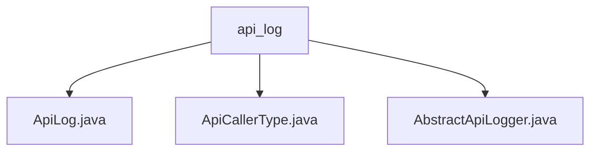

# Basic Information

|      |      |
|------|------|
| Name | api_log |
| Language | .java |
| Code Path | WeFe/common/java/common-web/src/main/java/com/welab/wefe/common/web/delegate/api_log |
| Package Name | docs.common.java.common-web.src.main.java.com.welab.wefe.common.web.delegate.api_log |
| Brief Description | The ApiLog class records API call logs, including request and response information. The ApiCallerType enum defines the types of callers, currently supporting only User. The AbstractApiLogger abstract class manages logs and user activity time, providing an ignore API list and update functionality. |

# Description

## Overview  
The core responsibility of this module is to standardize and record API call logs while managing user activity time. The interface specifications include the log abstraction methods save/updateAccountLastActionTime and the ignore rule control method ignoreWithoutLogin. Key data structures consist of the ApiLog entity (containing full-chain request/response fields) and a ConcurrentHashMap-stored user activity timeline. External dependencies are limited to Java's basic concurrency library. For example, whitelist filtering is implemented via the static IGNORE_LOG_APIS list, resembling a message screening mechanism akin to the event bus pattern.  

## Key Business Scenarios  
A typical scenario involves the API gateway intercepting requests, with AbstractApiLogger automatically recording structured logs containing caller information (e.g., User type + IP + latency) while maintaining user active status. The interaction mode adopts a "post-execution interception" mechanism, combined with thread pool asynchronous processing for log persistence. Full functionality covers log field assembly, access frequency control (e.g., 5-minute intervals for activity time updates), and whitelist filtering. Integration examples demonstrate the use of enums to restrict caller types, reserving the ability to extend third-party application types in the future.

### Package Internal Structure View

This flowchart illustrates the hierarchical relationships among three Java files under the api_log directory. With api_log as the parent node, it contains three child node files: ApiLog.java, ApiCallerType.java, and AbstractApiLogger.java, clearly presenting the organizational structure of API logging-related classes within this module. All node names adopt the last-level element of their paths, complying with specification requirements.

# File List

| Name   | Type  | Description |
|-------|------|-------------|
| [ApiLog.java](ApiLog.md) | file | The ApiLog class records API call information, including the interface name, caller type, ID, name, IP, request parameters, response code, message, content, request and response times, and duration. It provides getter/setter methods. |
| [ApiCallerType.java](ApiCallerType.md) | file | The enumeration type ApiCallerType defines a member User, representing the API caller type. |
| [AbstractApiLogger.java](AbstractApiLogger.md) | file | The abstract class AbstractApiLogger implements API logging functionality, including an ignore list for logging APIs, updating user last activity time, and log saving capabilities, with support for asynchronous processing and parameter filtering. |

