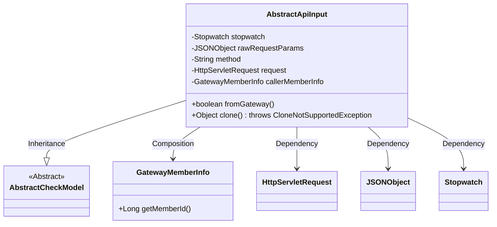
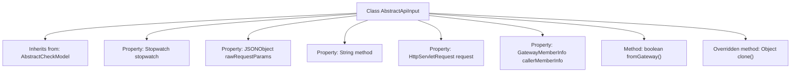

# Basic Information

|      |      |
|------|------|
| Name | AbstractApiInput |
| Language | .java |
| Code Path | WeFe/common/java/common-web/src/main/java/com/welab/wefe/common/web/dto/AbstractApiInput.java |
| Package Name | com.welab.wefe.common.web.dto |
| Dependencies | ['com.alibaba.fastjson.JSONObject', 'com.alibaba.fastjson.annotation.JSONField', 'com.welab.wefe.common.Stopwatch', 'com.welab.wefe.common.fieldvalidate.AbstractCheckModel', 'com.welab.wefe.common.fieldvalidate.annotation.Check', 'javax.servlet.http.HttpServletRequest'] |
| Brief Description | The `AbstractApiInput` class inherits from `AbstractCheckModel`, containing debug time consumption, original request parameters, request method and object, as well as gateway caller information, providing gateway request judgment and cloning methods. |

# Description

The `AbstractApiInput` class inherits from `AbstractCheckModel` and is primarily used for handling API request inputs. It includes a `Stopwatch` object for debugging API latency and a `JSONObject` for storing raw request parameters. The class defines the request method `method` and the request object `request`, both annotated with validation markers. The `callerMemberInfo` field determines whether the request originates from a gateway, and the `fromGateway` method is provided for verification. Additionally, the class implements the `clone` method to support object cloning functionality. All sensitive fields are marked to be excluded from JSON serialization.

# Class Summary

| Name   | Type  | Description |
|-------|------|-------------|
| AbstractApiInput | class | The AbstractApiInput class inherits from AbstractCheckModel and includes functionalities such as debugging time consumption, raw request parameters, request methods, and source verification, while supporting clone operations. |

## Class AbstractApiInput

|      |      |
|------|------|
| Access Modifier | public |
| Type | class |
| Name | AbstractApiInput |
| Description | The AbstractApiInput class inherits from AbstractCheckModel and includes functionalities such as debugging time consumption, raw request parameters, request methods, and source verification, while supporting clone operations. |

### UML Class Diagram

This code demonstrates an abstract API input class `AbstractApiInput` that inherits from the base class `AbstractCheckModel`. The class encapsulates core attributes of API requests, including a debugging timer, raw request parameters, HTTP method, request object, and caller information. Notably, the `fromGateway()` method is used to determine if the request originates from a gateway, and it overrides the `clone()` method to implement shallow copying. Several fields in the class are marked with the `@JSONField(serialize=false)` annotation to exclude them from JSON serialization, reflecting awareness of sensitive data protection. The class maintains clear dependency relationships with components such as `GatewayMemberInfo` and `HttpServletRequest`, forming a complete foundational structure for request processing.

### Internal Method Call Graph

This code illustrates the AbstractApiInput class which inherits from AbstractCheckModel, primarily designed for handling API request inputs. The class contains five key properties: a Stopwatch timer for debugging, a JSONObject of raw request parameters, a String representing the request method, an HttpServletRequest object, and GatewayMemberInfo for gateway caller information. It provides two core methods: fromGateway() to determine if the request originates from the gateway, and an overridden clone() method implementing shallow copy. All properties are marked as non-participants in JSON serialization, demonstrating awareness of sensitive data protection.

### Field List

| Name  | Type  | Description |
|-------|-------|------|
| request | HttpServletRequest | This is a Java code snippet that defines an HttpServletRequest object named request, annotated with @Check and @JSONField, where the @JSONField annotation specifies that the field should not be serialized. |
| rawRequestParams | JSONObject | The code defines a JSONObject type field named rawRequestParams that does not participate in JSON serialization. |
| callerMemberInfo | GatewayMemberInfo | JSON field annotation indicating that callerMemberInfo is excluded from serialization. |
| stopwatch = Stopwatch.startNew() | Stopwatch | The JSONField annotation marks stopwatch as non-serializable, and the Stopwatch instance is created and immediately started. |
| method | String | Java field annotations: @Check marks the request method, @JSONField disables JSON serialization. |

### Method List

| Name  | Type  | Description |
|-------|-------|------|
| fromGateway | boolean | Method checks if the caller is the gateway: returns true if both callerMemberInfo and its memberId are not null. |
| clone | Object | In Java, when overriding the clone method, invoke the parent class's clone implementation and return a copy of the object, which may throw a CloneNotSupportedException. |

