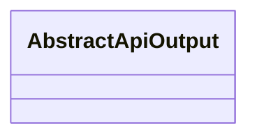
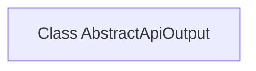

# Basic Information

|      |      |
|------|------|
| Name | AbstractApiOutput |
| Language | .java |
| Code Path | WeFe/common/java/common-web/src/main/java/com/welab/wefe/common/web/dto/AbstractApiOutput.java |
| Package Name | com.welab.wefe.common.web.dto |
| Dependencies | [] |
| Brief Description | Abstract API output base class, with no concrete implementation. |

# Description

AbstractApiOutput is a public abstract class designed to define the foundational structure of API outputs. Currently empty, this class may serve as a parent class for other concrete API output classes, providing a unified extension interface.

# Class Summary

| Name   | Type  | Description |
|-------|------|-------------|
| AbstractApiOutput | class | Abstract API Output Base Class |

## Class AbstractApiOutput

|      |      |
|------|------|
| Access Modifier | public |
| Type | class |
| Name | AbstractApiOutput |
| Description | Abstract API Output Base Class |

### UML Class Diagram

This class diagram depicts an abstract class named AbstractApiOutput, which is currently empty with no member variables or methods defined. Based on the class name, it can be inferred that it may serve as a base class for API output results, standardizing the output format or behavior of subclasses. Subsequent implementations can extend this class through inheritance, adding necessary fields and methods to fulfill specific functionalities.

### Internal Method Call Graph

This code defines an empty class named `AbstractApiOutput` without any attributes or methods. The class may serve as a base class or abstract implementation of an interface, but currently exists only as a structural placeholder. Due to the lack of concrete implementation, the flowchart displays only the class declaration node with no other associated elements. Functionality can be extended through inheritance or by adding abstract methods to enforce subclass behavior.

### Field List

| Name  | Type  | Description |
|-------|-------|------|

### Method List

| Name  | Type  | Description |
|-------|-------|------|

