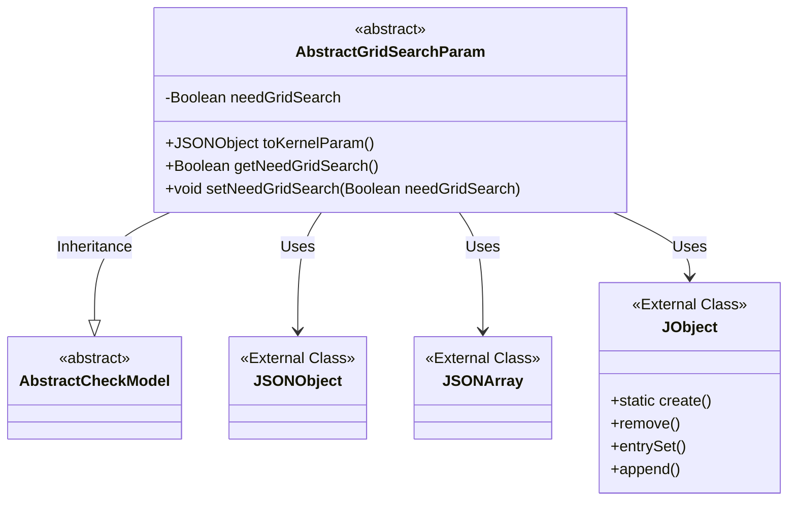
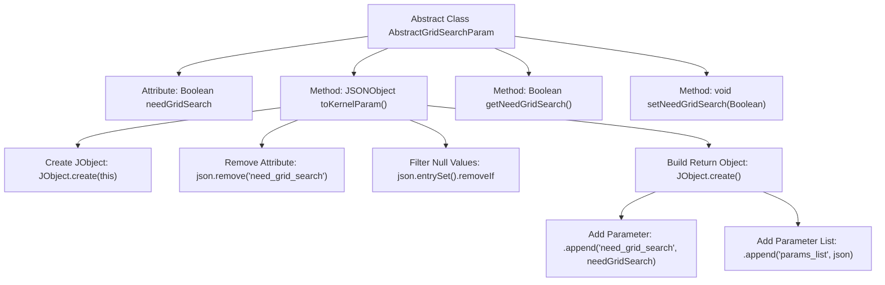

# Basic Information

|      |      |
|------|------|
| Name | AbstractGridSearchParam |
| Language | .java |
| Code Path | WeFe/common/java/common-web/src/main/java/com/welab/wefe/common/web/dto/AbstractGridSearchParam.java |
| Package Name | com.welab.wefe.common.web.dto |
| Dependencies | ['com.alibaba.fastjson.JSONArray', 'com.alibaba.fastjson.JSONObject', 'com.alibaba.fastjson.annotation.JSONField', 'com.welab.wefe.common.fieldvalidate.AbstractCheckModel', 'com.welab.wefe.common.util.JObject'] |
| Brief Description | The abstract class `AbstractGridSearchParam` extends `AbstractCheckModel`, containing the `needGridSearch` property and the `toKernelParam` method, which converts the data into the JSON structure required by the kernel, removes null-value items, and retains the parameter list. It provides getter/setter methods. |

# Description

AbstractGridSearchParam is an abstract class that inherits from AbstractCheckModel, primarily used for grid search parameter processing. The core field `needGridSearch` controls whether grid search is enabled. The key method `toKernelParam` converts the object into a JSON structure required by the kernel, removing null values and empty arrays, then generates an object containing the `needGrid_search` flag and a `params_list` parameter list. The parameter list supports multiple sets of key-value pairs, such as optimizer type and iteration count. The class provides standard getter/setter methods to access the `needGridSearch` field. The conversion process uses the `JSONField` annotation to prevent serialization of this method.

# Class Summary

| Name   | Type  | Description |
|-------|------|-------------|
| AbstractGridSearchParam | class | The abstract class `AbstractGridSearchParam` extends `AbstractCheckModel` and provides grid search parameter conversion functionality. It includes the `needGridSearch` property and the `toKernelParam` method for generating the JSON structure required by the kernel, removing null values and empty arrays. It also contains getter/setter methods. |

## Class AbstractGridSearchParam

|      |      |
|------|------|
| Access Modifier | public abstract |
| Type | class |
| Name | AbstractGridSearchParam |
| Description | The abstract class `AbstractGridSearchParam` extends `AbstractCheckModel` and provides grid search parameter conversion functionality. It includes the `needGridSearch` property and the `toKernelParam` method for generating the JSON structure required by the kernel, removing null values and empty arrays. It also contains getter/setter methods. |

### UML Class Diagram

This code demonstrates an abstract class `AbstractGridSearchParam` that inherits from `AbstractCheckModel`, primarily used for handling grid search parameters. The class contains a private Boolean field `needGridSearch` and three public methods: `toKernelParam()` for converting parameters into the JSON structure required by the kernel, along with getter and setter methods for `needGridSearch`. The class relies on external classes `JSONObject`, `JSONArray`, and `JObject` to process and convert JSON data.

### Internal Method Call Graph

This code defines an abstract class AbstractGridSearchParam, primarily used for handling the conversion and encapsulation of grid search parameters. The core method toKernelParam() transforms the object into a JSON structure required by the kernel, involving two main processes: parameter cleanup (removing null values and specific fields) and structured encapsulation (adding the need_grid_search flag and parameter list). The grid search toggle state is controlled via getter/setter methods, with the overall design emphasizing data filtering and format standardization.

### Field List

| Name  | Type  | Description |
|-------|-------|------|
| needGridSearch = false | Boolean | Define a boolean variable `needGridSearch`, initially set to `false`, to control whether to perform grid search. |

### Method List

| Name  | Type  | Description |
|-------|-------|------|
| toKernelParam | JSONObject | The method `toKernelParam` converts the object into JSON, removes null values and empty arrays, while retaining the `need_grid_search` and `params_list` fields. |
| getNeedGridSearch | Boolean | The method returns a boolean value needGridSearch. |
| setNeedGridSearch | void | This method is used to set whether grid search is required, controlled by a boolean parameter. |

