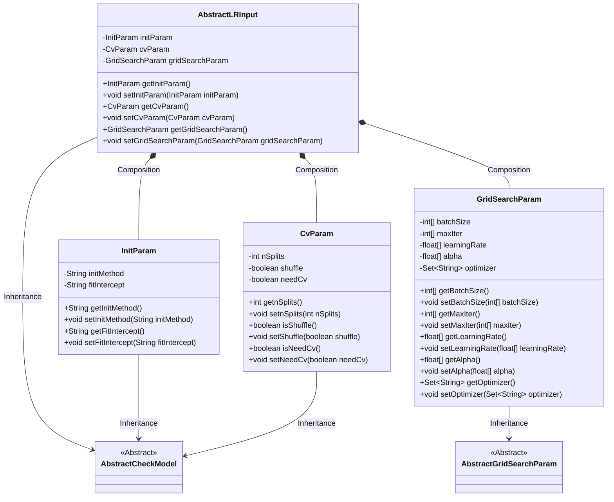

# Basic Information

|      |      |
|------|------|
| Name | AbstractLRInput |
| Language | .java |
| Code Path | WeFe/common/java/common-web/src/main/java/com/welab/wefe/common/web/dto/AbstractLRInput.java |
| Package Name | com.welab.wefe.common.web.dto |
| Dependencies | ['com.welab.wefe.common.fieldvalidate.AbstractCheckModel', 'com.welab.wefe.common.fieldvalidate.annotation.Check', 'java.util.Set'] |
| Brief Description | The `AbstractLRInput` class inherits from `AbstractCheckModel` and includes required parameters `initParam`, `cvParam`, and `gridSearchParam`. `initParam` contains the initialization method and bias coefficient settings; `cvParam` defines cross-validation parameters; `gridSearchParam` includes grid search parameters such as batch size and iteration count. |

# Description

The AbstractLRInput class inherits from AbstractCheckModel and includes three mandatory parameters: initParam, cvParam, and gridSearchParam. initParam is of type InitParam and contains two required fields: the model initialization method and whether a bias coefficient is needed. cvParam is of type CvParam and includes three mandatory fields: the KFold split size, whether to shuffle, and whether this module is required. gridSearchParam is of type GridSearchParam and consists of configurable parameters such as batch size, maximum iterations, learning rate, penalty coefficient, and optimization algorithm. All parameters are accessed and modified via getter and setter methods.

# Class Summary

| Name   | Type  | Description |
|-------|------|-------------|
| AbstractLRInput | class | The AbstractLRInput class inherits from AbstractCheckModel and contains three nested classes: InitParam, CvParam, and GridSearchParam. InitParam has the attributes initMethod and fitIntercept; CvParam includes nSplits, shuffle, and needCv; GridSearchParam has parameters such as batchSize and maxIter. All attributes are equipped with getter and setter methods. |

## Class AbstractLRInput

|      |      |
|------|------|
| Access Modifier | public |
| Type | class |
| Name | AbstractLRInput |
| Description | The AbstractLRInput class inherits from AbstractCheckModel and contains three nested classes: InitParam, CvParam, and GridSearchParam. InitParam has the attributes initMethod and fitIntercept; CvParam includes nSplits, shuffle, and needCv; GridSearchParam has parameters such as batchSize and maxIter. All attributes are equipped with getter and setter methods. |

### UML Class Diagram

This code illustrates a class structure for a machine learning model configuration system. The AbstractLRInput serves as the main configuration class, inheriting from AbstractCheckModel and containing three nested configuration classes: InitParam (model initialization parameters), CvParam (cross-validation parameters), and GridSearchParam (grid search parameters). All configuration classes implement parameter validation through inheritance, with GridSearchParam specifically inheriting from AbstractGridSearchParam. The classes form a hierarchical structure through composition relationships, with each configuration class containing domain-specific parameters and corresponding getter/setter methods.

### Internal Method Call Graph

```mermaid
graph TD
    A["Class AbstractLRInput"]
    B["Attribute: InitParam initParam"]
    C["Method: getInitParam()/setInitParam()"]
    D["Static Inner Class InitParam"]
    E["Attribute: String initMethod"]
    F["Attribute: String fitIntercept"]
    G["Method: getInitMethod()/setInitMethod()"]
    H["Method: getFitIntercept()/setFitIntercept()"]
    I["Attribute: CvParam cvParam"]
    J["Method: getCvParam()/setCvParam()"]
    K["Static Inner Class CvParam"]
    L["Attribute: int nSplits"]
    M["Attribute: boolean shuffle"]
    N["Attribute: boolean needCv"]
    O["Method: getnSplits()/setnSplits()"]
    P["Method: isShuffle()/setShuffle()"]
    Q["Method: isNeedCv()/setNeedCv()"]
    R["Attribute: GridSearchParam gridSearchParam"]
    S["Method: getGridSearchParam()/setGridSearchParam()"]
    T["Static Inner Class GridSearchParam"]
    U["Attribute: int[] batchSize"]
    V["Attribute: int[] maxIter"]
    W["Attribute: float[] learningRate"]
    X["Attribute: float[] alpha"]
    Y["Attribute: Set<String> optimizer"]
    Z["Method: getBatchSize()/setBatchSize()"]
    AA["Method: getMaxIter()/setMaxIter()"]
    AB["Method: getLearningRate()/setLearningRate()"]
    AC["Method: getAlpha()/setAlpha()"]
    AD["Method: getOptimizer()/setOptimizer()"]

    A --> B
    A --> C
    A --> D
    D --> E
    D --> F
    D --> G
    D --> H
    A --> I
    A --> J
    A --> K
    K --> L
    K --> M
    K --> N
    K --> O
    K --> P
    K --> Q
    A --> R
    A --> S
    A --> T
    T --> U
    T --> V
    T --> W
    T --> X
    T --> Y
    T --> Z
    T --> AA
    T --> AB
    T --> AC
    T --> AD
```

This code demonstrates the structure of a machine learning model parameter configuration class AbstractLRInput, which inherits from AbstractCheckModel. The class contains three main static inner classes: InitParam (initialization parameters), CvParam (cross-validation parameters), and GridSearchParam (grid search parameters), each with their own attributes and getter/setter methods. All attributes are marked with @Check annotations for validation, reflecting a comprehensive design for parameter validation. The overall structure clearly separates different types of model parameters, facilitating parameter management and extension.

### Field List

| Name  | Type  | Description |
|-------|-------|------|
| initParam | InitParam | Mandatory check for non-null initialization parameter initParam. |
| cvParam | CvParam | The code defines a private variable `cvParam` of type `CvParam`, annotated with `@Check(require=true)` indicating this parameter must exist and be non-null. |
| gridSearchParam | GridSearchParam | Grid search parameter object with mandatory validation. |

### Method List

| Name  | Type  | Description |
|-------|-------|------|
| getGridSearchParam | GridSearchParam | Methods to obtain grid search parameters, returns a gridSearchParam object. |
| setCvParam | void | Methods for setting the CvParam object. |
| setInitParam | void | Method for setting initialization parameters, which assigns the passed `initParam` to the properties of the current object with the same names. |
| getInitParam | InitParam | Methods for obtaining the initialization parameter object. |
| setGridSearchParam | void | The method for setting grid search parameters assigns the input parameters to the class member variable `gridSearchParam`. |
| getCvParam | CvParam | Methods to obtain a cvParam object. |

