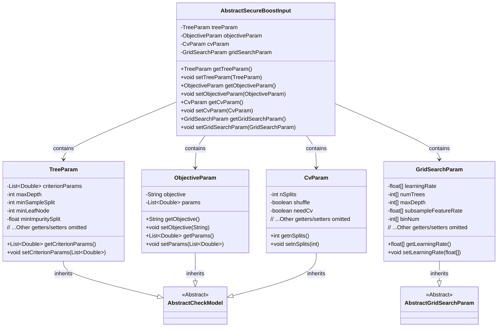

# Basic Information

|      |      |
|------|------|
| Name | AbstractSecureBoostInput |
| Language | .java |
| Code Path | WeFe/common/java/common-web/src/main/java/com/welab/wefe/common/web/dto/AbstractSecureBoostInput.java |
| Package Name | com.welab.wefe.common.web.dto |
| Dependencies | ['com.welab.wefe.common.fieldvalidate.AbstractCheckModel', 'com.welab.wefe.common.fieldvalidate.annotation.Check', 'java.util.List'] |
| Brief Description | The AbstractSecureBoostInput class contains tree parameters, objective parameters, cross-validation parameters, and grid search parameters for configuring the training of a secure enhanced XGBoost model. |

# Description

The `AbstractSecureBoostInput` class inherits from `AbstractCheckModel` and includes four main parameters: `treeParam`, `objectiveParam`, `cvParam`, and `gridSearchParam`. `treeParam` defines tree-related parameters, including regularization coefficients, maximum depth, minimum samples required for splitting, minimum samples per leaf node, and minimum gain. `objectiveParam` contains the loss function and its regularization coefficients. `cvParam` sets cross-validation parameters such as the number of splits, whether to shuffle, and whether validation is required. `gridSearchParam` is used for grid search, covering tunable parameter ranges like learning rate, number of trees, depth, feature sampling rate, and number of buckets. All parameters are accessed and modified via getter and setter methods.

# Class Summary

| Name   | Type  | Description |
|-------|------|-------------|
| AbstractSecureBoostInput | class | The AbstractSecureBoostInput class includes tree parameters, objective parameters, cross-validation parameters, and grid search parameters for configuring the secure enhanced gradient boosting tree model. |

## Class AbstractSecureBoostInput

|      |      |
|------|------|
| Access Modifier | public |
| Type | class |
| Name | AbstractSecureBoostInput |
| Description | The AbstractSecureBoostInput class includes tree parameters, objective parameters, cross-validation parameters, and grid search parameters for configuring the secure enhanced gradient boosting tree model. |

### UML Class Diagram

Class diagram description: This diagram illustrates a security-enhanced machine learning input configuration system. The AbstractSecureBoostInput serves as the main class, containing four nested configuration classes: TreeParam (tree parameters), ObjectiveParam (objective function parameters), CvParam (cross-validation parameters), and GridSearchParam (grid search parameters). All parameter classes inherit from AbstractCheckModel (except GridSearchParam which inherits from AbstractGridSearchParam), reflecting common parameter validation characteristics. The diagram clearly presents containment relationships and inheritance hierarchies, with each configuration class encapsulating key parameters required for machine learning algorithm tuning.

### Internal Method Call Graph

```mermaid
graph TD
    A["Class AbstractSecureBoostInput"]
    B["Attribute: TreeParam treeParam"]
    C["Method: getTreeParam/setTreeParam"]
    D["Static Inner Class TreeParam"]
    E["Attribute: List<Double> criterionParams"]
    F["Attribute: int maxDepth"]
    G["Attribute: int minSampleSplit"]
    H["Attribute: int minLeafNode"]
    I["Attribute: float minImpuritySplit"]
    J["Method: Getters/Setters for each attribute"]
    K["Attribute: ObjectiveParam objectiveParam"]
    L["Method: getObjectiveParam/setObjectiveParam"]
    M["Static Inner Class ObjectiveParam"]
    N["Attribute: String objective"]
    O["Attribute: List<Double> params"]
    P["Method: Getters/Setters for each attribute"]
    Q["Attribute: CvParam cvParam"]
    R["Method: getCvParam/setCvParam"]
    S["Static Inner Class CvParam"]
    T["Attribute: int nSplits"]
    U["Attribute: boolean shuffle"]
    V["Attribute: boolean needCv"]
    W["Method: Getters/Setters for each attribute"]
    X["Attribute: GridSearchParam gridSearchParam"]
    Y["Method: getGridSearchParam/setGridSearchParam"]
    Z["Static Inner Class GridSearchParam"]
    AA["Attribute: float[] learningRate"]
    AB["Attribute: int[] numTrees"]
    AC["Attribute: int[] maxDepth"]
    AD["Attribute: float[] subsampleFeatureRate"]
    AE["Attribute: int[] binNum"]
    AF["Method: Getters/Setters for each attribute"]

    A --> B
    A --> C
    A --> D
    D --> E
    D --> F
    D --> G
    D --> H
    D --> I
    D --> J
    A --> K
    A --> L
    A --> M
    M --> N
    M --> O
    M --> P
    A --> Q
    A --> R
    A --> S
    S --> T
    S --> U
    S --> V
    S --> W
    A --> X
    A --> Y
    A --> Z
    Z --> AA
    Z --> AB
    Z --> AC
    Z --> AD
    Z --> AE
    Z --> AF
```

This flowchart illustrates the structural relationships of the AbstractSecureBoostInput class and its nested classes. The main class contains four core parameter classes (TreeParam/ObjectiveParam/CvParam/GridSearchParam) as attributes, each of which includes multiple configuration parameters with validation annotations and corresponding getter/setter methods. All nested classes inherit from AbstractCheckModel, with GridSearchParam additionally inheriting from AbstractGridSearchParam, forming a multi-level configuration parameter system.

### Field List

| Name  | Type  | Description |
|-------|-------|------|
| objectiveParam | ObjectiveParam | The code snippet defines a private variable `objectiveParam` and annotates it with `@Check(require=true)` validation annotation, indicating this parameter is mandatory. |
| cvParam | CvParam | The code snippet defines a private variable cvParam of type CvParam, annotated with @Check(require = true) indicating this parameter must be validated. |
| gridSearchParam | GridSearchParam | The code snippet defines a private variable `gridSearchParam`, marked as a required field with the `@Check` annotation. |
| treeParam | TreeParam | Tree-shaped parameter object with mandatory validation. |

### Method List

| Name  | Type  | Description |
|-------|-------|------|
| getCvParam | CvParam | Methods to obtain a cvParam object. |
| getObjectiveParam | ObjectiveParam | The method returns an ObjectiveParam object. |
| getTreeParam | TreeParam | The method returns the treeParam object. |
| setObjectiveParam | void | Method for setting target parameters: assigns the passed objectiveParam to the property of the current object with the same name. |
| setTreeParam | void | The method for setting tree parameters assigns the passed-in treeParam to the treeParam property of the current object. |
| setCvParam | void | This is a Java method used to set the cvParam member variable of a class. The method accepts a parameter of type CvParam and assigns it to the cvParam property of the current object. |
| getGridSearchParam | GridSearchParam | Methods for obtaining grid search parameters, returning a gridSearchParam object. |
| setGridSearchParam | void | The method for setting grid search parameters assigns the input parameters to the member variables of the class. |

