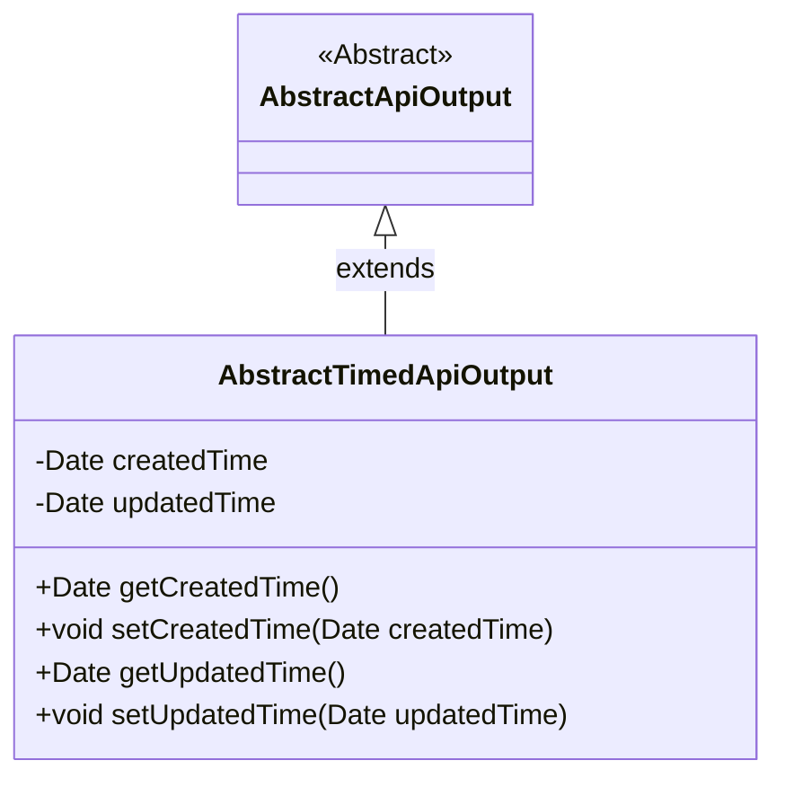
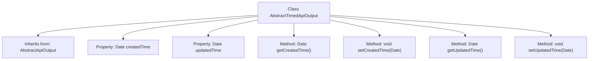

# Basic Information

|      |      |
|------|------|
| Name | AbstractTimedApiOutput |
| Language | .java |
| Code Path | WeFe/common/java/common-web/src/main/java/com/welab/wefe/common/web/dto/AbstractTimedApiOutput.java |
| Package Name | com.welab.wefe.common.web.dto |
| Dependencies | ['java.util.Date'] |
| Brief Description | The AbstractTimedApiOutput class inherits from AbstractApiOutput and includes attributes for creation time and update time, along with their corresponding getter and setter methods. |

# Description

This is an abstract class named AbstractTimedApiOutput, which inherits from AbstractApiOutput. The class contains two protected Date-type properties: createdTime and updatedTime, representing the creation time and update time respectively. It provides four public methods: getCreatedTime and setCreatedTime for getting and setting the creation time, and getUpdatedTime and setUpdatedTime for getting and setting the update time.

# Class Summary

| Name   | Type  | Description |
|-------|------|-------------|
| AbstractTimedApiOutput | class | The AbstractTimedApiOutput class inherits from AbstractApiOutput and includes attributes for creation time and update time, along with their corresponding getter and setter methods. |

## Class AbstractTimedApiOutput

|      |      |
|------|------|
| Access Modifier | public |
| Type | class |
| Name | AbstractTimedApiOutput |
| Description | The AbstractTimedApiOutput class inherits from AbstractApiOutput and includes attributes for creation time and update time, along with their corresponding getter and setter methods. |

### UML Class Diagram

This class diagram illustrates the inheritance relationship where AbstractTimedApiOutput extends the abstract class AbstractApiOutput. The subclass adds two private Date-type attributes, createdTime and updatedTime, along with corresponding getter and setter methods. This design extends the basic API output functionality by incorporating timestamp management capabilities, making it suitable for scenarios requiring creation and modification time tracking. The diagram clearly demonstrates object-oriented inheritance principles and the encapsulation of temporal attributes.

### Internal Method Call Graph

This code demonstrates an AbstractTimedApiOutput class that inherits from AbstractApiOutput, primarily designed to manage time-related properties createdTime and updatedTime. The class contains four methods for getting and setting these two time properties. The flowchart clearly illustrates the class inheritance relationship, property definitions, and method structure, showcasing its capability to encapsulate timestamp data management.

### Field List

| Name  | Type  | Description |
|-------|-------|------|
| updatedTime | Date | The field updatedTime is a protected date type that records the update time. |
| createdTime | Date | Create a time field with the type Date. |

### Method List

| Name  | Type  | Description |
|-------|-------|------|
| getUpdatedTime | Date | The method returns an updated time object. |
| getCreatedTime | Date | Methods to obtain creation time, returns Date type. |
| setCreatedTime | void | Method for setting object creation time, with the parameter being of Date type. |
| setUpdatedTime | void | The method to set the update time involves assigning the parameter `updatedTime` to the `updatedTime` property of the object. |

