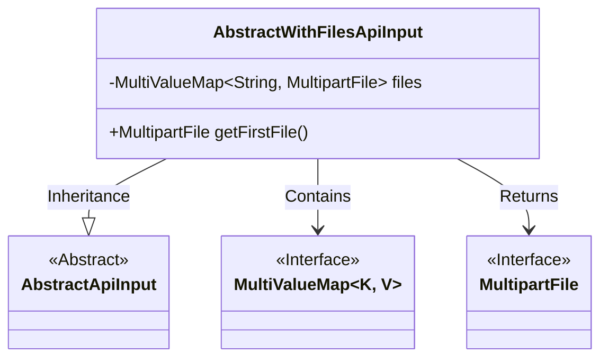
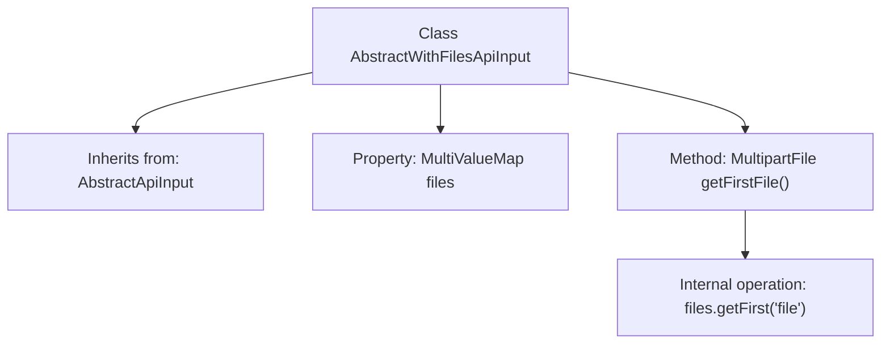

# Basic Information

|      |      |
|------|------|
| Name | AbstractWithFilesApiInput |
| Language | .java |
| Code Path | WeFe/common/java/common-web/src/main/java/com/welab/wefe/common/web/dto/AbstractWithFilesApiInput.java |
| Package Name | com.welab.wefe.common.web.dto |
| Dependencies | ['org.springframework.util.MultiValueMap', 'org.springframework.web.multipart.MultipartFile'] |
| Brief Description | The `AbstractWithFilesApiInput` class extends `AbstractApiInput`, containing a file mapping field `files` and a method `getFirstFile` to retrieve the first file. |

# Description

The `AbstractWithFilesApiInput` class inherits from `AbstractApiInput` and is designed to handle API inputs that include file uploads. This class contains a `MultiValueMap`-type member variable named `files`, which stores multiple `MultipartFile` objects. It provides a `getFirstFile` method to retrieve the first file object with the key "file". This class simplifies the file retrieval process in file upload operations.

# Class Summary

| Name   | Type  | Description |
|-------|------|-------------|
| AbstractWithFilesApiInput | class | The `AbstractWithFilesApiInput` class extends `AbstractApiInput` and includes methods for file mapping and retrieving the first file. |

## Class AbstractWithFilesApiInput

|      |      |
|------|------|
| Access Modifier | public |
| Type | class |
| Name | AbstractWithFilesApiInput |
| Description | The `AbstractWithFilesApiInput` class extends `AbstractApiInput` and includes methods for file mapping and retrieving the first file. |

### UML Class Diagram

This class diagram illustrates that AbstractWithFilesApiInput inherits from the abstract class AbstractApiInput and contains a files member variable of type MultiValueMap, which stores string keys and values of MultipartFile interface type. The class provides a getFirstFile() method to retrieve the first file with the key "file". Both MultiValueMap and MultipartFile are interface types, representing a common multi-file handling pattern in file upload functionality. The overall design achieves the basic functionality of file upload API input through inheritance and composition.

### Internal Method Call Graph

This flowchart illustrates the structure of the AbstractWithFilesApiInput class, which inherits from the base class AbstractApiInput. The class contains a files property of type MultiValueMap for storing multiple files. The core method is getFirstFile(), which retrieves the first uploaded file object by calling files.getFirst("file"). The flowchart clearly presents the class inheritance relationship, property definition, and method invocation chain, highlighting key design points of the file processing API input.

### Field List

| Name  | Type  | Description |
|-------|-------|------|
| files | MultiValueMap<String, MultipartFile> | Multi-valued mapping, with string keys and multi-part file objects as values. |

### Method List

| Name  | Type  | Description |
|-------|-------|------|
| getFirstFile | MultipartFile | Get the first file in the file list. |

