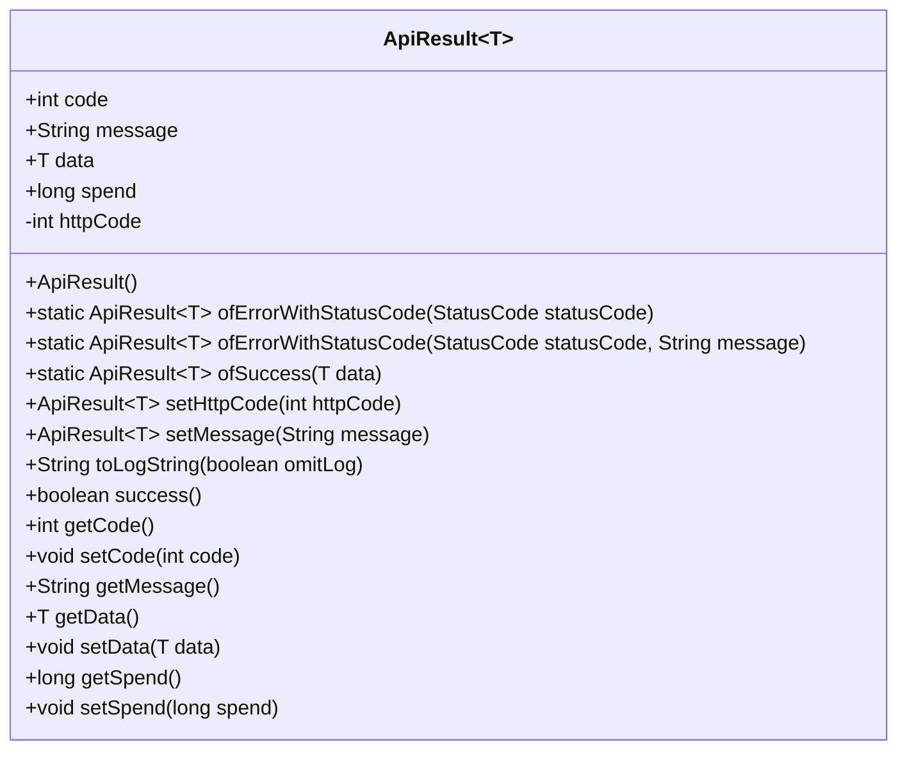
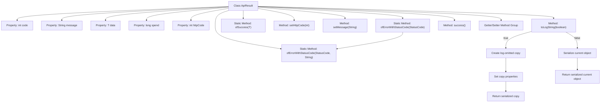

# Basic Information

|      |      |
|------|------|
| Name | ApiResult |
| Language | .java |
| Code Path | WeFe/common/java/common-web/src/main/java/com/welab/wefe/common/web/dto/ApiResult.java |
| Package Name | com.welab.wefe.common.web.dto |
| Dependencies | ['com.alibaba.fastjson.JSON', 'com.alibaba.fastjson.annotation.JSONField', 'com.welab.wefe.common.StatusCode', 'com.welab.wefe.common.fastjson.LoggerValueFilter'] |
| Brief Description | ApiResult is a universal API response class that includes status codes, messages, data, time consumption, and HTTP status codes. It provides success/error construction methods, log output, and status judgment functionalities. |

# Description

ApiResult is a generic class used to encapsulate API response data. It includes the status code `code`, message `message`, generic data `data`, time consumption `spend`, and HTTP status code `httpCode`. It provides static methods to create error or success responses and supports chained calls to set properties. It contains a log output method `toLogString`, which allows controlling whether to omit log content. The `success` method determines whether the response is successful. It includes getter and setter methods for each property.

# Class Summary

| Name   | Type  | Description |
|-------|------|-------------|
| ApiResult | class | ApiResult is a generic API response class that includes status codes, messages, data, time consumption, and HTTP status codes, providing success/error construction methods, log output, and chainable calls. |

## Class ApiResult

|      |      |
|------|------|
| Access Modifier | public |
| Type | class |
| Name | ApiResult |
| Description | ApiResult is a generic API response class that includes status codes, messages, data, time consumption, and HTTP status codes, providing success/error construction methods, log output, and chainable calls. |

### UML Class Diagram

This code defines a generic class `ApiResult<T>` for encapsulating API response data, including status code, message, generic data fields, and processing time. It provides static factory methods for error and success responses, along with log output and status judgment functionalities. The class diagram displays its public fields, constructor, static factory methods, chainable setter methods, and conventional getter/setter methods. The `httpCode` field is marked as private and non-serializable, reflecting a common design pattern for response wrapping and log handling.

### Internal Method Call Graph

The flowchart describes the structure and method invocation relationships of the generic ApiResult class. This class encapsulates API response data, containing properties such as status code, message, generic data, and execution time. Core methods include constructing error/success responses, setting HTTP status codes, generating log strings, and status checking. Special attention is given to the branching logic of the toLogString method, which determines whether to omit log data based on the omitLog parameter to avoid file resource serialization issues. The class structure clearly distinguishes between properties and method groups, demonstrating comprehensive lifecycle management capabilities for response objects.

### Field List

| Name  | Type  | Description |
|-------|-------|------|
| data | T | Declare a public variable data with the generic type T. |
| httpCode = 200 | int | The JSONField annotation marks httpCode as 200 and does not serialize it. |
| spend | long | The variable `spend` is of type long integer, used to store expenditure amounts. |
| code = 0 | int | Define an integer variable named code with an initial value of 0. |
| message | String | Declare a public string variable named message. |

### Method List

| Name  | Type  | Description |
|-------|-------|------|
| ofErrorWithStatusCode | ApiResult<T> | The static method `ofErrorWithStatusCode` creates an `ApiResult` object containing a status code and error message, then returns this object. |
| ofErrorWithStatusCode | ApiResult<T> | The static method `ofErrorWithStatusCode` accepts a status code parameter and returns an ApiResult error object containing that status code and its corresponding message. |
| setHttpCode | ApiResult<T> | The method `setHttpCode` sets the HTTP status code and returns the current object instance. |
| success | boolean | The method `success` checks whether the `code` is 0, returning a boolean value to indicate whether the operation was successful. |
| setMessage | ApiResult<T> | This is a generic method used to set the message and return the current ApiResult object instance. |
| getCode | int | The method returns the value of the integer variable code. |
| ofSuccess | ApiResult<T> | This is a Java static method designed to create an ApiResult object containing successful data. The method accepts a generic data parameter, assigns it to a newly created ApiResult instance, and returns it. |
| toLogString | String | The method determines the log output format based on the omitLog parameter: if true, it returns a simplified JSON (retaining only key fields); if false, it returns the complete object JSON and applies the default filter. |
| setCode | void | Set the value of the integer variable code. |
| getMessage | String | Methods to obtain the message string. |
| getData | T | This is a Java method that returns the value of the data variable with a generic type T. |
| setData | void | Set the data attributes of an object. |
| getSpend | long | The method to obtain the consumption amount returns the value of the long integer variable `spend`. |
| setSpend | void | The method to set the spending amount assigns the parameter value to the class member variable `spend`. |

