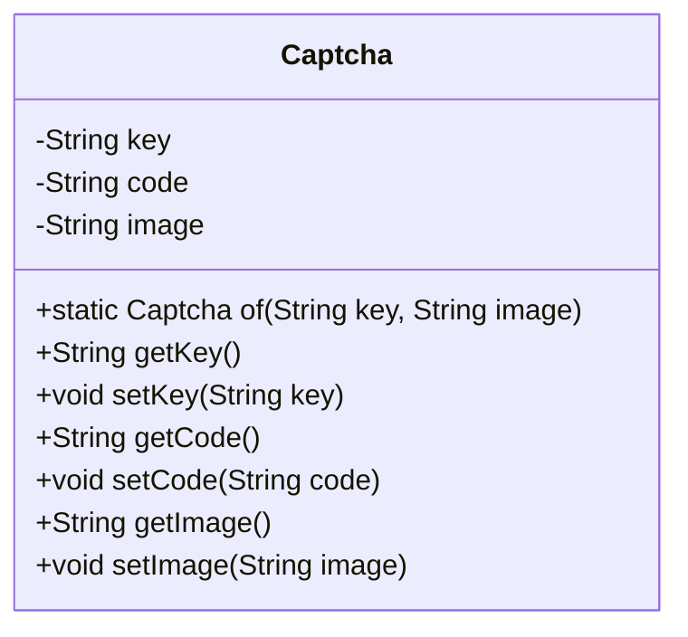
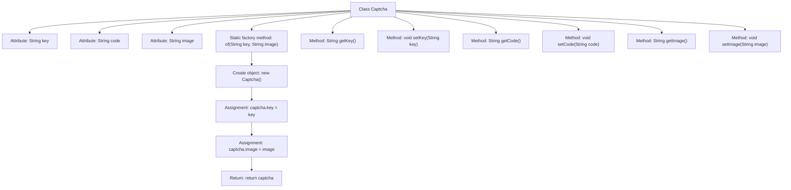

# Basic Information

|      |      |
|------|------|
| Name | Captcha |
| Language | .java |
| Code Path | WeFe/common/java/common-web/src/main/java/com/welab/wefe/common/web/dto/Captcha.java |
| Package Name | com.welab.wefe.common.web.dto |
| Dependencies | [] |
| Brief Description | The Captcha class includes key, code, and image attributes, providing getter/setter methods and a static factory method 'of' for creating instances. |

# Description

The Captcha class is a Java class designed for captcha functionality, containing three private fields: key, code, and image. It provides a static factory method `of` to create instances and initialize the key and image fields. The class also includes corresponding getter and setter methods for each field to retrieve and modify their values. The key and image fields are initialized via the `of` method, while the code can be set using the setter method.

# Class Summary

| Name   | Type  | Description |
|-------|------|-------------|
| Captcha | class | The Captcha class includes attributes such as key, code, and image, providing getter/setter methods and a static factory method `of` for creating instances. |

## Class Captcha

|      |      |
|------|------|
| Access Modifier | public |
| Type | class |
| Name | Captcha |
| Description | The Captcha class includes attributes such as key, code, and image, providing getter/setter methods and a static factory method `of` for creating instances. |

### UML Class Diagram

This code defines a class named `Captcha` to represent captcha information. The class contains three private attributes: `key` (unique identifier for the captcha), `code` (captcha text), and `image` (captcha image data), along with corresponding getter and setter methods. The core functionality is provided by the static factory method `of()`, which takes key and image parameters to initialize the object. This class is typically used in captcha generation scenarios, supporting subsequent setting of captcha values via setCode(), making it suitable for system modules that require dynamic captcha generation and validation.

### Internal Method Call Graph

This code defines a Captcha class representing captcha information, containing three attributes: key, code, and image. It creates and initializes objects with key and image attributes through the static factory method "of", while providing getter and setter methods for each attribute. The flowchart illustrates the class structure, attributes, methods, and the internal creation and initialization process of the factory method.

### Field List

| Name  | Type  | Description |
|-------|-------|------|
| image | String | The private string variable `image` is used to store image information. |
| code | String | Defined a private string variable named code. |
| key | String | Private string type variable key. |

### Method List

| Name  | Type  | Description |
|-------|-------|------|
| getImage | String | Methods to obtain the image string. |
| setCode | void | Set the string-type code value. |
| setKey | void | This is a Java method used to set the value of the class member variable `key`. The method takes a string parameter `key` and assigns it to the `key` property of the current object. |
| getCode | String | Methods to obtain the code string. |
| getKey | String | Common methods for obtaining key values. |
| of | Captcha | The static method `of` creates and returns a `Captcha` object, setting its `key` and `image` properties to the passed parameters. |
| setImage | void | This is a Java method used to set the image property value of an object. The method takes a string parameter named image and assigns it to the image member variable of the current object. |

