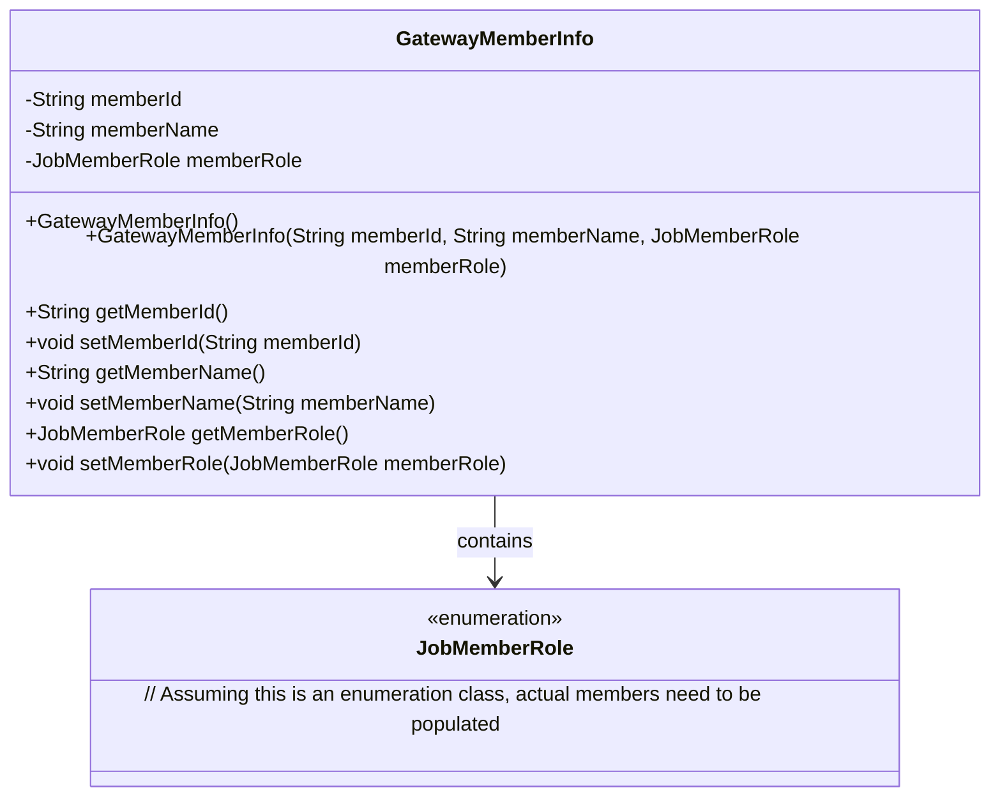
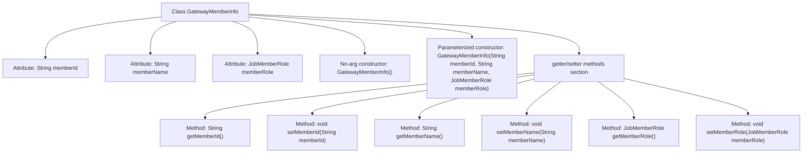

# Basic Information

|      |      |
|------|------|
| Name | GatewayMemberInfo |
| Language | .java |
| Code Path | WeFe/common/java/common-web/src/main/java/com/welab/wefe/common/web/dto/GatewayMemberInfo.java |
| Package Name | com.welab.wefe.common.web.dto |
| Dependencies | ['com.welab.wefe.common.wefe.enums.JobMemberRole'] |
| Brief Description | The GatewayMemberInfo class contains member ID, name, and role attributes, providing a no-argument constructor, a parameterized constructor, as well as corresponding getter and setter methods. |

# Description

The `GatewayMemberInfo` class is used to store member information, including three attributes: member ID, name, and role. This class provides a no-argument constructor to ensure proper deserialization, as well as a parameterized constructor to initialize all attributes. Corresponding getter and setter methods are also provided for each attribute, facilitating access and modification of member information. The member role is represented using the `JobMemberRole` enumeration type.

# Class Summary

| Name   | Type  | Description |
|-------|------|-------------|
| GatewayMemberInfo | class | The GatewayMemberInfo class includes member ID, name, and role, providing both a no-argument constructor and a parameterized constructor, as well as getter and setter methods for each attribute. |

## Class GatewayMemberInfo

|      |      |
|------|------|
| Access Modifier | public |
| Type | class |
| Name | GatewayMemberInfo |
| Description | The GatewayMemberInfo class includes member ID, name, and role, providing both a no-argument constructor and a parameterized constructor, as well as getter and setter methods for each attribute. |

### UML Class Diagram

This code defines a `GatewayMemberInfo` class representing gateway member information, containing three core attributes: member ID, name, and role. The class provides two constructors (an empty one for serialization and a full-parameter one) along with complete getter/setter methods. The class diagram shows its composition relationship with the `JobMemberRole` enumeration, which likely defines member role types (e.g., ADMIN/USER). This is a typical Data Transfer Object (DTO) design suitable for serialized transmission of member information between systems.

### Internal Method Call Graph

This code defines a class named GatewayMemberInfo, which stores basic information of gateway members, including member ID, name, and role. The class contains two constructors (a no-arg constructor for deserialization and a parameterized constructor to initialize all attributes) along with corresponding getter and setter methods. The flowchart clearly illustrates the class structure, showing the hierarchical relationships among attributes, constructors, and getter/setter methods, making it easy to understand the class composition and functionality.

### Field List

| Name  | Type  | Description |
|-------|-------|------|
| memberRole | JobMemberRole | Private member variable of type JobMemberRole, representing the job member role. |
| memberId | String | Define a private string type variable memberId. |
| memberName | String | Private string type variable, storing member name. |

### Method List

| Name  | Type  | Description |
|-------|-------|------|
| setMemberRole | void | This is a Java method used to set the member role attribute. The method accepts a parameter of type JobMemberRole and assigns it to the memberRole field of the current object. |
| setMemberName | void | Define a public method setMemberName that takes a string parameter memberName and assigns it to the member variable of the same name in the current object. |
| setMemberId | void | The method to set the member ID assigns the input parameter memberId to the memberId property of the current object. |
| getMemberRole | JobMemberRole | Method to obtain member roles, returns a JobMemberRole type object. |
| getMemberName | String | This is a Java method that returns the value of the member variable memberName. |
| getMemberId | String | The method returns the member ID string. |

