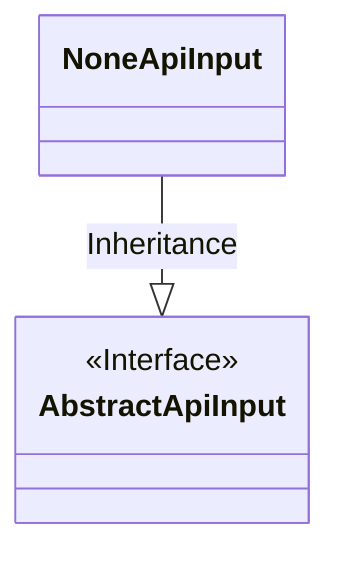
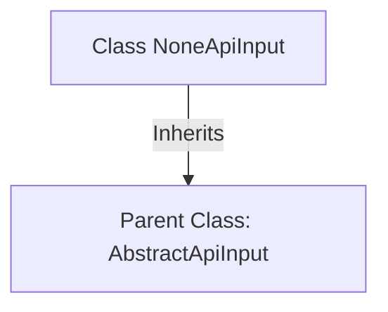

# Basic Information

|      |      |
|------|------|
| Name | NoneApiInput |
| Language | .java |
| Code Path | WeFe/common/java/common-web/src/main/java/com/welab/wefe/common/web/dto/NoneApiInput.java |
| Package Name | com.welab.wefe.common.web.dto |
| Dependencies | [] |
| Brief Description | The `NoneApiInput` class inherits from `AbstractApiInput`, representing no API input. |

# Description

NoneApiInput is a public class that inherits from AbstractApiInput, used to represent scenarios where no API input is provided. This class does not define any additional attributes or methods, and solely indicates its identity as an API input type by inheriting from the base class AbstractApiInput. This design is typically employed in situations requiring type placeholders or default input parameters, maintaining the integrity of the code structure.

# Class Summary

| Name   | Type  | Description |
|-------|------|-------------|
| NoneApiInput | class | The class NoneApiInput inherits from AbstractApiInput with no additional implementations. |

## Class NoneApiInput

|      |      |
|------|------|
| Access Modifier | public |
| Type | class |
| Name | NoneApiInput |
| Description | The class NoneApiInput inherits from AbstractApiInput with no additional implementations. |

### UML Class Diagram

This class diagram illustrates a simple relationship where the NoneApiInput class inherits from the AbstractApiInput interface. AbstractApiInput is marked as an interface (<<Interface>>), while NoneApiInput, as its implementation class, denotes the inheritance relationship through a solid-line hollow triangle arrow. This structure indicates that NoneApiInput must implement all abstract methods defined by AbstractApiInput, making it suitable for scenarios requiring a unified interface but with specialized implementations.

### Internal Method Call Graph

This code illustrates a simple Java class inheritance relationship. The NoneApiInput class inherits from the AbstractApiInput abstract class via the `extends` keyword, indicating it is an empty subclass without implementing any additional methods or properties. Such a structure is typically used to mark specific types of API inputs while reusing the generic functionality of the parent class. The inheritance enables NoneApiInput to automatically acquire all non-private members of AbstractApiInput while maintaining its own logical simplicity.

### Field List

| Name  | Type  | Description |
|-------|-------|------|

### Method List

| Name  | Type  | Description |
|-------|-------|------|

