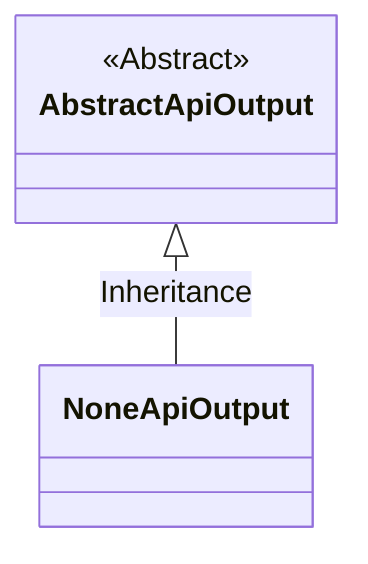
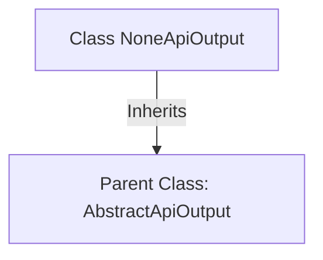

# Basic Information

|      |      |
|------|------|
| Name | NoneApiOutput |
| Language | .java |
| Code Path | WeFe/common/java/common-web/src/main/java/com/welab/wefe/common/web/dto/NoneApiOutput.java |
| Package Name | com.welab.wefe.common.web.dto |
| Dependencies | [] |
| Brief Description | The class NoneApiOutput inherits from AbstractApiOutput with no additional implementations. |

# Description

This is a Java class named NoneApiOutput, which inherits from the AbstractApiOutput class. The class does not define any additional fields or methods and only acquires basic functionality by inheriting from the parent class AbstractApiOutput. This suggests that NoneApiOutput may be used to represent a scenario of empty or no-output API responses.

# Class Summary

| Name   | Type  | Description |
|-------|------|-------------|
| NoneApiOutput | class | The NoneApiOutput class inherits from AbstractApiOutput and is an API output class with no concrete implementation. |

## Class NoneApiOutput

|      |      |
|------|------|
| Access Modifier | public |
| Type | class |
| Name | NoneApiOutput |
| Description | The NoneApiOutput class inherits from AbstractApiOutput and is an API output class with no concrete implementation. |

### UML Class Diagram

This class diagram illustrates a simple relationship where the NoneApiOutput class inherits from the abstract class AbstractApiOutput. AbstractApiOutput is marked as an abstract class (<<Abstract>>), while NoneApiOutput serves as its concrete implementation subclass, with the inheritance relationship represented by a hollow triangle arrow. This design pattern is commonly used in API output processing scenarios, where base functionality is provided by the parent class and specific behaviors are implemented by child classes.

### Internal Method Call Graph

This code demonstrates a simple class inheritance relationship. The NoneApiOutput class inherits from the abstract class AbstractApiOutput, indicating it is a concrete class without additional API output implementations. The diagram clearly presents the inheritance relationship, where NoneApiOutput as the child class points to the parent class AbstractApiOutput via a solid arrow, reflecting the inheritance feature in object-oriented programming. This design might be used to represent a base output type with empty implementation or default behavior.

### Field List

| Name  | Type  | Description |
|-------|-------|------|

### Method List

| Name  | Type  | Description |
|-------|-------|------|

