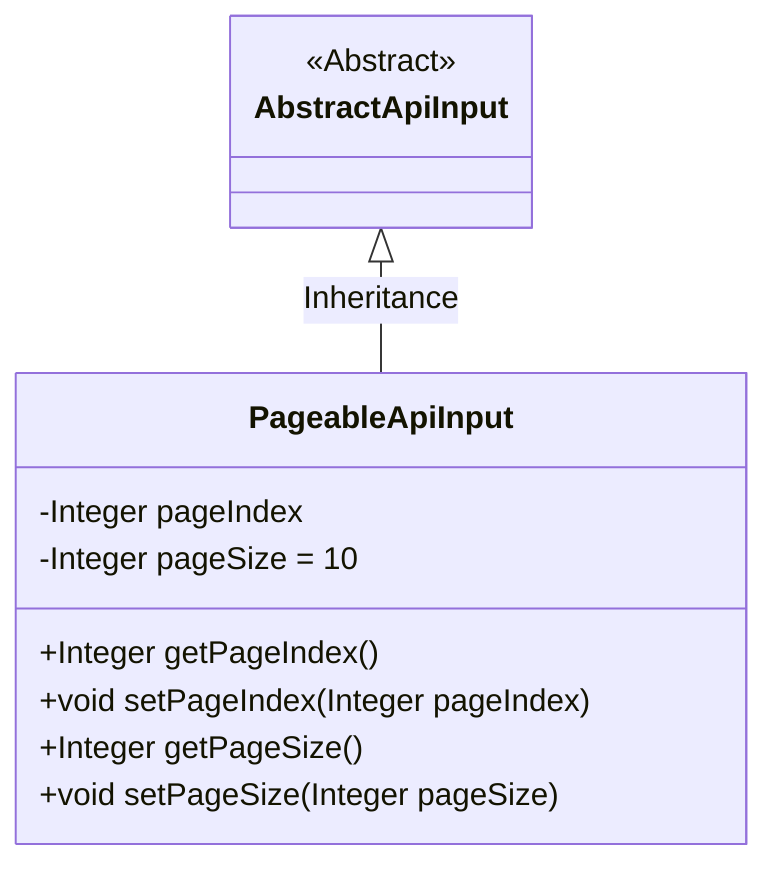
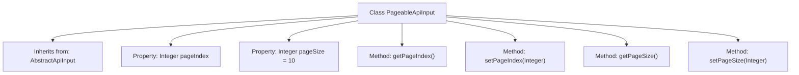

# Basic Information

|      |      |
|------|------|
| Name | PageableApiInput |
| Language | .java |
| Code Path | WeFe/common/java/common-web/src/main/java/com/welab/wefe/common/web/dto/PageableApiInput.java |
| Package Name | com.welab.wefe.common.web.dto |
| Dependencies | [] |
| Brief Description | Pagination API input class, including page number and a default of 10 records per page, with getter and setter methods provided. |

# Description

The PageableApiInput class inherits from AbstractApiInput and is used to handle pagination requests. It contains two integer properties: pageIndex represents the current page number, and pageSize has a default value of 10, indicating the number of records per page. Getter and setter methods are provided to retrieve and set the values of these two properties, respectively.

# Class Summary

| Name   | Type  | Description |
|-------|------|-------------|
| PageableApiInput | class | The PageableApiInput class inherits from AbstractApiInput, containing the pagination index pageIndex and a default value of 10 for pageSize, providing getter and setter methods. |

## Class PageableApiInput

|      |      |
|------|------|
| Access Modifier | public |
| Type | class |
| Name | PageableApiInput |
| Description | The PageableApiInput class inherits from AbstractApiInput, containing the pagination index pageIndex and a default value of 10 for pageSize, providing getter and setter methods. |

### UML Class Diagram

This class diagram illustrates the structure where PageableApiInput inherits from the abstract class AbstractApiInput. The PageableApiInput class contains two private integer attributes, pageIndex and pageSize (with a default value of 10), along with their corresponding getter and setter methods. As a encapsulation class for paginated API input parameters, it inherits the basic API input functionality from AbstractApiInput while extending pagination control capabilities. It is typically used in scenarios requiring parameter encapsulation for backend interfaces with paginated queries.

### Internal Method Call Graph

This code demonstrates a paginated API input class PageableApiInput, which inherits from the base class AbstractApiInput. The class contains two core pagination properties: pageIndex representing the current page number, and pageSize with a default value of 10 indicating the number of records per page. Standard getter and setter methods are provided for property access and modification, complying with JavaBean specifications. This design encapsulates pagination parameters, facilitating unified management of pagination logic in API calls.

### Field List

| Name  | Type  | Description |
|-------|-------|------|
| pageIndex | Integer | The private integer variable pageIndex is used to represent the page number index. |
| pageSize = 10 | Integer | Define an integer variable pageSize with a default value of 10. |

### Method List

| Name  | Type  | Description |
|-------|-------|------|
| setPageIndex | void | This is a Java method used to set the current page number. The method takes an integer parameter pageIndex and assigns it to the class's member variable pageIndex. |
| getPageIndex | Integer | Get the integer value of the current page number. |
| getPageSize | Integer | Get the integer value of pageSize. |
| setPageSize | void | This is a Java method used to set the page size. The method takes an Integer parameter named pageSize and assigns it to the class member variable of the same name. |

