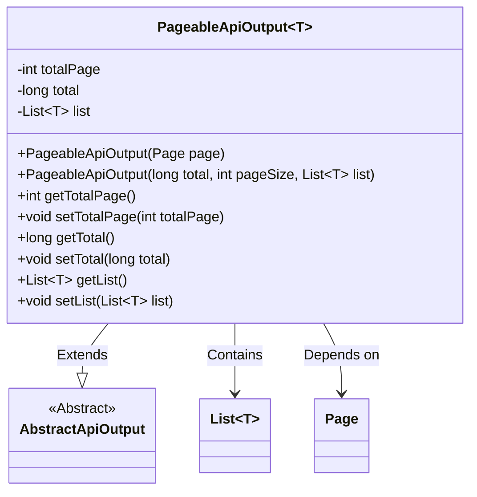
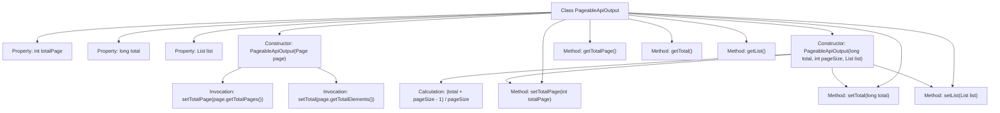

# Basic Information

|      |      |
|------|------|
| Name | PageableApiOutput |
| Language | .java |
| Code Path | WeFe/common/java/common-web/src/main/java/com/welab/wefe/common/web/dto/PageableApiOutput.java |
| Package Name | com.welab.wefe.common.web.dto |
| Dependencies | ['org.springframework.data.domain.Page', 'java.util.List'] |
| Brief Description | Pagination API output class, including total pages, total count, and data list, providing two construction methods. |

# Description

PageableApiOutput is a generic class that inherits from AbstractApiOutput, designed to encapsulate paginated data. It contains three core attributes: `totalPage` represents the total number of pages, `total` indicates the total record count, and `list` stores the data list of the current page. The class provides two constructors—one directly accepts a Page object to automatically calculate pagination information, while the other manually computes the total page count based on the total records, page size, and data list. It also includes getter and setter methods for each attribute, supporting flexible data access and modification.

# Class Summary

| Name   | Type  | Description |
|-------|------|-------------|
| PageableApiOutput | class | Pagination API output class, containing total pages, total count, and data list, supports construction via Page object or direct parameters. |

## Class PageableApiOutput

|      |      |
|------|------|
| Access Modifier | public |
| Type | class |
| Name | PageableApiOutput |
| Description | Pagination API output class, containing total pages, total count, and data list, supports construction via Page object or direct parameters. |

### UML Class Diagram

Class Diagram Description: PageableApiOutput is a generic class that inherits from AbstractApiOutput, designed to handle paginated API output data. It contains three core attributes: totalPage (total pages), total (total records), and list (data list). The class provides two construction methods: one directly accepts a Page object, while the other builds the output using total records, page size, and a data list. Through the generic type T, this class ensures that list elements must inherit from AbstractApiOutput, achieving type-safe encapsulation of paginated data.

### Internal Method Call Graph

This flowchart illustrates the complete structure of the generic class PageableApiOutput, including two constructors and six basic methods. The first constructor initializes pagination data through a Page object, while the second constructor calculates the total pages directly from parameters. All properties are encapsulated and assigned via setter methods, with the second constructor containing special logic for total page calculation. The class inherits from AbstractApiOutput and is used for encapsulating API response data with pagination.

### Field List

| Name  | Type  | Description |
|-------|-------|------|
| list | List<T> | Private generic list variable `list`. |
| total | long | private long total |
| totalPage | int | Private integer variable used to store the total number of pages. |

### Method List

| Name  | Type  | Description |
|-------|-------|------|
| setList | void | This is a Java method used to set the List-type member variable `list` of a class, which accepts a generic List parameter and assigns it to the member variable. |
| getTotal | long | Public method to obtain the total value. |
| setTotal | void | This is a Java method used to set the value of the class member variable `total`. The method accepts a parameter of type `long` named `total` and assigns it to the `total` property of the current object. |
| getTotalPage | int | The method getTotalPage returns the value of totalPage. |
| setTotalPage | void | The method to set the total number of pages assigns the parameter totalPage to the class member variable of the same name. |
| getList | List<T> | Return the list object list. |

