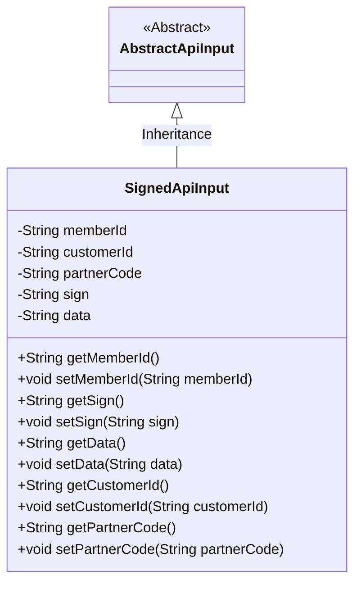

# Basic Information

|      |      |
|------|------|
| Name | SignedApiInput |
| Language | .java |
| Code Path | WeFe/common/java/common-web/src/main/java/com/welab/wefe/common/web/dto/SignedApiInput.java |
| Package Name | com.welab.wefe.common.web.dto |
| Dependencies | [] |
| Brief Description | The SignedApiInput class inherits from AbstractApiInput and includes fields such as memberId, customerId (to be removed later), partnerCode, sign, and data, along with their corresponding getter and setter methods. |

# Description

The `SignedApiInput` class inherits from `AbstractApiInput` and contains five fields: `memberId`, `customerId`, `partnerCode`, `sign`, and `data`. Among them, `memberId` and `customerId` are marked as deprecated fields. Each field has corresponding getter and setter methods for retrieving and setting field values. `partnerCode` represents the partner code, `sign` is used to store signature information, and `data` stores the primary data.

# Class Summary

| Name   | Type  | Description |
|-------|------|-------------|
| SignedApiInput | class | The SignedApiInput class inherits from AbstractApiInput and includes the memberId, customerId (marked for deletion), partnerCode, sign, and data fields along with their corresponding getter/setter methods. |

## Class SignedApiInput

|      |      |
|------|------|
| Access Modifier | public |
| Type | class |
| Name | SignedApiInput |
| Description | The SignedApiInput class inherits from AbstractApiInput and includes the memberId, customerId (marked for deletion), partnerCode, sign, and data fields along with their corresponding getter/setter methods. |

### UML Class Diagram

This code demonstrates a class named SignedApiInput, which inherits from the abstract class AbstractApiInput. The SignedApiInput class contains five private String fields: memberId, customerId (these two fields are marked for deletion), partnerCode, sign, and data, along with public getter and setter methods for each field. This class is primarily used for handling API input data with signatures, where the sign field may be used to verify data integrity, the data field stores actual business data, and partnerCode identifies the partner. The class diagram clearly illustrates the inheritance relationship and the access permissions of all member methods.

### Internal Method Call Graph

```mermaid
graph TD
    A["Class SignedApiInput"]
    B["Inherits from: AbstractApiInput"]
    C["Property: String memberId"]
    D["Property: String customerId"]
    E["Property: String partnerCode"]
    F["Property: String sign"]
    G["Property: String data"]
    H["Method: getMemberId()/setMemberId()"]
    I["Method: getSign()/setSign()"]
    J["Method: getData()/setData()"]
    K["Method: getCustomerId()/setCustomerId()"]
    L["Method: getPartnerCode()/setPartnerCode()"]

    A --> B
    A --> C
    A --> D
    A --> E
    A --> F
    A --> G
    A --> H
    A --> I
    A --> J
    A --> K
    A --> L
```

This code illustrates a class named SignedApiInput, which inherits from the AbstractApiInput class. The class contains five private String properties: memberId, customerId (these two properties are marked for deletion), partnerCode, sign, and data. Corresponding getter and setter methods are provided for each property to enable reading and modification. The class structure is clear, achieving code reuse through inheritance while protecting internal data via encapsulation. All methods are simple property accessors without complex business logic.

### Field List

| Name  | Type  | Description |
|-------|-------|------|
| memberId | String | Member ID string variable |
| customerId | String | The private string-type variable customerId is used to store the customer ID. |
| data | String | Private string type variable data. |
| sign | String | private string variable sign |
| partnerCode | String | Private string type variable partnerCode |

### Method List

| Name  | Type  | Description |
|-------|-------|------|
| getPartnerCode | String | Method to obtain the partner code, returns a partnerCode string. |
| getMemberId | String | Methods to obtain member ID, returns a memberId of string type. |
| getSign | String | Method to obtain the sign string, directly returns the sign value. |
| getData | String | Methods to obtain the data string. |
| setSign | void | Methods for setting signature properties, assigning input parameters to internal variables of the object. |
| setMemberId | void | The method to set the member ID assigns the input parameter to the class's member variable memberId. |
| setPartnerCode | void | The method to set the partner code assigns the input parameter to the member variable partnerCode of the class. |
| setData | void | Set string type data. |
| getCustomerId | String | Methods to obtain the customer ID, returns a string-type customerId. |
| setCustomerId | void | Methods for setting the customer ID, which assigns the passed string parameter to the class's customerId member variable. |

