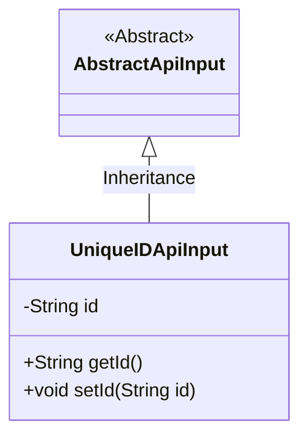
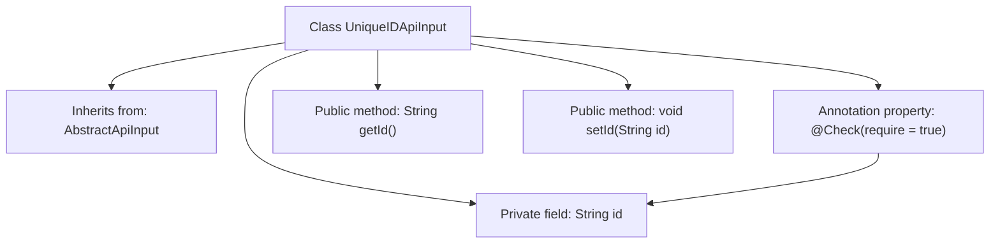

# Basic Information

|      |      |
|------|------|
| Name | UniqueIDApiInput |
| Language | .java |
| Code Path | WeFe/common/java/common-web/src/main/java/com/welab/wefe/common/web/dto/UniqueIDApiInput.java |
| Package Name | com.welab.wefe.common.web.dto |
| Dependencies | ['com.welab.wefe.common.fieldvalidate.annotation.Check'] |
| Brief Description | The UniqueIDApiInput class inherits from AbstractApiInput and includes the required field id along with its getter and setter methods. |

# Description

The content describes a Java class named UniqueIDApiInput, which extends the AbstractApiInput class. This class includes a private String property called id, marked as mandatory with the @Check annotation. It provides two public methods, getId and setId, for retrieving and setting the value of the id property, respectively. This class is primarily used to handle API requests that require unique identifier input.

# Class Summary

| Name   | Type  | Description |
|-------|------|-------------|
| UniqueIDApiInput | class | The UniqueIDApiInput class inherits from AbstractApiInput and includes a mandatory string-type id property along with its getter and setter methods. |

## Class UniqueIDApiInput

|      |      |
|------|------|
| Access Modifier | public |
| Type | class |
| Name | UniqueIDApiInput |
| Description | The UniqueIDApiInput class inherits from AbstractApiInput and includes a mandatory string-type id property along with its getter and setter methods. |

### UML Class Diagram

This class diagram illustrates the inheritance relationship where the UniqueIDApiInput class extends the abstract class AbstractApiInput. The UniqueIDApiInput contains a private String field 'id' along with corresponding public getter and setter methods. The diagram explicitly marks AbstractApiInput as an abstract class (using the <<Abstract>> notation) and represents the inheritance relationship with a solid line featuring a hollow triangular arrow. This design pattern demonstrates encapsulation of API input parameters, enabling code reuse through inheritance while supporting validation and access control for unique ID parameters.

### Internal Method Call Graph

This flowchart illustrates the structure of the UniqueIDApiInput class, which inherits from AbstractApiInput and contains a private field 'id' annotated with @Check, along with corresponding getter and setter methods. The annotation @Check(require=true) enforces that the 'id' property must exist, reflecting the design intent of input validation. The class structure is concise, compliant with JavaBean specifications, exposing property access through methods while maintaining encapsulation.

### Field List

| Name  | Type  | Description |
|-------|-------|------|
| id | String | Required field: String type id. |

### Method List

| Name  | Type  | Description |
|-------|-------|------|
| getId | String | This is a Java method that returns the string-type id attribute value. |
| setId | void | Methods for setting object ID, assigning the parameter id to the object's id property. |

