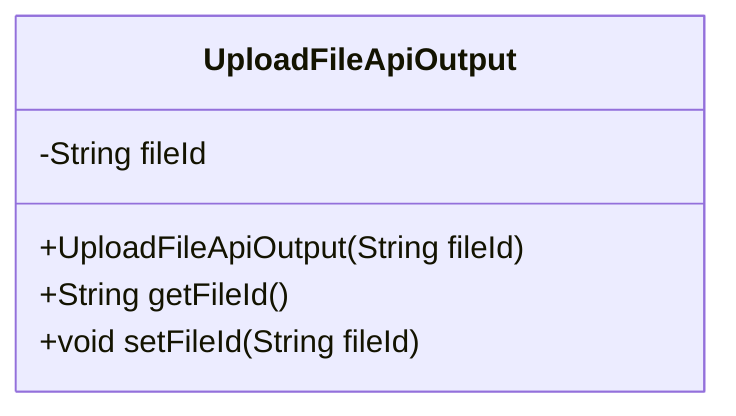
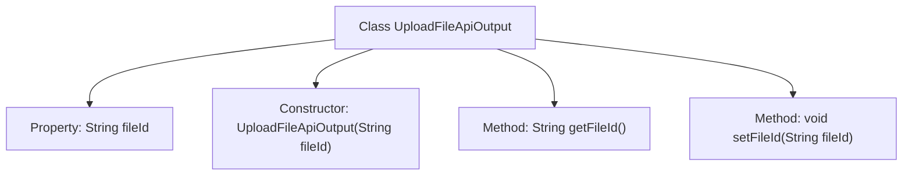

# Basic Information

|      |      |
|------|------|
| Name | UploadFileApiOutput |
| Language | .java |
| Code Path | WeFe/common/java/common-web/src/main/java/com/welab/wefe/common/web/dto/UploadFileApiOutput.java |
| Package Name | com.welab.wefe.common.web.dto |
| Dependencies | [] |
| Brief Description | The UploadFileApiOutput class includes the fileId field along with its constructor, getter, and setter methods. |

# Description

This is a Java class named UploadFileApiOutput, which represents the output result of a file upload API. The class includes a private string attribute fileId, used to store the file identifier. It provides a constructor to initialize fileId, as well as getter and setter methods for accessing and modifying the value of fileId.

# Class Summary

| Name   | Type  | Description |
|-------|------|-------------|
| UploadFileApiOutput | class | File upload API output class, containing file ID attribute and constructor, providing get and set methods. |

## Class UploadFileApiOutput

|      |      |
|------|------|
| Access Modifier | public |
| Type | class |
| Name | UploadFileApiOutput |
| Description | File upload API output class, containing file ID attribute and constructor, providing get and set methods. |

### UML Class Diagram

This class diagram depicts a simple file upload API output class `UploadFileApiOutput`, which contains a private string attribute `fileId` for storing file identifiers. The class provides a constructor to initialize `fileId`, along with standard getter and setter methods for accessing and modifying this attribute. This class is typically used to encapsulate response data returned by the server after file uploads, featuring a simple structure that effectively ensures data encapsulation.

### Internal Method Call Graph

This code defines a class named UploadFileApiOutput, which encapsulates the output results of a file upload API. The class contains a private property fileId representing the file identifier, initialized via the constructor, and provides getFileId() and setFileId() methods for retrieving and setting the fileId value respectively. The flowchart clearly illustrates the class structure, the hierarchical relationship between properties and methods, demonstrating a simple data encapsulation pattern.

### Field List

| Name  | Type  | Description |
|-------|-------|------|
| fileId | String | The private string variable fileId is used to store the file identifier. |

### Method List

| Name  | Type  | Description |
|-------|-------|------|
| getFileId | String | This is a Java method that returns a fileId string. |
| setFileId | void | Methods for setting the file ID: Assign the input parameter `fileId` to the `fileId` property of the current object. |

