# Basic Information

|      |      |
|------|------|
| Name | dto |
| Language | .java |
| Code Path | WeFe/common/java/common-web/src/main/java/com/welab/wefe/common/web/dto |
| Package Name | docs.common.java.common-web.src.main.java.com.welab.wefe.common.web.dto |
| Brief Description | AbstractWithFilesApiInput handles file uploads; AbstractTimedApiOutput contains time attributes; GatewayMemberInfo stores member information; Captcha processes verification codes; NoneApiOutput indicates an empty response; UploadFileApiOutput stores file IDs; PageableApiInput handles pagination; ApiResult encapsulates API responses; UniqueIDApiInput processes unique IDs; AbstractApiOutput serves as the base class for outputs; AbstractApiInput processes inputs; NoneApiInput indicates no input; PageableApiOutput encapsulates paginated data; AbstractSecureBoostInput and AbstractLRInput handle model parameters; AbstractGridSearchParam handles grid search; SignedApiInput processes signed inputs. |

# Description

## Overview  
The core responsibility of this module is to provide a unified framework for API input and output processing in web services, including foundational abstract classes, pagination handling, file uploads, CAPTCHA components, and more. The interface specifications follow a layered design, with base classes such as AbstractApiInput/AbstractApiOutput and derived implementations like PageableApiInput/PageableApiOutput. Key data structures include MultiValueMap (for file storage), Date (timestamps), and the generic ApiResult (response encapsulation). External dependencies involve JSON serialization (e.g., JSONObject), file handling (MultipartFile), and validation frameworks (e.g., @Check annotations). For example, the Captcha class creates CAPTCHAs via the factory method `of()`, resembling the builder pattern.

## Key Business Scenarios  
The module supports typical scenarios such as file uploads (e.g., AbstractWithFilesApiInput for handling MultipartFile), paginated queries (PageableApiInput/Output), and parameter validation (@Check for mandatory fields). The interaction pattern employs chained calls (e.g., ApiResult.success()) and factory methods (e.g., Captcha.of()). Functional completeness is reflected in covering input validation, data encapsulation, and exception handling, such as SignedApiInput implementing signature verification via the `sign` field. Typical applications include gateway communication (GatewayMemberInfo for storing member information) and machine learning parameter configuration (AbstractSecureBoostInput for defining tree parameters). API types encompass basic CRUD (UniqueIDApiInput), file operations (UploadFileApiOutput), and placeholder for empty parameters (NoneApiInput/Output).

### Package Internal Structure View

```mermaid
graph TD
    dto --> AbstractWithFilesApiInput.java
    dto --> AbstractTimedApiOutput.java
    dto --> GatewayMemberInfo.java
    dto --> Captcha.java
    dto --> NoneApiOutput.java
    dto --> UploadFileApiOutput.java
    dto --> PageableApiInput.java
    dto --> ApiResult.java
    dto --> UniqueIDApiInput.java
    dto --> AbstractApiOutput.java
    dto --> AbstractApiInput.java
    dto --> NoneApiInput.java
    dto --> PageableApiOutput.java
    dto --> AbstractSecureBoostInput.java
    dto --> AbstractLRInput.java
    dto --> AbstractGridSearchParam.java
    dto --> SignedApiInput.java
```

This flowchart illustrates the directory structure of the dto package under the common-web module in the WeFe project, comprising 18 Java class files. These files primarily involve data transfer objects for web service inputs and outputs, covering core functional components such as API parameters, result encapsulation, file uploads, pagination handling, etc., forming a complete DTO layer structure. All files are directly subordinate to the dto node with no secondary directory hierarchy.

# File List

| Name   | Type  | Description |
|-------|------|-------------|
| [AbstractWithFilesApiInput.java](AbstractWithFilesApiInput.md) | file | The AbstractWithFilesApiInput class extends AbstractApiInput, containing a file mapping field named files and a method getFirstFile to retrieve the first file. |
| [AbstractTimedApiOutput.java](AbstractTimedApiOutput.md) | file | The `AbstractTimedApiOutput` class extends `AbstractApiOutput` and includes creation time and update time attributes along with their getter and setter methods. |
| [GatewayMemberInfo.java](GatewayMemberInfo.md) | file | The `GatewayMemberInfo` class includes member ID, name, and role attributes, providing a no-argument constructor, a parameterized constructor, and corresponding getter and setter methods. |
| [Captcha.java](Captcha.md) | file | The Captcha class includes attributes such as key, code, and image, providing getter/setter methods and a static factory method `of` for creating instances. |
| [NoneApiOutput.java](NoneApiOutput.md) | file | The class NoneApiOutput inherits from AbstractApiOutput with no additional implementations. |
| [UploadFileApiOutput.java](UploadFileApiOutput.md) | file | The UploadFileApiOutput class includes the fileId field along with its constructor, getter, and setter methods. |
| [PageableApiInput.java](PageableApiInput.md) | file | Pagination API input class, containing page number and a default of 10 records per page, providing getter and setter methods. |
| [ApiResult.java](ApiResult.md) | file | ApiResult is a universal API response class that includes status codes, messages, data, time consumption, and HTTP status codes, providing success/error construction methods, log output, and status judgment functionality. |
| [UniqueIDApiInput.java](UniqueIDApiInput.md) | file | The UniqueIDApiInput class extends AbstractApiInput and includes a required field id along with its getter and setter methods. |
| [AbstractApiOutput.java](AbstractApiOutput.md) | file | Abstract API output base class, with no concrete implementation. |
| [AbstractApiInput.java](AbstractApiInput.md) | file | The `AbstractApiInput` class inherits from `AbstractCheckModel`, containing debug time consumption, original request parameters, request method and object, as well as gateway caller information, providing gateway request judgment and cloning methods. |
| [NoneApiInput.java](NoneApiInput.md) | file | The `NoneApiInput` class inherits from `AbstractApiInput`, representing no API input. |
| [PageableApiOutput.java](PageableApiOutput.md) | file | Pagination API output class, containing total pages, total count, and data list, providing two construction methods. |
| [AbstractSecureBoostInput.java](AbstractSecureBoostInput.md) | file | The `AbstractSecureBoostInput` class includes tree parameters, objective parameters, cross-validation parameters, and grid search parameters for configuring the training of a secure enhanced XGBoost model. |
| [AbstractLRInput.java](AbstractLRInput.md) | file | The `AbstractLRInput` class inherits from `AbstractCheckModel` and includes mandatory parameters `initParam`, `cvParam`, and `gridSearchParam`. `initParam` contains the initialization method and bias coefficient settings; `cvParam` defines cross-validation parameters; `gridSearchParam` includes grid search parameters such as batch size and iteration count. |
| [AbstractGridSearchParam.java](AbstractGridSearchParam.md) | file | The abstract class AbstractGridSearchParam inherits from AbstractCheckModel, containing the attribute needGridSearch and the method toKernelParam, which converts to the JSON structure required by the kernel, removes null-value items, and retains the parameter list. It provides getter/setter methods. |
| [SignedApiInput.java](SignedApiInput.md) | file | The SignedApiInput class extends AbstractApiInput and includes fields such as memberId, customerId (to be removed later), partnerCode, sign, and data, along with their corresponding getter/setter methods. |

