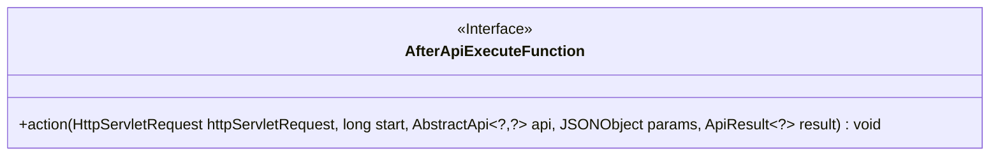
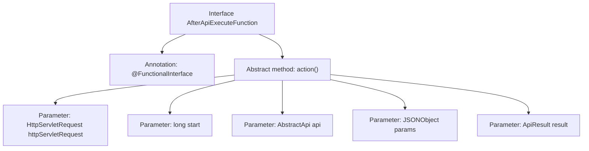

# Basic Information

|      |      |
|------|------|
| Name | AfterApiExecuteFunction |
| Language | .java |
| Code Path | WeFe/common/java/common-web/src/main/java/com/welab/wefe/common/web/function/AfterApiExecuteFunction.java |
| Package Name | com.welab.wefe.common.web.function |
| Dependencies | ['com.alibaba.fastjson.JSONObject', 'com.welab.wefe.common.web.api.base.AbstractApi', 'com.welab.wefe.common.web.dto.ApiResult', 'javax.servlet.http.HttpServletRequest'] |
| Brief Description | This is a functional interface that defines the callback method after API execution, with parameters including the request object, start time, API instance, parameters, and result. |

# Description

This is a functional interface named AfterApiExecuteFunction, marked with the @FunctionalInterface annotation. The interface defines an action method used to perform specific operations after API execution. The method parameters include an HttpServletRequest object, a start timestamp, an api object of type AbstractApi, parameters of type JSONObject, and a result of type ApiResult. This interface is primarily used to handle callback logic after API execution.

# Class Summary

| Name   | Type  | Description |
|-------|------|-------------|
| AfterApiExecuteFunction | interface | This is a functional interface that defines a callback method after API execution, accepting the request, start time, API instance, parameters, and result as arguments. |

## Class AfterApiExecuteFunction

|      |      |
|------|------|
| Access Modifier | @FunctionalInterface;public |
| Type | interface |
| Name | AfterApiExecuteFunction |
| Description | This is a functional interface that defines a callback method after API execution, accepting the request, start time, API instance, parameters, and result as arguments. |

### UML Class Diagram

This code defines a functional interface `AfterApiExecuteFunction`, which contains an abstract method `action` for performing specific operations after API execution. The method takes an HTTP request object, start timestamp, API instance, parameter object, and API result as parameters. The interface is marked with the `@FunctionalInterface` annotation, indicating it is a functional interface that can be used with lambda expressions or method references.

### Internal Method Call Graph

This code defines a functional interface AfterApiExecuteFunction, which contains an abstract method action() for performing specific operations after API execution. The method accepts five parameters: an HTTP request object, a start timestamp, an API instance, JSON-formatted parameters, and an API result object. The @FunctionalInterface annotation indicates this is a functional interface that can only contain one abstract method, making it suitable for Lambda expressions or method reference scenarios.

### Field List

| Name  | Type  | Description |
|-------|-------|------|

### Method List

| Name  | Type  | Description |
|-------|-------|------|
| action | void | The action method for handling HTTP requests includes parameters such as the request object, start time, API instance, JSON parameters, and result object. |

