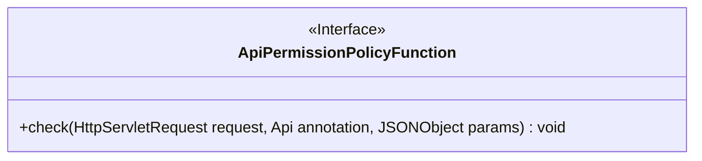
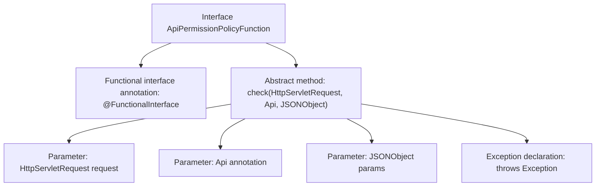

# Basic Information

|      |      |
|------|------|
| Name | ApiPermissionPolicyFunction |
| Language | .java |
| Code Path | WeFe/common/java/common-web/src/main/java/com/welab/wefe/common/web/function/ApiPermissionPolicyFunction.java |
| Package Name | com.welab.wefe.common.web.function |
| Dependencies | ['javax.servlet.http.HttpServletRequest', 'com.alibaba.fastjson.JSONObject', 'com.welab.wefe.common.web.api.base.Api'] |
| Brief Description | This is a functional interface that defines a method for checking API permissions, which takes the request, API annotation, and parameters as inputs and may throw an exception. |

# Description

This is a functional interface named ApiPermissionPolicyFunction, annotated with @FunctionalInterface. The interface defines a check method that takes an HttpServletRequest request object, an Api annotation, and a JSONObject parameter as input, and may throw exceptions. This method is used to implement API permission checking logic and has no return value.

# Class Summary

| Name   | Type  | Description |
|-------|------|-------------|
| ApiPermissionPolicyFunction | interface | Java functional interface, defining a method to check API permissions with parameters including request, API annotation, and JSON parameters, which may throw exceptions. |

## Class ApiPermissionPolicyFunction

|      |      |
|------|------|
| Access Modifier | @FunctionalInterface;public |
| Type | interface |
| Name | ApiPermissionPolicyFunction |
| Description | Java functional interface, defining a method to check API permissions with parameters including request, API annotation, and JSON parameters, which may throw exceptions. |

### UML Class Diagram

This code defines a functional interface named `ApiPermissionPolicyFunction`, marked with the `@FunctionalInterface` annotation. The interface contains an abstract method `check` that takes `HttpServletRequest`, `Api` annotation, and `JSONObject` parameters, returns no value but may throw exceptions. Designed for implementing API permission validation strategies, the interface passes request context, API metadata, and JSON parameters to concrete implementation classes for authorization checks.

### Internal Method Call Graph

This flowchart illustrates the structure of the ApiPermissionPolicyFunction interface, which is a functional interface marked with @FunctionalInterface. Its core is the check method definition. The method accepts three parameters: an HttpServletRequest request object, an Api annotation object, and a JSONObject parameters object, and may throw an Exception. Being a functional interface, it implicitly enforces the constraint of having only one abstract method, making it suitable for lambda expressions or method reference scenarios.

### Field List

| Name  | Type  | Description |
|-------|-------|------|

### Method List

| Name  | Type  | Description |
|-------|-------|------|
| check | void | Check HTTP requests, API annotations, and JSON parameters, which may throw exceptions. |

