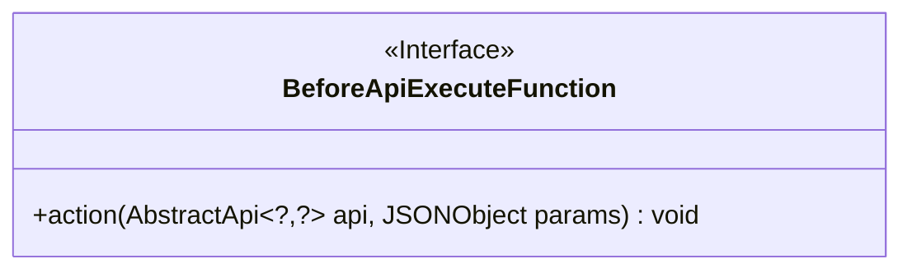
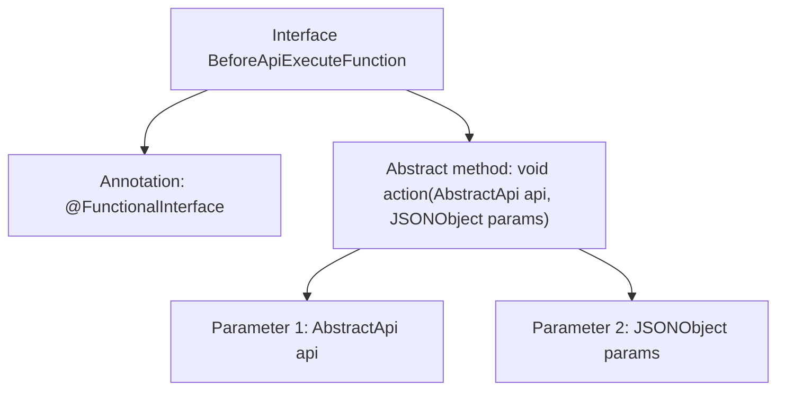

# Basic Information

|      |      |
|------|------|
| Name | BeforeApiExecuteFunction |
| Language | .java |
| Code Path | WeFe/common/java/common-web/src/main/java/com/welab/wefe/common/web/function/BeforeApiExecuteFunction.java |
| Package Name | com.welab.wefe.common.web.function |
| Dependencies | ['com.alibaba.fastjson.JSONObject', 'com.welab.wefe.common.web.api.base.AbstractApi'] |
| Brief Description | This is a functional interface BeforeApiExecuteFunction, which defines an action method used to process the API instance and parameters before API execution. |

# Description

This is a functional interface named BeforeApiExecuteFunction, marked with the @FunctionalInterface annotation. The interface defines an abstract method called action, which accepts two parameters: an api object of type AbstractApi<?, ?> and a params object of type JSONObject. The method has a return type of void, indicating that it performs an operation without returning a result. The interface is designed to perform certain operations before API execution, with parameter types using generics and JSON objects to provide flexibility.

# Class Summary

| Name   | Type  | Description |
|-------|------|-------------|
| BeforeApiExecuteFunction | interface | Java functional interface BeforeApiExecuteFunction, defining the action method that accepts AbstractApi and JSONObject parameters with no return value. |

## Class BeforeApiExecuteFunction

|      |      |
|------|------|
| Access Modifier | @FunctionalInterface;public |
| Type | interface |
| Name | BeforeApiExecuteFunction |
| Description | Java functional interface BeforeApiExecuteFunction, defining the action method that accepts AbstractApi and JSONObject parameters with no return value. |

### UML Class Diagram

This code defines a functional interface `BeforeApiExecuteFunction`, which contains an abstract method `action` used to perform certain operations before API execution. The interface employs generic parameters `AbstractApi<?,?>` to indicate it can accept API objects of any type, along with a JSONObject as a parameter. As a functional interface, it is suitable for implementing callback or interceptor patterns, typically serving as a pre-processor in API invocation chains.

### Internal Method Call Graph

This flowchart illustrates the structure of a functional interface `BeforeApiExecuteFunction`. The top is marked with the `@FunctionalInterface` annotation, indicating it's a functional interface. The core part is an abstract method named `action`, which takes two parameters: a generic `AbstractApi` object and a `JSONObject` parameter. Being a functional interface, it can contain only this single abstract method, making it suitable for Lambda expressions or method reference scenarios.

### Field List

| Name  | Type  | Description |
|-------|-------|------|

### Method List

| Name  | Type  | Description |
|-------|-------|------|
| action | void | Abstract API operation methods that accept API objects of any type and JSON parameters. |

