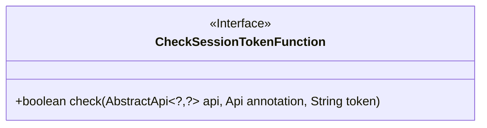
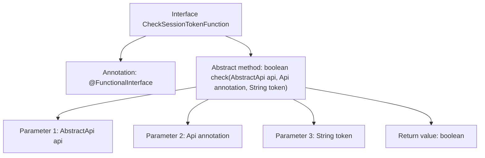

# Basic Information

|      |      |
|------|------|
| Name | CheckSessionTokenFunction |
| Language | .java |
| Code Path | WeFe/common/java/common-web/src/main/java/com/welab/wefe/common/web/function/CheckSessionTokenFunction.java |
| Package Name | com.welab.wefe.common.web.function |
| Dependencies | ['com.welab.wefe.common.web.api.base.AbstractApi', 'com.welab.wefe.common.web.api.base.Api'] |
| Brief Description | Java functional interface CheckSessionTokenFunction, defining the check method for validating API session tokens, with parameters including the API instance, annotation, and token string, returning a boolean value. |

# Description

This is a functional interface named CheckSessionTokenFunction, designed to verify the validity of session tokens. The interface contains an abstract method `check`, which accepts three parameters: an `AbstractApi`-type api object, an `Api`-type annotation object, and a string `token` representing an identity identifier. The method returns a boolean value indicating the verification result. The interface is annotated with `@FunctionalInterface`, signifying it is a functional interface with only one abstract method. The comments briefly explain the purpose of the parameters, noting that the `token` parameter is used for identity verification. The interface is designed concisely, focusing solely on token validation functionality.

# Class Summary

| Name   | Type  | Description |
|-------|------|-------------|
| CheckSessionTokenFunction | interface | The functional interface CheckSessionTokenFunction defines a method for checking session tokens, which takes an API instance, annotation, and token parameters as input and returns a boolean value. |

## Class CheckSessionTokenFunction

|      |      |
|------|------|
| Access Modifier | @FunctionalInterface;public |
| Type | interface |
| Name | CheckSessionTokenFunction |
| Description | The functional interface CheckSessionTokenFunction defines a method for checking session tokens, which takes an API instance, annotation, and token parameters as input and returns a boolean value. |

### UML Class Diagram

This code defines a functional interface `CheckSessionTokenFunction`, which contains an abstract method `check` for validating session tokens. The method accepts three parameters: a generic `AbstractApi` instance, an `Api` annotation object, and a string-type token, returning a boolean value indicating the validation result. The interface is marked with the `@FunctionalInterface` annotation, signifying it is a functional interface suitable for Lambda expressions or method reference scenarios. The class diagram clearly illustrates the interface's structure and the signature of its single abstract method.

### Internal Method Call Graph

This code defines a functional interface CheckSessionTokenFunction, marked with the @FunctionalInterface annotation, indicating the interface can only contain one abstract method. The core functionality of the interface is to validate session tokens through the check method, which accepts three parameters: a generic abstract API object, an API annotation, and a token string, returning a boolean validation result. This design is commonly used in scenarios requiring dynamic injection of token validation logic, such as API gateways or permission control layers.

### Field List

| Name  | Type  | Description |
|-------|-------|------|

### Method List

| Name  | Type  | Description |
|-------|-------|------|
| check | boolean | Check if the API matches the annotations and verify the token validity. |

