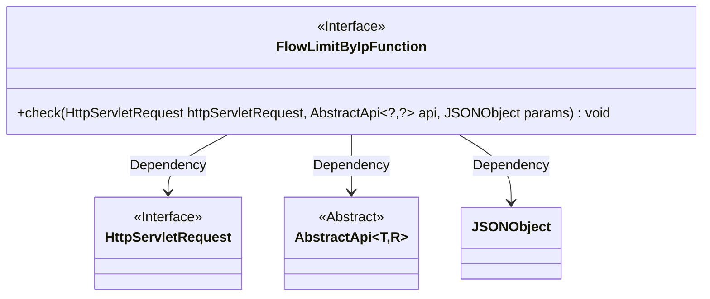
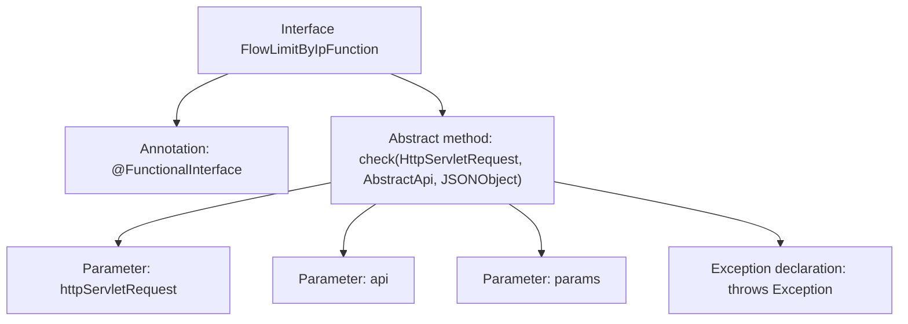

# Basic Information

|      |      |
|------|------|
| Name | FlowLimitByIpFunction |
| Language | .java |
| Code Path | WeFe/common/java/common-web/src/main/java/com/welab/wefe/common/web/function/FlowLimitByIpFunction.java |
| Package Name | com.welab.wefe.common.web.function |
| Dependencies | ['com.alibaba.fastjson.JSONObject', 'com.welab.wefe.common.web.api.base.AbstractApi', 'javax.servlet.http.HttpServletRequest'] |
| Brief Description | The `FlowLimitByIpFunction` is a functional interface that defines the `check` method for IP flow limiting checks, with parameters including the request, API, and JSON parameters, and may throw exceptions. |

# Description

This is a functional interface named FlowLimitByIpFunction, marked with the @FunctionalInterface annotation. It defines a check method that takes three parameters: an HttpServletRequest object, a generic AbstractApi object, and a JSONObject object. The method is used for checking logic, potentially involving IP-based flow limiting, and may throw exceptions during execution. The interface is designed concisely, focusing on a single responsibility, and is suitable for implementation via Lambda expressions.

# Class Summary

| Name   | Type  | Description |
|-------|------|-------------|
| FlowLimitByIpFunction | interface | Java functional interface FlowLimitByIpFunction, defining the check method for IP-based traffic limit checking, with parameters including HttpServletRequest, AbstractApi, and JSONObject, which may throw exceptions. |

## Class FlowLimitByIpFunction

|      |      |
|------|------|
| Access Modifier | @FunctionalInterface;public |
| Type | interface |
| Name | FlowLimitByIpFunction |
| Description | Java functional interface FlowLimitByIpFunction, defining the check method for IP-based traffic limit checking, with parameters including HttpServletRequest, AbstractApi, and JSONObject, which may throw exceptions. |

### UML Class Diagram

This class diagram illustrates a functional interface `FlowLimitByIpFunction` and its dependencies. The interface defines a single abstract method `check()`, which takes `HttpServletRequest`, a generic abstract class `AbstractApi`, and `JSONObject` as parameters. Here, `HttpServletRequest` is an interface from the Servlet specification, `AbstractApi` uses generic parameters to represent request/response types, and `JSONObject` handles JSON data. The overall design embodies the core contract of IP-based flow checking functionality.

### Internal Method Call Graph

This flowchart illustrates the structure of the FlowLimitByIpFunction interface, which is a functional interface (annotated with @FunctionalInterface). Its core is the check method definition. The method accepts three parameters: an HttpServletRequest object, a generic AbstractApi object, and a JSONObject parameter, and may throw an Exception. The diagram clearly shows the hierarchical relationships between the interface's annotation, method signature, parameter list, and exception declaration, conforming to the single abstract method characteristic of functional interfaces.

### Field List

| Name  | Type  | Description |
|-------|-------|------|

### Method List

| Name  | Type  | Description |
|-------|-------|------|
| check | void | Methods for inspecting HTTP requests, API objects, and JSON parameters, which may throw exceptions. |

