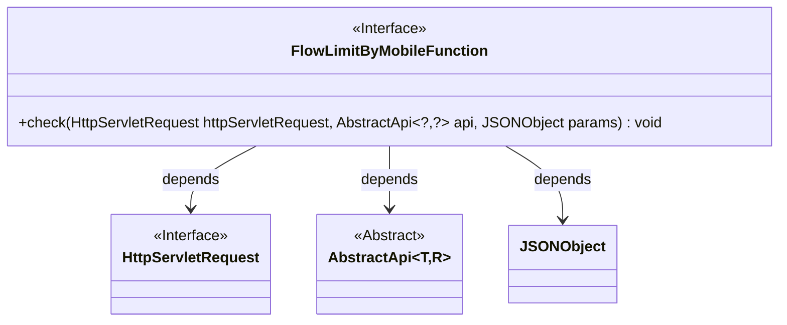
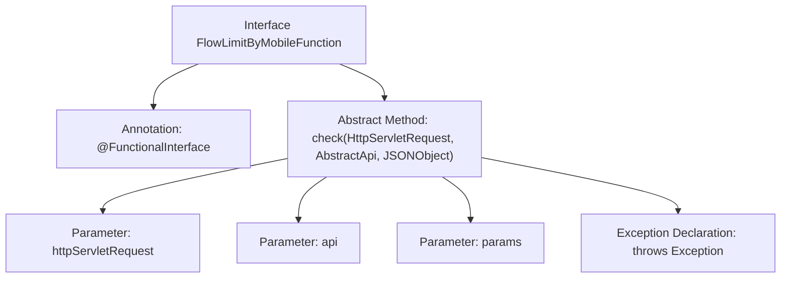

# Basic Information

|      |      |
|------|------|
| Name | FlowLimitByMobileFunction |
| Language | .java |
| Code Path | WeFe/common/java/common-web/src/main/java/com/welab/wefe/common/web/function/FlowLimitByMobileFunction.java |
| Package Name | com.welab.wefe.common.web.function |
| Dependencies | ['com.alibaba.fastjson.JSONObject', 'com.welab.wefe.common.web.api.base.AbstractApi', 'javax.servlet.http.HttpServletRequest'] |
| Brief Description | This is a functional interface designed for rate limiting checks via mobile numbers, which accepts requests, APIs, and parameters, and may throw exceptions. |

# Description

This is a functional interface named FlowLimitByMobileFunction, marked with the @FunctionalInterface annotation. The interface defines a check method that takes three parameters: an HttpServletRequest-type httpServletRequest, an AbstractApi<?, ?>-type api, and a JSONObject-type params. The method may throw an Exception. This interface is primarily used for mobile device-based flow restriction checking functionality.

# Class Summary

| Name   | Type  | Description |
|-------|------|-------------|
| FlowLimitByMobileFunction | interface | This is a functional interface that defines a phone number-based rate limiting check method, which accepts request objects, API, and parameters, and may throw exceptions. |

## Class FlowLimitByMobileFunction

|      |      |
|------|------|
| Access Modifier | @FunctionalInterface;public |
| Type | interface |
| Name | FlowLimitByMobileFunction |
| Description | This is a functional interface that defines a phone number-based rate limiting check method, which accepts request objects, API, and parameters, and may throw exceptions. |

### UML Class Diagram

This diagram illustrates a functional interface `FlowLimitByMobileFunction` and its dependencies. The interface defines a `check` method that accepts parameters of type `HttpServletRequest`, generic abstract class `AbstractApi`, and `JSONObject`. Both `HttpServletRequest` and `AbstractApi` are interfaces/abstract classes, marked with special notations. The arrows indicate a unidirectional dependency relationship from `FlowLimitByMobileFunction` to these three classes, used for method parameter passing.

### Internal Method Call Graph

This flowchart illustrates the structure of a functional interface `FlowLimitByMobileFunction`, which includes the `@FunctionalInterface` annotation and a single abstract method `check`. The method accepts three parameters: a `HttpServletRequest` request object, a generic `AbstractApi` interface object, and a `JSONObject` parameter object, while declaring that it may throw an `Exception`. Designed for mobile traffic restriction validation scenarios, this interface complies with functional programming specifications.

### Field List

| Name  | Type  | Description |
|-------|-------|------|

### Method List

| Name  | Type  | Description |
|-------|-------|------|
| check | void | Methods for inspecting HTTP requests, API objects, and JSON parameters, which may throw exceptions. |

