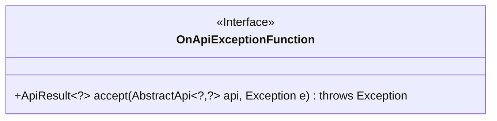
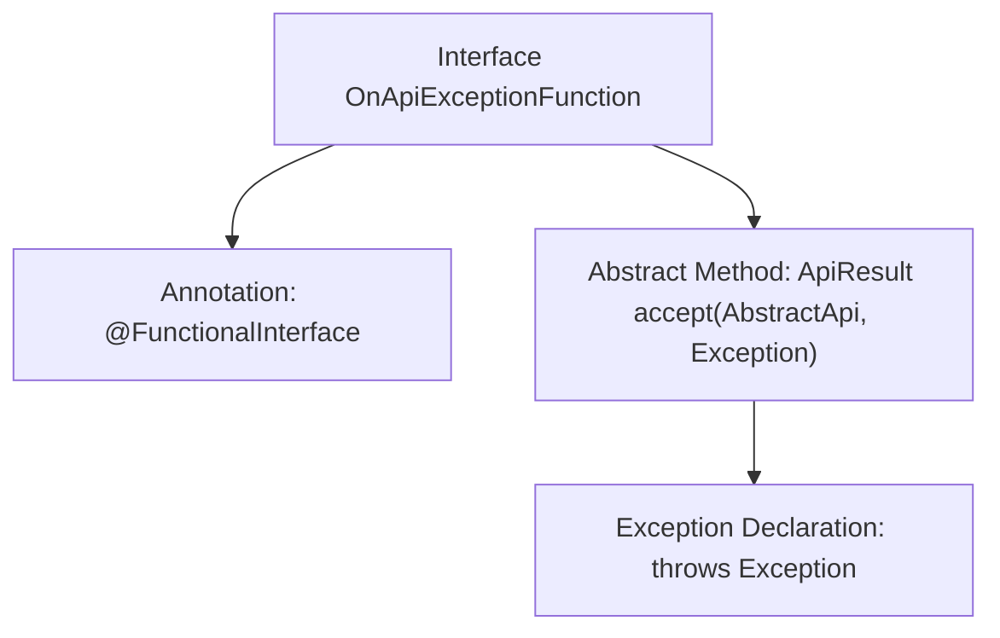

# Basic Information

|      |      |
|------|------|
| Name | OnApiExceptionFunction |
| Language | .java |
| Code Path | WeFe/common/java/common-web/src/main/java/com/welab/wefe/common/web/function/OnApiExceptionFunction.java |
| Package Name | com.welab.wefe.common.web.function |
| Dependencies | ['com.welab.wefe.common.web.api.base.AbstractApi', 'com.welab.wefe.common.web.dto.ApiResult'] |
| Brief Description | Functional interface, defines an exception handling function, accepts an API and an exception, returns a result or throws an exception. |

# Description

This is a functional interface named OnApiExceptionFunction, designed to handle API exception scenarios. It defines an accept method that takes two parameters: an AbstractApi-type api object and an Exception-type exception object. The method returns a generic ApiResult object and may throw an Exception. The interface is annotated with @FunctionalInterface, indicating it can serve as the target for lambda expressions or method references. Its primary purpose is to provide a unified exception handling mechanism when API calls encounter exceptions.

# Class Summary

| Name   | Type  | Description |
|-------|------|-------------|
| OnApiExceptionFunction | interface | The functional interface OnApiExceptionFunction defines the exception handling method, which takes api and exception parameters and returns an ApiResult or throws an exception. |

## Class OnApiExceptionFunction

|      |      |
|------|------|
| Access Modifier | @FunctionalInterface;public |
| Type | interface |
| Name | OnApiExceptionFunction |
| Description | The functional interface OnApiExceptionFunction defines the exception handling method, which takes api and exception parameters and returns an ApiResult or throws an exception. |

### UML Class Diagram

This code defines a functional interface named `OnApiExceptionFunction`, marked with the `@FunctionalInterface` annotation. The interface contains an abstract method `accept`, which takes a generic `AbstractApi` object and an `Exception` object as parameters, returns a generic `ApiResult` object, and may throw an exception. The interface is designed to handle API exception scenarios, providing type flexibility through generic parameters (`?` denotes unknown types). The class diagram clearly illustrates the interface structure and method signature details.

### Internal Method Call Graph

This flowchart illustrates the structure of the OnApiExceptionFunction interface, which is a functional interface (annotated with @FunctionalInterface) containing an abstract accept method. The method takes an AbstractApi generic object and an Exception parameter, returns an ApiResult generic result, and declares that it may throw an Exception. The entire design is used to uniformly handle exception scenarios during API calls, enabling flexible error handling logic through functional programming.

### Field List

| Name  | Type  | Description |
|-------|-------|------|

### Method List

| Name  | Type  | Description |
|-------|-------|------|
| accept | ApiResult<?> | Interface method: Accepts API and exception parameters, returns a generic result, and may throw exceptions. |

