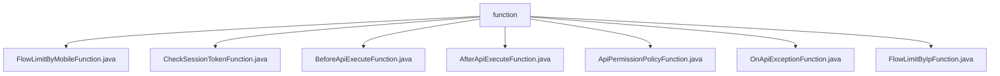

# Basic Information

|      |      |
|------|------|
| Name | function |
| Language | .java |
| Code Path | WeFe/common/java/common-web/src/main/java/com/welab/wefe/common/web/function |
| Package Name | docs.common.java.common-web.src.main.java.com.welab.wefe.common.web.function |
| Brief Description | The FlowLimitByMobileFunction checks mobile device traffic limits. The CheckSessionTokenFunction verifies the validity of session tokens. The BeforeApiExecuteFunction performs operations before API execution. The AfterApiExecuteFunction handles post-API execution callbacks. The ApiPermissionPolicyFunction checks API permissions. The OnApiExceptionFunction handles API exceptions. The FlowLimitByIpFunction checks IP traffic limits. |

# Description

## Overview  
The core responsibility of this module is to provide various Hook functions during Web API execution, similar to a middleware mechanism, covering aspects such as permission validation, flow control, and exception handling. The interface specifications uniformly adopt functional interface design, all annotated with `@FunctionalInterface`, and include single methods like `check`, `action`, and `accept`, with parameters often combining `HttpServletRequest`, `AbstractApi`, and `JSONObject`. Key data structures include `ApiResult` (for exception handling returns), `Api` annotation (for permission metadata), and `JSONObject` (as a parameter container). External dependencies are limited to the Servlet API and JSON library. For example, `FlowLimitByIpFunction` implements IP-based flow limiting, while `OnApiExceptionFunction` uniformly captures exceptions.  

## Main Business Scenarios  
The module supports full lifecycle management of APIs, forming a complete chain of "validation-pre-execution-post-execution-exception" handling. Typical scenarios include first verifying tokens via `CheckSessionTokenFunction`, then preprocessing parameters with `BeforeApiExecuteFunction`, and finally logging via `AfterApiExecuteFunction`. The interaction mode resembles a responsibility chain, with each function being pluggable and combinable. For example, `ApiPermissionPolicyFunction` implements RBAC-based permission control, while `FlowLimitByMobileFunction` performs device-level flow limiting. Integration examples include dual-dimensional flow control for IP and mobile devices (`FlowLimitByIpFunction` + `FlowLimitByMobileFunction`) and returning user-friendly errors during exceptions (`OnApiExceptionFunction`).

### Package Internal Structure View

This flowchart illustrates the structural relationships of the function directory within the common-web module of the WeFe project. The root node "function" contains seven direct child nodes, all of which are Java class files implementing different functional interfaces, including flow control, session validation, pre/post API execution processing, permission policies, and exception handling. All class files reside at the same hierarchical level with no nested subdirectory structures, reflecting a flat design characteristic of functional programming interfaces.

# File List

| Name   | Type  | Description |
|-------|------|-------------|
| [FlowLimitByMobileFunction.java](FlowLimitByMobileFunction.md) | file | This is a functional interface for performing rate limit checks via mobile numbers, which accepts requests, APIs, and parameters, and may throw exceptions. |
| [CheckSessionTokenFunction.java](CheckSessionTokenFunction.md) | file | Java functional interface CheckSessionTokenFunction, defining the check method for validating API session tokens, with parameters including an API instance, annotation, and token string, returning a boolean value. |
| [BeforeApiExecuteFunction.java](BeforeApiExecuteFunction.md) | file | This is a functional interface BeforeApiExecuteFunction, which defines an action method used to process API instances and parameters before API execution. |
| [AfterApiExecuteFunction.java](AfterApiExecuteFunction.md) | file | This is a functional interface that defines the callback method after API execution, with parameters including the request object, start time, API instance, parameters, and result. |
| [ApiPermissionPolicyFunction.java](ApiPermissionPolicyFunction.md) | file | This is a functional interface that defines a method for checking API permissions, which takes the request, API annotation, and parameters as input, and may throw an exception. |
| [OnApiExceptionFunction.java](OnApiExceptionFunction.md) | file | Functional interface, defining an exception handling function, which takes an API and an exception, then returns a result or throws an exception. |
| [FlowLimitByIpFunction.java](FlowLimitByIpFunction.md) | file | The FlowLimitByIpFunction is a functional interface that defines the check method for IP-based rate limiting, with parameters including the request, API, and JSON parameters, and may throw exceptions. |

