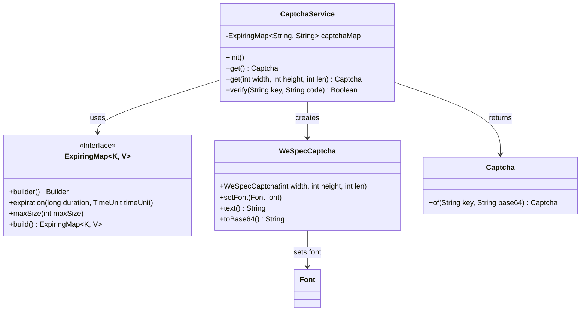
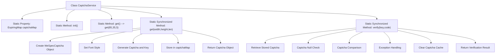

# Basic Information

|      |      |
|------|------|
| Name | CaptchaService |
| Language | .java |
| Code Path | WeFe/common/java/common-web/src/main/java/com/welab/wefe/common/web/service/CaptchaService.java |
| Package Name | com.welab.wefe.common.web.service |
| Dependencies | ['com.welab.wefe.common.WeSpecCaptcha', 'com.welab.wefe.common.web.dto.Captcha', 'net.jodah.expiringmap.ExpiringMap', 'org.slf4j.Logger', 'org.slf4j.LoggerFactory', 'java.awt', 'java.util.UUID', 'java.util.concurrent.TimeUnit'] |
| Brief Description | The `CaptchaService` class provides CAPTCHA functionality, including generation, storage, and verification. CAPTCHAs expire after 60 seconds, with a maximum storage limit of 10,000. The generation method supports custom width, height, and length, while the verification method deletes the CAPTCHA after validation. |

# Description

The CaptchaService is a verification code service class that uses ExpiringMap to store verification codes, with a validity period of 60 seconds and a maximum capacity of 10,000. It provides functions for obtaining and verifying verification codes. When obtaining a verification code, the width, height, and length can be specified, with default values of 85x35 pixels and a 5-character length. It generates a verification code image with 24-point KaiTi font and converts it to Base64, while also generating a unique key stored in the mapping table. During verification, the verification code is retrieved based on the key and compared with the input, after which the key is removed regardless of success or failure. Exceptions are logged. All operations are thread-safe.

# Class Summary

| Name   | Type  | Description |
|-------|------|-------------|
| CaptchaService | class | The CaptchaService class provides captcha generation and verification functionality, utilizing ExpiringMap to store captchas (expiring in 60 seconds), supports customizable dimensions and length, and automatically removes them after verification. |

## Class CaptchaService

|      |      |
|------|------|
| Access Modifier | public |
| Type | class |
| Name | CaptchaService |
| Description | The CaptchaService class provides captcha generation and verification functionality, utilizing ExpiringMap to store captchas (expiring in 60 seconds), supports customizable dimensions and length, and automatically removes them after verification. |

### UML Class Diagram

This code demonstrates a captcha service system. The core class CaptchaService manages the lifecycle of captchas through ExpiringMap, generates graphical captchas using WeSpecCaptcha, and encapsulates results via the Captcha class. The system provides captcha generation (with customizable dimensions and length) and verification functions, featuring thread-safe design and automatic expiration cleanup. ExpiringMap serves as the core storage component, ensuring captchas automatically expire after 60 seconds while limiting maximum storage capacity to prevent memory overflow. The entire architecture reflects the design principle of high cohesion and low coupling.

### Internal Method Call Graph

This flowchart illustrates the complete workflow of the CaptchaService class. Core functionalities include: 1) Generating time-expired graphic captchas via the get method, involving WeSpecCaptcha object creation, style configuration, and cache storage; 2) Performing captcha verification through the verify method, incorporating exception handling and automatic cleanup mechanisms. Captchas are stored in ExpiringMap using UUID as keys, with default 60-second expiration and maximum capacity of 10,000 entries. All critical operations are thread-safe via synchronized methods.

### Field List

| Name  | Type  | Description |
|-------|-------|------|
| LOG = LoggerFactory.getLogger(CaptchaService.class) | Logger | The CaptchaService class defines a static immutable logger instance named LOG. |
| captchaMap = ExpiringMap            .builder()            .expiration(60, TimeUnit.SECONDS)            .maxSize(10000)            .build() | ExpiringMap<String, String> | Created a static ExpiringMap instance named captchaMap for storing verification codes, which automatically expires after 60 seconds with a maximum capacity of 10,000. |

### Method List

| Name  | Type  | Description |
|-------|-------|------|
| get | Captcha | Get the verification code instance, with default parameters of width 85, height 35, and character count 5. |
| get | Captcha | Static synchronous method to generate a CAPTCHA, setting width, height, length, and KaiTi font, generating a lowercase CAPTCHA and storing a random key in a map, returning the key and the Base64-encoded CAPTCHA. |
| init | void | Empty initialization method, no parameters and no operations. |
| verify | Boolean | Synchronize static method verification code validation, check if the code corresponding to the key matches. Return true if matched, otherwise false. Log exceptions and clear the cache. |

